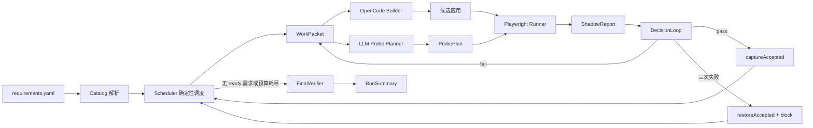
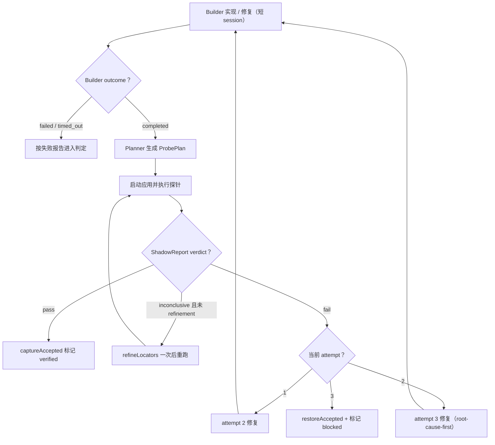
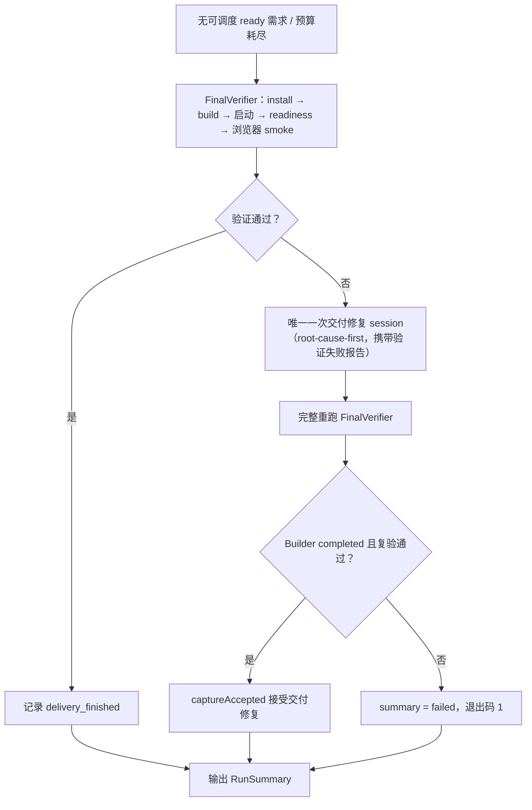

# ShallowCode

ShallowCode 是 OpenCode 之外的一层轻量比赛控制器，面向 GOSIM Factory 2026 / ARC-Bench。它的边界只有一句话：

> 只实现 OpenCode 因为不知道整场比赛的全局状态而无法可靠实现的部分。

OpenCode 负责创建和修改目标应用、选择技术栈、局部构建与修复；ShallowCode 负责解析整棵需求树、调度 WorkPacket、用独立 LLM 生成黑盒探针、用真实浏览器确定性判定、维护唯一的 accepted SHA，并完成最终交付验证。详细设计见 `docs/superpowers/specs/2026-09-02-shallowcode-v1-lite-design.md`（主设计）、`2026-09-04-shallowcode-opencode-prompts-design.md` 与 `2026-09-05-builder-prompts-externalization-design.md`（Builder prompt 体系）。

## 快速开始

```powershell
npm ci
```

配置三个网关变量（OpenCode Builder 与 Probe Planner 共用同一网关）：

| 环境变量 | 说明 |
| --- | --- |
| `OPENAI_API_KEY` | 网关 API key，交给 Planner 请求头与 OpenCode provider 配置 |
| `OPENAI_BASE_URL` | OpenAI-compatible 网关地址 |
| `MODEL` | 网关接受的完整模型 ID（含 `/` 时原样传递） |

三个变量可以写入仓库根目录的 `.env` 文件（模板见 `.env.example`，`.env` 不会入库），真实环境变量优先于文件值；credential smoke 同样读取 `.env`。

OpenCode 使用控制器显式配置的 `shallow-gateway` provider，主模型和辅助模型均走上述网关；SDK 服务使用随机空闲端口。运行环境须提供 Node.js/npm、Git、`opencode` 可执行程序与 Playwright Chromium（可用 `npx playwright install chromium` 安装）。

启动一次完整运行：

```powershell
npm start -- --requirements-dir data/sheet --output-dir tmp/main --budget-ms 600000
```

| 参数 | 说明 |
| --- | --- |
| `--requirements-dir` | 包含 `requirements.yaml` 的目录 |
| `--output-dir` | 目标应用输出目录（会作为独立 Git 仓库维护 accepted 状态） |
| `--budget-ms` | 可选，开发调度预算（非负整数毫秒）；缺省或 `0` 表示不限时，阶段调用与交付的边界见“预算与超时” |

初赛需求位于 `data/github`（仓库协作）与 `data/sheet`（电子表格），更换 `--requirements-dir` 即可切换题目。本地约定主线使用 `tmp/main`，baseline 使用 `tmp/baseline`；两者分别维护输出与 `.arc`。每次新实验前先保存需要保留的结果，再手动清空对应实验目录。

通过 Python 适配入口运行主线，使用：

```powershell
python main.py data/sheet --output-dir tmp/main --type web
```

Python 层从真实环境读取 `SHALLOW_BUDGET_MS` 和 `ARCBENCH_*`，模型网关三变量由 TypeScript 层合并 `.env`。本地运行显式传入输出目录。

主线可选环境变量：`SHALLOW_PROBE_PORT` 指定生成期探针端口（默认随机，保留 3000 用于评测）；`SHALLOW_RUN_DIR` 指定运行日志的父目录，每次运行在其下建立独立子目录。

运行结束返回 `RunSummary`，`failed` 时进程退出码为 1，其余为 0。

`delivered` 要求最终验证通过且所有原子需求均已 verified；仍有 blocked 或 todo 需求时为 `partial`。`pipeline_finished` 事件包含结果、接受 SHA、已验证、阻塞和待处理需求 ID。

## Raw OpenCode baseline

baseline 通过 `baseline/main.py` 或 `baseline/index.ts` 运行，用于比较直接驱动 OpenCode 的效果：

```powershell
python baseline/main.py data/sheet --output-dir tmp/baseline --type web
npx tsx baseline/index.ts --requirements-dir data/sheet --output-dir tmp/baseline
```

| 维度 | ShallowCode 主线 | baseline |
| --- | --- | --- |
| 工作单元 | 依赖就绪的 1–3 个原子需求 | 按声明顺序提交 ROOT 的直接子树及全部后代 |
| 会话 | 每次实现或修复创建短会话 | 一次运行复用同一个会话 |
| 输入 | 当前需求、产品及依赖合同、种子数据、可用参考图片 | `baseline/system.md`、当前子树 JSON、需求目录及已完成模块 ID |
| 完成依据 | 独立黑盒探针、接受点与最终交付验证 | OpenCode 调用结果；Python 入口另检查 frontend/backend 目录 |
| 观测 | 结构化台账、中文日志与 `.arc` | `[baseline]` stderr 日志与 `.arc` 模块状态 |

baseline 的 `completed` 表示调用完成，业务正确性由后续独立评估确认。其 TypeScript 入口在正常结束循环时返回 0，即使存在失败或因预算跳过的模块；比较结果时应同时查看日志中的完成量和失败量。

baseline 单模块调用上限为主线 packet 的两倍：不限总预算时为 80 分钟，显式预算时按预算缩放（见“预算与超时”）。超时后先 abort，再等待旧请求结束，两阶段各最多 5 秒；清理失败会终止本轮运行并关闭运行时，清理成功后继续处理下一模块。

## 运行流程总览

以下流程与判定规则适用于 ShallowCode 主线。



1. **Catalog**（`src/catalog.ts`）：按声明顺序保留原文、目录路径、场景、引用与显式 UI 文本；顶层 `data` 解析为产品种子数据。拒绝重复 ID、未知依赖与依赖环。目录依赖展开为该目录下所有原子需求，祖先的依赖由叶子继承；展开后再次检查依赖环。所有 ATOMIC 需求初始为 `todo`。
2. **Scheduler**（`src/scheduler.ts`）：从依赖全部 `verified` 的 todo 需求中选种子，依次比较场景数、直接依赖者数、显式 UI 文本数、较低的描述成本、声明顺序，前项相同才比较后一项。再按声明顺序加入至多两个同最近父目录、且与种子共享依赖或场景词项的 ready 需求；packet id 由选中 ID 的 slug 拼接生成。
3. **Builder**（`src/builder/`）：通过 `@opencode-ai/sdk` 驱动 OpenCode。Prompt 由 `prompts/` 中文资产编译为固定系统合同与模式任务模板，并按产品类型和需求关键词挑选规则碎片，附带完成回执。实现和修复均保留当前需求与产品上下文；修复额外接收白名单化的 `ShadowReport` 观测。第 3 次尝试（第 2 次修复）要求先给出根因判断再改代码。调用返回 `completed / failed / timed_out`。
4. **Probe Planner**（`src/judge/llm-probe-planner.ts`、`probe-schema.ts`）：LLM 只根据 packet 证据生成声明式 `ProbePlan`（`goto/click/doubleClick/hover/press/fill/select/expectVisible/expectText/expectValue/expectCount/reload/newContext`，`press` 的 key 限枚举键），禁止 CSS/XPath、脚本执行与跨源导航；网关返回的 JSON 自动剥离 markdown 围栏与前后杂文后解析。
5. **Probe Runner**（`src/judge/playwright-probe-runner.ts`）：真实 Chromium 按白名单执行探针，locator 只映射 `getByRole / getByLabel / getByText`，`goto` 绑定受控 baseUrl，每个 case 使用隔离 context；单步超时 2s、单 case 超时 15s，输出带失败分类（`assertion / locator / navigation / timeout / runner`）的结构化 `ShadowReport`。
6. **DecisionLoop**（`src/run-state.ts`）与 **GitOps**（`src/git-ops.ts`）：见下两节。
7. **FinalVerifier**（`src/final-verifier.ts`）：见交付阶段。

ProbePlan 的 JSON Schema 完整描述步骤与 locator 字段；每个 case 必须有断言，计划必须覆盖 packet 中每个需求 ID。空输入与空值断言均合法。每个 case 独立建立其所需前提。

管线启动时先 `captureAccepted` 一次，把输出目录初始状态（空目录时为空提交）记录为 baseline SHA。所有事件的去向见[运行产物与日志](#运行产物与日志)。

## Builder 浏览器自测

主线在每次 Builder 请求中提供官方 `@playwright/mcp` 的浏览器工具。工具随 harness 依赖安装，使用固定版本和绝对入口路径，复用 `npx playwright install chromium` 安装的 Chromium；目标应用无需额外安装自测依赖。baseline 保持原有工具装配。

Builder 完成代码修改后调用 `candidate` MCP 的 `prepare`。控制器在本次运行目录 `candidate/app/` 创建应用副本，安装必要依赖、构建并启动自测实例，返回 `baseUrl`。Builder 用浏览器操作当前需求的关键路径，涉及持久化时重新加载页面；继续修改前调用 `stop`，修改后重新 `prepare`。回执列出通过／失败／未执行、实际观察与资源清理结果，仍属于自述诊断，最终通过条件由独立 Judge 决定。

运行时在发送模型请求前连接并检查 MCP 状态，请求结束后断开 MCP；取消期间的延迟连接不会继续发送模型请求。连接失败或清理失败按 `builder_self_test` 执行故障停止。自测计入本次 Builder 调用，未增加 Builder 尝试次数；超时后的资源收尾仍按有界清理执行。

浏览器使用无头、临时配置；允许来源配置为本次合同中的本地探针地址，图片响应关闭，主要通过 `browser_snapshot` 查看页面结构。来源过滤是防误操作措施，不是操作系统级安全隔离。自测产物保存在本次日志目录的 `builder-self-test/` 下；自动导航返回文件链接时可调用 `browser_snapshot` 获取直接返回的页面结构。

运行时负责关闭候选工具准入、取消在途安装/构建、停止控制器自测实例并断开 MCP。Builder 负责清理自测创建的业务数据和自行启动的额外进程。浏览器配置隔离不恢复服务端数据；预置数据和已有用户数据必须保留。自测只依据当前需求与允许的外部观察，不访问隐藏探针、台账和官方测试。

### 候选构建复用

Judge 在控制器应用副本中另启实例，复用匹配的构建产物；Builder 未调用 `prepare` 时，控制器在验收前准备。源码、新建文件、产物或依赖安装状态变化会使构建凭据失效。浏览器重试及定位器精化复用本次候选；最终交付验证也复用匹配产物。报告、探针完成事件和接受事件关联 `candidateId`、`buildId`、`runtimeId`、输入摘要及产物摘要；接受 Git 提交前后再次复核，变更时回滚。

输入摘要覆盖输出目录所有普通文件，包括未跟踪和被 Git 忽略的业务文件；排除根 `.git`、`.arc` 和 `node_modules`。应用符号链接/junction 当前会被拒绝。私有副本重新准备时清理旧应用文件，保留有效的控制器依赖。依赖声明、锁文件、npm 配置、平台合同和进程环境参与安装键；安装生命周期脚本、本地依赖或 workspaces 存在时，源文件变化也触发重装。依赖目录用文件元数据检查通常的修改/删除，不逐次读取全部依赖内容；仅在当前运行复用。

运行数据必须写入 `SHALLOW_DATA_DIR` 指定目录（本地生成期为 `candidate/data/`），未设置该变量时由应用使用缺省数据目录。种子数据保留为应用输入，由应用初始化到数据目录。数据不参与构建摘要，也不会因重启自动重置；本功能不实现 roadmap 第 5 节的数据隔离。私有构建、依赖和运行数据不会回写输出目录；交付仍由平台按输出源码执行安装与构建。

`candidate_prepared` 记录是否复用、安装/构建和总准备耗时，`candidate_prepare_failed` 记录失败阶段。安装、构建和启动失败走已有修复配额；验收或提交期间发现候选变化则终止本轮并恢复接受基线。构建副本与摘要是生命周期一致性措施，不是 OS 沙箱；应用构建脚本的语义仍由 Builder 负责。详见[实施方案与边界](docs/2026-09-08-candidate-build-reuse.md)。

`test/builder-self-test.test.ts` 使用真实 MCP 和 Chromium 验证页面输入、保存、重新加载及浏览器关闭；SDK 连接、取消和清理由 `test/opencode-runtime.test.ts` 验证。真实模型是否遵循自测流程，需要显式启用凭证冒烟后另行验证。

## 需求证据与模型输入

主线从选定目录的 `requirements.yaml` 读取需求。Builder 的实现、修复和根因修复输入包含当前 packet、产品目标、祖先说明与已满足的直接依赖合同。

顶层 `data` 按分类全量渲染为种子数据段，保留预置账号、名称、数值和场景约定；空数组省略该段。交付修复的输入聚焦最终验证失败与平台运行合同。Planner 接收当前需求的 ID、名称、原文、场景、引用路径和精确 UI 文案，使用这些文字证据生成探针。

### 参考图片

`src/builder/reference-images.ts` 读取当前 packet 引用的本地 PNG、JPEG、WebP、GIF，校验需求目录归属、真实路径及文件签名，去重后以 SDK 文件附件发送。每张图片上限 10 MiB，每包合计上限 30 MiB。附件由控制器传入，引用路径相对于需求目录；图片用于补充布局和视觉关系，业务规则仍以文字和场景为准。

缺失、越界、格式不支持或超限的引用会记录跳过原因，Builder 依据文字继续。读取范围仅限需求目录内的本地文件。

当携图请求返回明确的图片输入不支持错误，且响应中没有工具或已完成步骤的执行证据时，Builder 停止原会话，在同一次尝试的剩余超时额度内新建纯文本会话，最多回退一次。后续 packet 沿用该模型的文本模式；普通调用错误仍进入失败处理。SDK 的图片模态配置用于允许附件传输，实际模型能力由网关响应确认。

`builder_reference_images` 事件记录 `attached / text_fallback / unavailable` 模式、附件数量及跳过原因，写入台账和中文日志。诊断仅保存图片使用状态，图片载荷经模型输入通道传递。

## 单个 WorkPacket 的判定循环



判定规则（`deriveProbeVerdict`）：

- **pass**：没有任何失败。`captureAccepted` 更新 accepted SHA，packet 需求标记 `verified`，继续调度。
- **fail**：存在 locator 之外的失败（断言、导航、超时、runner），或 locator 失败没有任何 aria snapshot。按 attempt 递进——第一次失败进入 attempt 2 修复；第二次失败进入 attempt 3 修复（prompt 要求先做根因分析）；第三次失败调用 `restoreAccepted` 回滚到 accepted SHA 并将该 packet 标记 `blocked`。每个 packet 最多三次 Builder 调用。
- **inconclusive**：仅当全部失败都是 `locator` 类且至少一个携带 aria snapshot 时，把清洗后的快照交给 Planner 做一次 locator-only refinement（不得改变输入值、断言或步骤数），重跑探针；refinement 不消耗 Builder 修复次数。
- 判定循环另有迭代上限（6）作为止损保险：超出即回滚并阻塞该 packet。
- 每次 Builder 尝试前检查预算；预算耗尽时不再开启 packet 修复，回滚未接受的候选并进入交付。
- 修复 prompt 保留需求证据，并追加白名单化观测；Planner 的隐藏推理与完整探针计划保持在 Judge 一侧。

## 交付阶段

调度器持续领取新 packet，直到没有可调度的 ready 需求或总预算耗尽，随后不可逆进入交付。



- FinalVerifier 按固定平台合同执行 install → build → 启动（注入 `PORT`）→ 轮询 `/health` readiness → 用真实浏览器打开根页面做最小 smoke；无论结果如何都终止本次验证启动的进程。
- 验证失败时启动恰好一次交付修复 session：Builder 收到 root-cause-first 指令与由验证报告转换的失败证据；随后**完整重跑**全部验证步骤，只接受复验通过的修复（`captureAccepted`）。
- 交付修复最多一次：只有 Builder 返回 `completed` 且复验通过才接受；其余情况恢复 accepted SHA 并以 `failed` 退出。异常 runner 故障同样会停止 Builder、回滚并记录失败。
- 启动日志持续读取，避免管道塞满；启动命令不存在时返回 readiness 失败。Windows 清理进程树，Linux 使用独立进程组停止启动器及其后代。

## 运行产物与日志

主线每次运行产生以下可观测产物：

- **stderr**：运行事件的脱敏 JSON；包含规划、应用启停、探针、修复安排和交付验证等阶段。Planner 原始响应片段只进入私有台账。
- **run-log.txt（人类可读）**：与 ledger 同目录，显示本地时间、累计耗时、事件序号、尝试次数，以及可用的阶段耗时、需求名称、失败分类、证据 ID、接受 SHA 和最终 verified/blocked/todo 数量及未完成 ID。Builder 回执标为“自述回执（非验收）”，换行转换为可见分隔，保持每事件一行。启动时打印文件绝对路径。
- **run-ledger.jsonl（机读台账）**：`%TMP%/shallowcode-runs/<目录运行ID>/run-ledger.jsonl`。内部事件采用判别联合，由 `RunStateStore` 注入运行 UUID、唯一事件 ID、递增序号、累计耗时、最后接受 SHA 和已登记的 packet 尝试次数；SHA 表示接受基线，不是当前未提交候选的摘要。生产启动事件记录模型、Builder/Planner 超时、prompt 资产与 Probe schema 的 SHA-256；当前 usage 标记 `unavailable`，不报告估算计费 token。
- **evidence/**：与 ledger 同目录，只保存失败报告的白名单文本：每运行最多 128 份、每份最多 8 个失败、各文本字段最多 1500 字符，单文件硬上限 128 KiB；包含总失败数、尝试次数和接受基线。日志通过 ID 引用，正文保留在控制器目录。
- **arc-projection.jsonl**：与 ledger 同目录，保存官方格式的平台事件及完整需求树投影意图，内部记录带唯一 ID。主线结束时从它重建本轮 `.arc`，重复 ID 只投影一次；写入失败记录告警，不改变已提交的验收决定。
- **输出仓库与 `.arc/`**：见 ARC-Bench 提交一节。

Planner 失败事件（`probe_planner_retry`、`probe_planner_failed`、`probe_refinement_failed`）包含错误类别、底层错误信息与可用的模型内容片段。中文日志和 stderr 展示类别与原因，`contentPreview` 仅保留在私有 ledger。JSON 或 ProbePlan 校验失败时，现有的一次重试会携带校验原因、内容片段和完整 schema；传输错误维持原请求重试。反馈仅在 Judge 侧使用。

`diagnostics.ts` 统一处理日志、Builder 观测和 Planner 诊断：先替换已知网关密钥，过滤常见授权头、Cookie、引号内密码和 URL 凭证，再清理控制字符并截断。字段匹配不会误删 `inputTokens` 等数值统计。原始需求与种子数据保持原样；脱敏是有限规则，不保证识别任意未标记敏感文本。

`SHALLOW_RUN_DIR` 指定运行目录的父目录，生产装配拒绝日志目录落在候选输出中，并检查真实路径以识别目录链接。私有证据不进入 `.arc`、Builder 输入或完整浏览器 trace；Builder 反馈仍单独从白名单报告构建。OpenCode runtime 通过内联 config（优先级高于 Builder 可写的项目 `opencode.json`）注入工具级 deny：`read`/`edit` 拒绝 `.arc` 路径、bash 命令文本含 `.arc` 被拒、外部目录访问一律拒绝（同时消除 SDK 无头模式下 `external_directory` 默认 ask 的挂起风险）。这是运行时工具层限制，不是 OS 级隔离；bash 文本变换或自定义 subagent 仍可能绕过。运行目录由操作者按需归档和清理，目前没有自动过期清理；目录归属检查和 POSIX 创建权限不是完整 OS 隔离，Windows ACL/容器挂载仍待运行环境验证。投影重放也不是完整运行恢复。设计与官方协议映射见 [观测与 ARC 投影说明](docs/2026-09-07-observability-arc-projection.md)。

GitOps（`src/git-ops.ts`）细节：

- 输出目录必须是 git 仓库根（`open` 会 init 或校验），仓库内提交统一使用内联 `-c user.name=ShallowCode -c user.email=shallowcode@local.invalid`。
- 首次打开时若没有 `.gitignore`，会写入 `node_modules/`、`dist/`、`build/`、`.next/`、`.env` 并**立即提交**；已有文件（包括空文件）保持原样，读取错误直接报告。
- 首次初始化要求目录为空或仅含 `.gitignore`。重新打开既有仓库时，GitOps 按根提交标题识别 ShallowCode 仓库：匹配 `shallow: initial state` 或 `chore: add ShallowCode ignore rules` 后，自动清理应用的未提交改动并删除旧 `runner-events.jsonl`；其他仓库有未提交应用改动时会拒绝打开。复用输出目录前应备份人工修改及需要保留的运行记录。
- 回滚先 `reset --mixed <acceptedSha>`，再恢复除 `.arc` 外的已跟踪文件，并 `clean -fd -e .arc/`。应用回到 accepted 状态，`.arc` 保留完整运行事件和当前溯源记录，不加入忽略规则。
- 单条 git 命令默认 30s 超时，超时杀死子进程并等其退出后报错，避免悬挂与目录句柄泄漏。

## 预算与超时

### 故障来源与修复机会

| 来源 | 当前处理 |
| --- | --- |
| 业务断言、应用导航/操作超时、候选应用启动失败 | 白名单观测交给 Builder；首次实现加两次修复，最多三次调用 |
| 浏览器断连或页面 crash 事件 | `ExecutionFault` 标识执行故障；每 packet 最多重试一次，保持候选、应用进程和合法计划，重试前检查总预算 |
| Planner 网络请求失败、HTTP 408/429/5xx | 最多重试一次，独立于 Builder 次数；已有合法计划继续复用 |
| Planner JSON/schema 校验失败 | 一次带反馈的计划修正；仍失败则阻塞 packet |
| locator-only 失败 | 有快照时至多一次精化；仍缺少有效行为证据则阻塞 packet |
| Planner 其他 HTTP 错误或无效响应协议、Builder 运行时或浏览器启动失败 | 停止本轮并回滚，报告运行环境/协议问题 |

基础设施故障通过结构化类别与调用来源判断。应用自身的错误响应不按模型网关故障处理；已观察到的业务断言失败也不会被后续浏览器崩溃抹除。`builder_started` 记录实际 attempt，浏览器重试不增加或重置 Builder 次数；Builder 已开始的调用及普通 SDK 失败仍计入三次上限。

最终交付遇到可恢复的浏览器执行故障时，有独立的一次验证重试；耗尽后停止，而非发起代码修复。`execution_fault` 记录来源、故障码和重试决定。浏览器重跑使用新浏览器上下文，但当前没有被测应用的数据快照恢复机制，前一次执行留下的服务端数据可能仍在。

### 时间额度

| 超时 | 值 | 来源 |
| --- | --- | --- |
| 总预算 | `--budget-ms`，缺省或 `0` 为不限时 | CLI |
| Builder 单次调用 | 预算的 40%，下限 30s、上限 3600s；不限时取 3600s（1h） | `deriveModelTimeouts` |
| baseline 单模块调用 | 预算的 80%，下限 60s、上限 7200s；不限时取 10800s（3h） | `deriveBaselinePromptTimeoutMs` |
| Planner 单次调用 | 预算的 10%，下限 10s、上限 720s；不限时取 720s | `deriveModelTimeouts` |
| Builder 超时后落地等待 | 5s（可经 `promptSettleTimeoutMs` 配置） | `OpenCodeSdkBuilder` |
| git 单命令 | 30s | `runGit` |
| 探针单步 / 单 case | 2s / 15s | pipeline 固定 |
| 构建 / 启动就绪 | 180s / 30s | 平台合同 |

预算控制新 packet 与后续修复的启动，进行中的调用仍受各自超时控制；最终交付独立执行，因此 `--budget-ms` 不是整个进程的强制终止时刻。Builder abort 也有 5s 等待上限；abort 失败或 prompt 在等待结束后仍未落地时关闭运行时，后续修复重启服务。

## ARC 平台合同

`src/runtime-config.ts` 固定目标应用的平台合同（不来自 LLM 输出）：

- 健康检查 `/health`
- `frontend/`、`backend/` 各自 `npm install`
- `frontend/` 执行 `npm run build`
- `backend/` 执行 `npm run start`，必须读取 `PORT` 环境变量（缺省 3000）
- 前端通过同源相对路径访问后端，构建产物中不写死主机或端口

端口 3000 是评测端口：平台在评测阶段用它访问网站，生成期占用会被 SIGTERM。因此 ShallowCode 在生成与验证阶段使用独立探针端口——每次运行随机挑选空闲端口，可用环境变量或 `.env` 中的 `SHALLOW_PROBE_PORT` 显式指定（拒绝 3000）；Builder prompt 中会写明这两个端口语义。

无论 OpenCode 选择什么框架，Builder 按此形态产出，判定与交付按此形态验证，保证跨 WorkPacket 的可复现判定。

## ARC-Bench 提交（适配包契约）

ShallowCode 依照官方参考实现 [`octos-org/arc-adapter`](https://github.com/octos-org/arc-adapter) 的适配包契约提交评测。

平台调用方式：

```
python main.py <requirement_path> [--output-dir DIR] [--type web] [--web-port N]
```

| 输入 | 来源 |
| --- | --- |
| 需求目录 | argv 或 `ARCBENCH_TASK_DIR` |
| 交付目录 | `--output-dir` 或 `ARCBENCH_TEMPLATE_DIR` |
| 模型通道 | 环境变量 `OPENAI_API_KEY` / `OPENAI_BASE_URL` / `MODEL`（也支持 `.env`） |

`main.py`（仅用 Python 标准库）只做四件事：解析参数与 `ARCBENCH_*` 回退、准备 Node 运行时（`npm ci` + `npx playwright install chromium`）、以 `npx tsx index.ts` 驱动管线（参数映射为 `--requirements-dir/--output-dir/--budget-ms`，总预算可用 `SHALLOW_BUDGET_MS` 注入）、收尾检查交付目录含 `frontend/` 与 `backend/`。

平台通过交付目录内的文件观察进度，管线运行时写入：

- `<交付目录>/.arc/runner-events.jsonl`：`runner_state` / `requirement_state` / `signal` 事件流（`src/arc-protocol.ts`，时间戳为 UTC `YYYY-MM-DD HH:MM:SS`）
- `<交付目录>/.arc/traceability/*.json`：七张溯源表——requirements、scenarios（从需求树生成）、node_states（随 accept/block 更新），其余表保留空对象
- `signal` 事件：`git_commit`（每次 accept 刷新提交历史）、`requirement_tree_stored`（需求树刷新），使用官方六项 `refresh` 字段；Builder 回执归内部日志。
- 交付仓库的 git 提交历史（`captureAccepted` 每次 accept 自动产生）

工程要点：

- 运行事件以脱敏 JSON 行镜像到 stderr，人类可读中文日志见 run-log.txt（启动时打印路径）
- 上传上限约 50MB：本仓库不含 node_modules 与浏览器二进制，Playwright Chromium 在评测机运行时下载
- 评测机是共享的：探针端口随机化、每个 case 隔离 context、不依赖本地残留状态
- UI 契约（写入 Builder prompt）：关键输入用 `type="text"`、每个字段配可见 `<label>`、校验错误用 JS 输出文字而不用 HTML5 `required`、按钮用带纯文本的 `<button>`

提交流程（按官方 `arc.sh`）：

```sh
sh arc.sh pack   https://github.com/<org>/<repo>   # 验证打包
sh arc.sh submit <题目> <模型> https://github.com/<org>/<repo>  #官方示例：sh arc.sh submit ticketbooking gpt-5.5 https://github.com/octos-org/arc-adapter
sh arc.sh check
```

## 测试

```powershell
npm run typecheck        # TypeScript 类型检查
npm test                 # 单元与集成测试（含无凭证完整 pipeline e2e）
npm run test:browser     # 真实 Chromium 浏览器测试
npm run test:all         # 以上全部
```

无凭证测试使用 `FakeBuilder` / `FakeProbePlanner` / `FakeGitOps`（仅存在于 `test/fakes/`）加真实 Playwright 跑通 `schedule → build → plan → judge → accept/repair/restore → final verify` 全链路，覆盖 accept、修复后通过、三次失败后 restore/block、locator refinement、builder 超时落地等待、git 超时与忽略规则、交付修复 + 完整复验。

种子数据与图片链路另覆盖：全量提示词注入、目录越界及链接检查、SDK 附件序列化、拒图后纯文本回退、回退次数与超时限制、诊断落盘。请求格式通过真实 SDK 配合模拟响应验证；真实网关的图片消费能力需单独实测。

真实 OpenCode / LLM 集成由 credential smoke 覆盖：

```powershell
npm run smoke:credentials
```

仅当 `RUN_CREDENTIAL_SMOKE=1` 且三个网关变量齐备（环境变量或 `.env`）时执行，否则明确 SKIP。

## 目录结构

```text
main.py                        ARC-Bench 适配包入口：参数解析、Node 运行时准备、驱动管线
index.ts                       生产入口：CLI、.env 加载、凭证装配、依赖注入、退出码
baseline/
  main.py                      baseline 的 Python 适配入口与输出目录检查
  index.ts                     ROOT 子树顺序调度、单会话运行、模块状态记录
  system.md                    baseline 系统提示词与平台合同
prompts/
  system/                      Builder 系统合同、四类任务模板（实现/修复/根因修复/交付修复）、action 与 receipt 资产
                               seed-data 与 reference-images* 输入说明资产
  fragments/                   产品域实现规则：可访问控件、服务端持久化、权限、仓库协作、表格、交付合同
src/
  types.ts                     领域类型：需求、WorkPacket、平台合同、ShadowReport、RunEvent
  cli.ts                       严格 CLI 参数解析
  catalog.ts                   requirements.yaml → 需求树与种子数据（重复/依赖/环校验）
  scheduler.ts                 无模型确定性调度（1–3 个依赖全 verified 的需求）
  pipeline.ts                  依赖注入编排：packet 循环、修复梯子、交付窗口、事件记录
  run-state.ts                 判定决策、运行状态、脱敏 ledger 与 logSink
  git-ops.ts                   输出仓库操作：初始化 + .gitignore、capture/restore、单命令超时
  final-verifier.ts            交付验证（install→build→启动→readiness→浏览器 smoke）与 CommandAppLifecycle
  arc-protocol.ts              官方 .arc/ 事件与完整需求树、串行投影及重建
  diagnostics.ts              自由文本凭证脱敏、控制字符清理及长度限制
  runtime-config.ts            网关配置、预算→模型超时派生、平台合同、探针端口
  process-spawn.ts             子进程 seam：Windows .cmd 经 cmd.exe，拒绝 shell 元字符
  human-log.ts                 运行事件 → 中文人类可读日志行（本地时间 + 耗时）
  builder/
    port.ts                    BuilderPort/BuilderResult 端口（completed/failed/timed_out）
    opencode-sdk.ts            OpenCode SDK 适配：短会话、超时 abort + 落地等待
    reference-images.ts        当前工作包引用图片的读取、路径与格式校验、大小限制
    prompt.ts / prompt-input.ts  prompt 编译（四种模式）与输入类型
    prompt-assets.ts           prompts/ 资产加载与 {{占位符}} 模板填充
    prompt-fragments.ts        产品词典 → fragments 选择
    shadow-observation.ts      ShadowReport → 白名单观测（清洗、截断）
  judge/
    probe-schema.ts            ProbePlan 白名单 schema 与 locator-only refinement 校验
    llm-probe-planner.ts       LLM 探针规划（JSON 容错提取、一次 locator refinement）
    playwright-probe-runner.ts 真实 Chromium 探针执行与 verdict 判定
test/
  *.test.ts                    单元/集成测试（含无凭证全链路 e2e）
  browser/                     真实 Chromium 测试
  fakes/ fixtures/ helpers/    测试专用 fake、fixture app 与工具（不属于生产架构）
docs/superpowers/              设计文档（specs/）与实施计划（plans/）
data/github、data/sheet        初赛需求树、种子数据及参考图片
```

## 设计边界

- 生产路径只有一个业务代码 Builder：OpenCode SDK；ShallowCode 不新增第二套源码编辑工具。
- Builder 文案全部外置在 `prompts/` 中文资产中（系统合同、任务模板、规则碎片、回执），代码只负责组装与填充。
- Probe Planner 依据需求证据工作，与目标应用源码、diff 及 OpenCode 对话隔离；Builder 接收需求、种子数据、参考图片与白名单观测。官方测试和官方结果不进入运行模块。
- Probe Runner 不执行模型生成的任意代码，只解释白名单 DSL。
- 失败次数有硬上限（每个 packet 最多两次修复、判定循环 6 次迭代上限，交付阶段最多一次修复）；未接受的候选按最后 accepted SHA 执行回滚，回滚操作本身的错误会向上传播。
