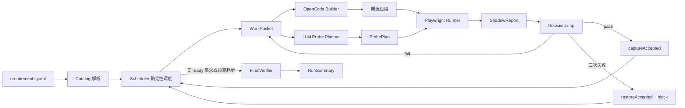
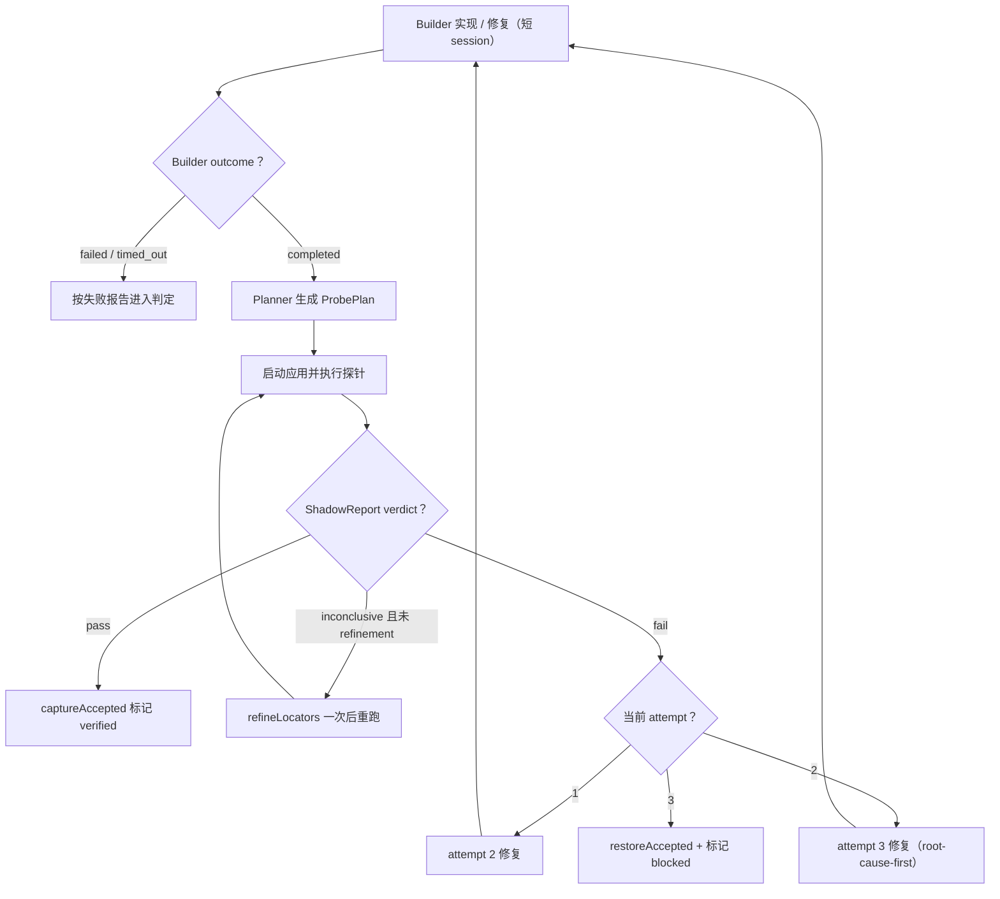
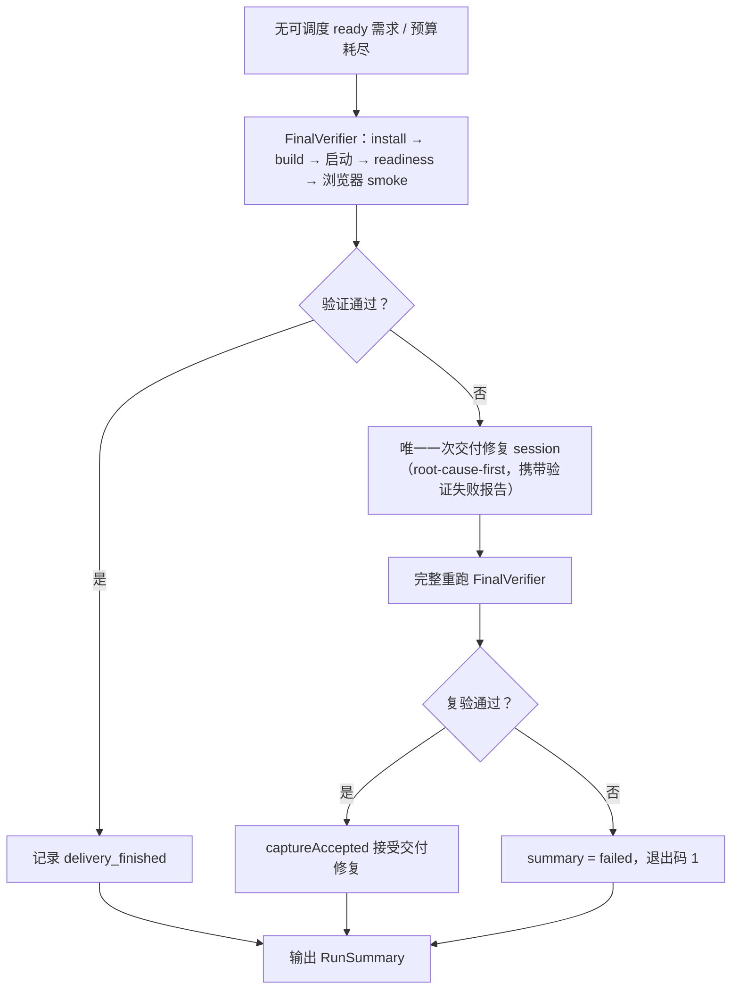

# ShallowCode

ShallowCode 是 OpenCode 之外的一层轻量比赛控制器，面向 GOSIM Factory 2026 / ARC-Bench。它的边界只有一句话：

> 只实现 OpenCode 因为不知道整场比赛的全局状态而无法可靠实现的部分。

OpenCode 负责创建和修改目标应用、选择技术栈、局部构建与修复；ShallowCode 负责解析整棵需求树、调度 WorkPacket、用独立 LLM 生成黑盒探针、用真实浏览器确定性判定、维护唯一的 accepted SHA，并完成最终交付验证。详细设计见 `docs/superpowers/specs/2026-09-02-shallowcode-v1-lite-design.md`。

## 快速开始

```powershell
npm ci
```

配置三个网关变量（OpenCode Builder 与 Probe Planner 共用同一网关）：

| 环境变量 | 说明 |
| --- | --- |
| `OPENAI_API_KEY` | 网关 API key，只进请求头，不写日志 |
| `OPENAI_BASE_URL` | OpenAI-compatible 网关地址 |
| `MODEL` | 模型名称 |

三个变量可以写入仓库根目录的 `.env` 文件（模板见 `.env.example`，`.env` 不会入库），真实环境变量优先于文件值；credential smoke 同样读取 `.env`。

启动一次完整运行：

```powershell
npm start -- --requirements-dir <需求目录> --output-dir <输出目录> --budget-ms 600000
```

| 参数 | 说明 |
| --- | --- |
| `--requirements-dir` | 包含 `requirements.yaml` 的目录 |
| `--output-dir` | 目标应用输出目录（会作为独立 Git 仓库维护 accepted 状态） |
| `--budget-ms` | 可选，总 wall-clock 预算（非负整数毫秒）；缺省或 `0` 表示不限时 |

运行结束返回 `RunSummary`，`failed` 时进程退出码为 1，其余为 0。

## 运行流程总览



1. **Catalog**（`src/catalog.ts`）：无损解析需求树，按声明顺序保留原文、目录路径、场景、引用与显式 UI 文本；拒绝重复 ID、未知依赖与依赖环。所有 ATOMIC 需求初始为 `todo`。
2. **Scheduler**（`src/scheduler.ts`）：确定性规则选择 1–3 个依赖全部 `verified` 的 ATOMIC 需求组成 WorkPacket；排序信号依次为具名场景数、直接依赖者数、显式 UI 文本数、声明顺序；packet id 由排序后 ID 的稳定哈希生成，重复调用结果字节级一致。
3. **Builder**（`src/builder/`）：通过 `@opencode-ai/sdk` 驱动 OpenCode。prompt 包含当前 packet 原文、场景、引用与平台合同；第二次修复追加结构化 `ShadowReport`，第三次修复要求先给出根因判断再改代码。超时自动 abort，返回 `completed / failed / timed_out`。
4. **Probe Planner**（`src/judge/llm-probe-planner.ts`、`probe-schema.ts`）：LLM 只根据 packet 证据生成声明式 `ProbePlan`（`goto/click/fill/select/expectVisible/expectText/expectValue/expectCount/reload/newContext`），禁止 CSS/XPath、脚本执行与跨源导航。
5. **Probe Runner**（`src/judge/playwright-probe-runner.ts`）：真实 Chromium 按白名单执行探针，locator 只映射 `getByRole / getByLabel / getByText`，`goto` 绑定受控 baseUrl，每个 case 使用隔离 context；单步超时 2s、单 case 超时 15s，输出带失败分类（`assertion / locator / navigation / timeout / runner`）的结构化 `ShadowReport`。
6. **DecisionLoop**（`src/run-state.ts`）与 **GitOps**（`src/git-ops.ts`）：见下两节。
7. **FinalVerifier**（`src/final-verifier.ts`）：见交付阶段。

管线启动时先 `captureAccepted` 一次，把输出目录初始状态（空目录时为空提交）记录为 baseline SHA。所有事件写入追加式 JSONL ledger（系统临时目录 `shallowcode-runs/<运行ID>/run-ledger.jsonl`），写入前自动脱敏 key/token 并截断超长文本。

## 单个 WorkPacket 的判定循环



判定规则：

- **pass**：`captureAccepted` 更新 accepted SHA，packet 需求标记 `verified`，继续调度。
- **fail**：按 attempt 递进——第一次失败进入 attempt 2 修复；第二次失败进入 attempt 3 修复（prompt 要求先做根因分析）；第三次失败调用 `restoreAccepted` 回滚到 accepted SHA 并将该 packet 标记 `blocked`。每个 packet 最多三次 Builder 调用。
- **inconclusive**：仅当失败分类为 `locator` 且携带 aria snapshot 时，把清洗后的快照交给 Planner 做一次 locator-only refinement（不得改变输入值、断言或步骤数），重跑探针；refinement 不消耗 Builder 修复次数。
- 修复 prompt 只包含观测到的 `ShadowReport`，Planner 的隐藏推理与目标应用源码不进入修复上下文。

## 交付阶段

调度器持续领取新 packet，直到没有可调度的 ready 需求或总预算耗尽，随后不可逆进入交付。



- FinalVerifier 按固定平台合同执行 install → build → 启动（注入 `PORT`）→ 轮询 `/health` readiness → 用真实浏览器打开根页面做最小 smoke；无论结果如何都终止本次验证启动的进程。
- 验证失败时启动恰好一次交付修复 session：Builder 收到 root-cause-first 指令与由验证报告转换的失败证据；随后**完整重跑**全部验证步骤，只接受复验通过的修复（`captureAccepted`）。
- 交付修复恰有一次：复验结束后交付阶段即终止，结果只有接受（`captureAccepted`）或 `failed` 退出。

## 预算与超时

| 超时 | 值 | 来源 |
| --- | --- | --- |
| 总预算 | `--budget-ms`，缺省或 `0` 为不限时 | CLI |
| Builder 单次调用 | 预算的 40%，下限 30s、上限 240s；不限时取 240s | `deriveModelTimeouts` |
| Planner 单次调用 | 预算的 10%，下限 10s、上限 60s；不限时取 60s | `deriveModelTimeouts` |
| 探针单步 / 单 case | 2s / 15s | pipeline 固定 |
| 构建 / 启动就绪 | 180s / 30s | 平台合同 |

## ARC 平台合同

`src/runtime-config.ts` 固定目标应用的平台合同（不来自 LLM 输出）：

- 健康检查 `/health`
- `frontend/`、`backend/` 各自 `npm install`
- `frontend/` 执行 `npm run build`
- `backend/` 执行 `npm run start`，必须读取 `PORT` 环境变量（缺省 3000）
- 前端通过同源相对路径访问后端，构建产物中不写死主机或端口

端口 3000 是评测端口：平台在评测阶段用它访问网站，生成期占用会被 SIGTERM。因此 ShallowCode 在生成与验证阶段使用独立探针端口——每次运行随机挑选空闲端口，可用 `SHALLOW_PROBE_PORT` 显式指定；Builder prompt 中会写明这两个端口语义。

无论 OpenCode 选择什么框架，Builder 按此形态产出，判定与交付按此形态验证，保证跨 WorkPacket 的可复现判定。

## ARC-Bench 提交（适配包契约）

ShallowCode 依照官方参考实现 [`octos-org/arc-adapter`](https://github.com/octos-org/arc-adapter) 的适配包契约提交评测。

平台调用方式：

```
python main.py <requirement_path> [--output-dir DIR] [--type web] [--web-port N]
```

| 输入 | 来源 |
| --- | --- |
| 需求目录 | argv 或 `ARCBENCH_TASK_DIR` |
| 交付目录 | `--output-dir` 或 `ARCBENCH_TEMPLATE_DIR` |
| 模型通道 | 环境变量 `OPENAI_API_KEY` / `OPENAI_BASE_URL` / `MODEL`（也支持 `.env`） |

`main.py`（仅用 Python 标准库）只做四件事：解析参数与 `ARCBENCH_*` 回退、准备 Node 运行时（`npm ci` + `npx playwright install chromium`）、以 `npx tsx index.ts` 驱动管线（参数映射为 `--requirements-dir/--output-dir/--budget-ms`，总预算可用 `SHALLOW_BUDGET_MS` 注入）、收尾检查交付目录含 `frontend/` 与 `backend/`。

平台通过交付目录内的文件观察进度，管线运行时写入：

- `<交付目录>/.arc/runner-events.jsonl`：`runner_state` / `requirement_state` / `signal` 事件流（`src/arc-protocol.ts`，时间戳为 UTC `YYYY-MM-DD HH:MM:SS`）
- `<交付目录>/.arc/traceability/*.json`：七张溯源表——requirements、scenarios（从需求树生成）、node_states（随 accept/block 更新），其余表保留空对象
- 交付仓库的 git 提交历史（`captureAccepted` 每次 accept 自动产生）

工程要点：

- 关键运行事件同时镜像到 stderr（平台会截断长 stdout）
- 上传上限约 50MB：本仓库不含 node_modules 与浏览器二进制，Playwright Chromium 在评测机运行时下载
- 评测机是共享的：探针端口随机化、每个 case 隔离 context、不依赖本地残留状态
- UI 契约（写入 Builder prompt）：关键输入用 `type="text"`、每个字段配可见 `<label>`、校验错误用 JS 输出文字而不用 HTML5 `required`、按钮用带纯文本的 `<button>`

提交流程（按官方 `arc.sh`）：

```sh
sh arc.sh pack   https://github.com/<org>/<repo>   # 验证打包
sh arc.sh submit <题目> <模型> https://github.com/<org>/<repo>
sh arc.sh check
```

## 测试

```powershell
npm run typecheck        # TypeScript 类型检查
npm test                 # 单元与集成测试（含无凭证完整 pipeline e2e）
npm run test:browser     # 真实 Chromium 浏览器测试
npm run test:all         # 以上全部
```

无凭证测试使用 `FakeBuilder` / `FakeProbePlanner`（仅存在于 `test/`）加真实 Playwright 跑通 `schedule → build → plan → judge → accept/repair/restore → final verify` 全链路，覆盖 accept、修复后通过、三次失败后 restore/block、locator refinement 与交付修复 + 完整复验。

真实 OpenCode / LLM 集成由 credential smoke 覆盖：

```powershell
npm run smoke:credentials
```

仅当 `RUN_CREDENTIAL_SMOKE=1` 且三个网关变量齐备（环境变量或 `.env`）时执行，否则明确 SKIP。

## 目录结构

```text
main.py                     ARC-Bench 适配包入口：参数解析、Node 运行时准备、驱动管线
index.ts                    生产入口：参数解析、.env 加载、凭证装配、退出码
src/
  cli.ts                    纯函数 CLI 参数解析
  catalog.ts / scheduler.ts 需求解析与确定性调度
  builder/                  OpenCode SDK Builder（窄端口 + prompt + 适配器）
  judge/                    ProbePlan schema、LLM Planner、Playwright Runner
  run-state.ts              DecisionLoop、RunState、追加式 ledger
  arc-protocol.ts           平台 .arc/ 事件流与溯源表写入
  git-ops.ts                captureAccepted / restoreAccepted
  pipeline.ts               依赖注入式编排
  final-verifier.ts         交付验证 + 交付修复
  runtime-config.ts         网关配置、预算派生、平台合同、探针端口
test/
  fakes/ fixtures/ helpers/ 测试专用 fake 与 fixture（不属于生产架构）
data/
  guthub/                   比赛需求样例：原文、结构化 YAML、中文 YAML
  sheet/                    同上
```

## 设计边界

- 生产路径只有一个业务代码 Builder：OpenCode SDK。
- Probe Planner 看不到目标应用源码、diff 与 OpenCode 对话；Builder 看不到官方测试与评分反馈。
- Probe Runner 不执行模型生成的任意代码，只解释白名单 DSL。
- 失败次数有硬上限（每个 packet 最多两次修复，交付阶段最多一次修复），失败总能回到最后 accepted SHA。
