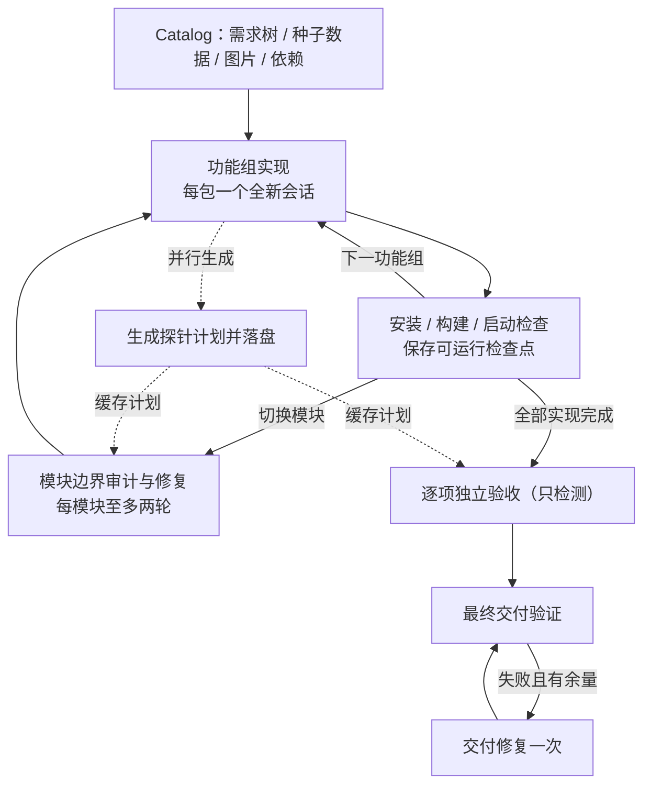

# ShallowCode

ShallowCode 是 coding agent 之外的一层轻量比赛控制器，面向 GOSIM Factory 2026 / ARC-Bench。它的边界只有一句话：

> 只实现 coding agent 因为不知道整场比赛的全局状态而无法可靠实现的部分。

Pi coding-agent（`@mariozechner/pi-coding-agent`）负责创建和修改目标应用、选择技术栈、局部构建与修复；ShallowCode 负责解析整棵需求树、按完整模块组织实现、用独立 LLM 生成黑盒探针、用真实浏览器验收、分别维护可运行检查点与功能验证状态，并完成最终交付验证。当前设计见 [模块优先重构](docs/2026-09-13-module-first-refactor.md)；引擎替换与模块反馈见 [Pi SDK 重构](docs/2026-09-14-pi-sdk-refactor-plan.md)；早期设计见 `docs/superpowers/specs/2026-09-02-shallowcode-v1-lite-design.md`、`2026-09-04-shallowcode-opencode-prompts-design.md` 与 `2026-09-05-builder-prompts-externalization-design.md`（Builder prompt 体系）。

## 快速开始

```powershell
npm ci
```

配置三个网关变量（Pi Builder 与 Probe Planner 共用同一网关）：

| 环境变量 | 说明 |
| --- | --- |
| `OPENAI_API_KEY` | 网关 API key，由 Planner 请求头与 Pi Worker 在进程内注入 provider |
| `OPENAI_BASE_URL` | OpenAI-compatible 网关地址 |
| `MODEL` | 网关接受的完整模型 ID（含 `/` 时原样传递） |

三个变量可以写入仓库根目录的 `.env` 文件（模板见 `.env.example`，`.env` 不会入库），真实环境变量优先于文件值；credential smoke 同样读取 `.env`。

Pi 在独立 Worker 子进程中把网关注册为进程内 `shallow-gateway` provider（Chat Completions），模型走上述网关；网关密钥经 IPC 传递，不落命令行或模型配置文件。运行环境须提供 Node.js/npm（>= 20.18.1）、Git 与 Playwright Chromium（可用 `npx playwright install chromium` 安装），无需全局安装 Pi CLI 或其它 coding agent。

启动一次完整运行：

```powershell
npm start -- --requirements-dir data/sheet --output-dir tmp/main --budget-ms 600000
```

| 参数 | 说明 |
| --- | --- |
| `--requirements-dir` | 包含 `requirements.yaml` 的目录 |
| `--output-dir` | 目标应用输出目录（会作为独立 Git 仓库维护 accepted 状态） |
| `--budget-ms` | 可选，开发调度预算（非负整数毫秒）；缺省或 `0` 表示不限时，阶段调用与交付的边界见“预算与超时” |

初赛需求位于 `data/github`（仓库协作）与 `data/sheet`（电子表格），更换 `--requirements-dir` 即可切换题目。本地约定主线使用 `tmp/main`，baseline 使用 `tmp/baseline`；两者分别维护输出与 `.arc`。每次新实验前先保存需要保留的结果，再手动清空对应实验目录。

通过 Python 适配入口运行主线，使用：

```powershell
python main.py data/sheet --output-dir tmp/main --type web
```

Python 层从真实环境读取 `SHALLOW_BUDGET_MS` 和 `ARCBENCH_*`，模型网关三变量由 TypeScript 层合并 `.env`。本地运行显式传入输出目录。

主线可选环境变量：`SHALLOW_PROBE_PORT` 指定生成期探针端口（默认随机，保留 3000 用于评测）；`SHALLOW_RUN_DIR` 指定运行日志的父目录，每次运行在其下建立独立子目录。

运行结束返回 `RunSummary`，`failed` 时进程退出码为 1，其余为 0。

`delivered` 要求最终验证通过且所有原子需求均已 verified；仍有 blocked 或 todo 需求时为 `partial`。`pipeline_finished` 事件包含结果、接受 SHA、已验证、阻塞和待处理需求 ID。

## Raw Pi baseline

baseline 通过 `baseline/main.py` 或 `baseline/index.ts` 运行，用于比较直接驱动同一 Pi 执行层（raw Pi）的效果：

```powershell
python baseline/main.py data/sheet --output-dir tmp/baseline --type web
npx tsx baseline/index.ts --requirements-dir data/sheet --output-dir tmp/baseline
```

| 维度 | ShallowCode 主线 | baseline |
| --- | --- | --- |
| 工作单元 | 确定性有界功能组（同父目录/同 ROOT 子树扩展，3 条/5 场景/3k 字符封口），按原子依赖排序 | 按声明顺序提交 ROOT 的直接子树及全部后代 |
| 会话 | 实现阶段每个工作包使用全新会话；修复使用新会话 | 一次运行复用同一个会话 |
| 输入 | 当前需求、产品及依赖合同、种子数据、可用参考图片 | `baseline/system.md`、当前子树 JSON、需求目录及已完成模块 ID |
| 完成依据 | 可运行检查点与独立功能验收分开记录；最终交付验证 | Pi 调用结果；Python 入口另检查 frontend/backend 目录 |
| 观测 | 结构化台账、中文日志与 `.arc` | `[baseline]` stderr 日志与 `.arc` 模块状态 |

baseline 的 `completed` 表示调用完成，业务正确性由后续独立评估确认。其 TypeScript 入口在正常结束循环时返回 0，即使存在失败或因预算跳过的模块；比较结果时应同时查看日志中的完成量和失败量。

baseline 单模块调用不限总预算时上限为3小时，显式预算时按预算缩放（见“预算与超时”）。每次调用结束后父进程回收该调用拥有的进程组/作业并等待退出确认；清理失败会终止本轮运行，清理成功后继续处理下一模块。

## 运行流程总览

下图对应 `src/pipeline.ts` 的 `runPipeline`：实现阶段按功能组推进，并在后台为对应审计包生成探针计划；修复统一在模块边界就地发生，全部实现完成后逐项独立验收（只检测不修复），最后交付验证。



1. Catalog 保留完整需求树、原子描述、场景、图片和种子数据，并展开和校验依赖；`featureGroupPackets` 把原子需求确定性组成有界功能组（3 条/5 场景/3,000 字符）。
2. 按功能组逐包实现，每包使用全新会话，跨包交接只经代码、测试与 ARCHITECTURE.md。每包开始后并行生成该组相关审计包的探针计划并落盘，供后续验收复用。
3. 功能组完成后做安装、构建与启动检查，保存可运行检查点。它不授予功能 verified，后续功能组也不等待前序功能验收；切换模块时对上一模块执行模块边界审计，失败按模块独立配额至多两轮修复。修复后必须既有 verified 全保持且至少一个修复目标变为 verified；没有改善、出现回归或无法重新验证既有 pass 时恢复修复前版本。
4. 全部功能组实现或实现预算耗尽后，按原子需求逐项独立验收（已通过优先）；Judge 仅看需求与浏览器观察。最终验收只检测不修复：可复现业务失败标记 failed 计入交付状态，不再发起跨模块的集中修复。
5. 最后执行 FinalVerifier（install → build → 就绪 → 浏览器 smoke → grader-like 额外端口复验），失败且有余量时至多一次交付修复并完整复验；随后生成对应交付版本的功能状态与运行结果。

`acceptedSha` 保留字段名，但现在表示可运行检查点；`verifiedRequirementIds` 才表示当前版本独立探针通过的需求。初始空状态只用于首次回滚。Planner/定位错误不会删除已保存的实现。

## Builder 开发检查与模块边界审计

Pi Builder 持有文件（read/edit/write）、shell 工具与会话内 `browser` 工具。每个实现工作包都在全新会话中执行，会话内先规划（逐条映射需求 ID 的改动与检查方式）再实施，跨包交接只通过项目文件（代码、测试、ARCHITECTURE.md）完成；复杂或边界逻辑必须编写并运行传统测试。`browser` 工具是昂贵操作（惰性启动真实 Chromium、脚本化页面操作），仅在构建、类型检查与传统测试无法回答真实浏览器行为问题时验证关键路径；它**不**持有常驻浏览器/MCP 自测工具。控制器在每次调用结束、进程释放之后执行安装、构建与独立浏览器检查，并把白名单失败观测反馈给 Builder。

具体地，每个模块实现并保存可运行检查点后，控制器在切换到下一模块时对该模块的审计包执行完整模块边界审计，复用实现阶段并行生成并落盘的缓存探针计划。边界审计发现可复现业务失败，或符合下述条件的缺失控件时触发模块边界修复，每个模块独立拥有至多两轮配额；修复后重跑缓存计划并优先复查已通过路径。边界修复失去既有 pass、无法重新验证或没有任何修复目标→verified 改善时恢复原检查点并停止。修复统一在模块边界就地发生，没有末尾集中修复；交付修复仍独立至多一次。

### 候选构建复用与数据隔离

Judge 在控制器应用副本中另启实例，复用匹配的构建产物；控制器在验收前准备。源码、新建文件、产物或依赖安装状态变化会使构建凭据失效。浏览器重试及定位器精化复用本次候选；最终交付验证也复用匹配产物。报告、探针完成事件和接受事件关联 `candidateId`、`buildId`、`runtimeId`、输入摘要及产物摘要；接受 Git 提交前后再次复核，变更时回滚。

输入摘要覆盖输出目录所有普通文件，包括未跟踪和被 Git 忽略的业务文件；排除根 `.git`、`.arc` 和 `node_modules`。应用符号链接/junction 当前会被拒绝。私有副本重新准备时清理旧应用文件，保留有效的控制器依赖。依赖声明、锁文件、npm 配置、平台合同和进程环境参与安装键；安装生命周期脚本、本地依赖或 workspaces 存在时，源文件变化也触发重装。依赖目录用文件元数据检查通常的修改/删除，不逐次读取全部依赖内容；仅在当前运行复用。

运行数据必须写入 `SHALLOW_DATA_DIR` 指定目录，未设置该变量时由应用使用缺省数据目录。种子数据保留为应用输入，由应用初始化到数据目录。每次独立探针执行在控制器私有 workspace 下用 `mkdtemp` 建立全新数据目录，由应用按种子数据初始化；同一 case 内刷新、新浏览器上下文及需要验证的重启继续用同一数据目录，失败确认用另一个全新目录。数据由该执行生命周期清理，不混入源码摘要，不回写交付应用，也不接触官方评估数据。

`candidate_prepared` 记录是否复用、安装/构建和总准备耗时，`candidate_prepare_failed` 记录失败阶段。安装、构建和启动失败走已有修复配额；验收或提交期间发现候选变化则终止本轮并恢复接受基线。构建副本与摘要是生命周期一致性措施，不是 OS 沙箱；应用构建脚本的语义仍由 Builder 负责。

Pi Worker、会话续接、进程组/作业回收、图片回退、网关 SSE 容错与开发检查的契约由 `test/pi-worker.test.ts`、`test/pi-errors.test.ts`、`test/sse-resilience.test.ts`、`test/process-lifecycle.test.ts` 与 `test/prompt-builder` 相关测试覆盖；会话内 browser 工具由 `test/browser/builder-browser-tool.test.ts`（真实 Chromium）覆盖；模块边界审计的额度与回滚由 `test/pipeline.e2e.test.ts` 覆盖。真实模型是否遵循开发检查流程，需要显式启用凭证冒烟后另行验证。

## 需求证据与模型输入

主线从选定目录的 `requirements.yaml` 读取需求。Builder 的实现、修复和根因修复输入包含当前 packet、产品目标、祖先说明与已满足的直接依赖合同。

顶层 `data` 按分类全量渲染为种子数据段，保留预置账号、名称、数值和场景约定；空数组省略该段。交付修复的输入聚焦最终验证失败与平台运行合同。Planner 接收当前需求的 ID、名称、原文、场景、祖先说明、引用路径和精确 UI 文案，使用这些文字证据生成探针。精确文案保留普通双引号、中文引号与反引号中的文本。

### 参考图片

`src/builder/reference-images.ts` 读取当前 packet 原子需求与祖先描述、`visual_reference` 引用的本地 PNG、JPEG、WebP、GIF，优先原子图片，校验需求目录归属、真实路径及文件签名，去重后以 SDK 文件附件发送。每张图片上限 10 MiB，每包合计上限 30 MiB。附件由控制器传入，引用路径相对于需求目录；图片用于补充布局和交互结构，业务规则仍以文字和场景为准。

缺失、越界、格式不支持或超限的引用会记录跳过原因，Builder 依据文字继续。读取范围仅限需求目录内的本地文件。

当携图请求返回明确的图片输入不支持错误，且响应中没有工具或已完成步骤的执行证据时，Builder 停止原会话，在同一次尝试的剩余超时额度内新建纯文本会话，最多回退一次。后续 packet 沿用该模型的文本模式；普通调用错误仍进入失败处理。SDK 的图片模态配置用于允许附件传输，实际模型能力由网关响应确认。

`builder_reference_images` 事件记录 `attached / text_fallback / unavailable` 模式、附件数量及跳过原因，写入台账和中文日志。诊断仅保存图片使用状态，图片载荷经模型输入通道传递。

## 独立验收

每个原子需求独立规划并检查，计划最多6个 case、每 case 最多30步；通常选择一条主路径和一条最高风险边界。wire case 的 `assertion` 必填，执行器将它附到 steps 末尾。 支持 expectHidden 和有限 ARIA 状态断言 expectAttribute（expanded/pressed/selected/checked），用于检查每次切换后的状态。goto 默认从 `/` 出发，非根路径必须逐字出现在需求或前置需求文字中；定位精化保留需求明示的目标名称。role/label/text 定位支持单层 scope 和字面 hasText，可以定位某张卡片或某行内的重复按钮。禁止 CSS/XPath、任意脚本及跨源导航。

定位失败在 Judge 内精化，最多两轮；混合报告也先处理 locator 部分。期望值、操作、输入和顺序保持固定。仍无法建立证据、计划无效或浏览器故障时记 inconclusive，保留可运行检查点。 若此前已有成功交互，且需求明示的操作控件在两个新应用实例中均于同一步缺失，则允许 Builder 按需求诊断；猜测名称、初始页面未定位和基础设施故障不触发该路径。该诊断仍须独立复验改善并通过既有路径回归才能保留。纯业务失败须在新应用实例重现同一失败位置和类别后才能记 failed，交给所在模块的边界修复。

修复统一在模块边界就地发生（每模块至多两轮，新会话，复查缓存计划）：必须至少使一个修复目标变为 verified，且所有既有 verified 仍通过，才保存修复；否则恢复原检查点并停止。全部模块完成后的最终验收只检测不修复，failed 直接计入交付状态。Builder 自述不能授予通过。

## 交付阶段

FinalVerifier 检查安装、构建、启动、健康状态和浏览器根页面。可恢复浏览器基础设施故障最多重试一次。存在剩余额度时，交付故障最多进行一次代码修复并完整复验；默认不限总时长也不会无限重试。

保留交付修复后，旧功能通过证据失效：按剩余额度重新验收，未重验的功能记 inconclusive。最终 `delivered` 需要交付验证通过且全部原子需求 verified；可运行但功能未全验证时为 partial，交付验证失败为 failed。

## 运行产物与日志

主线每次运行产生以下可观测产物：

- **stderr**：运行事件的脱敏 JSON；包含规划、应用启停、探针、修复安排和交付验证等阶段。Planner 原始响应片段只进入私有台账。
- **run-log.txt（人类可读）**：与 ledger 同目录，显示本地时间、累计耗时、事件序号、尝试次数，以及可用的阶段耗时、需求名称、失败分类、证据 ID、接受 SHA 和最终 verified/blocked/todo 数量及未完成 ID。Builder 回执标为“自述回执（非验收）”，换行转换为可见分隔，保持每事件一行。启动时打印文件绝对路径。
- **run-ledger.jsonl（机读台账）**：`%TMP%/shallowcode-runs/<目录运行ID>/run-ledger.jsonl`。内部事件采用判别联合，由 `RunStateStore` 注入运行 UUID、唯一事件 ID、递增序号、累计耗时、最后接受 SHA 和已登记的 packet 尝试次数；SHA 表示接受基线，不是当前未提交候选的摘要。生产启动事件记录模型、Builder/Planner 超时、prompt 资产与 Probe schema 的 SHA-256；当前 usage 标记 `unavailable`，不报告估算计费 token。
- **evidence/**：与 ledger 同目录，保存失败报告的白名单文本、执行计划 SHA-256、失败步骤的定位候选及每个候选的错误；完整计划和断言不落盘。每运行最多 128 份、每份最多 8 个失败、每个步骤最多 4 个候选、各文本字段最多 1500 字符，单文件硬上限 128 KiB；包含总失败数、尝试次数和接受基线。日志通过 ID 引用，正文保留在控制器目录。
- **arc-projection.jsonl**：与 ledger 同目录，保存官方格式的平台事件及完整需求树投影意图，内部记录带唯一 ID。主线结束时从它重建本轮 `.arc`，重复 ID 只投影一次；写入失败记录告警，不改变已提交的验收决定。
- **输出仓库与 `.arc/`**：见 ARC-Bench 提交一节。

Planner 失败事件（`probe_planner_retry`、`probe_planner_failed`、`probe_refinement_failed`）包含错误类别、底层错误信息与可用的模型内容片段。中文日志和 stderr 展示类别与原因，`contentPreview` 仅保留在私有 ledger。JSON 或 ProbePlan 校验失败时，现有的一次重试会携带校验原因、内容片段和完整 schema；传输错误维持原请求重试。`probe_started` 记录执行计划指纹，`probe_refined` 记录恢复轮次及前后计划指纹，`probe_refinement_failed` 记录轮次与被保留的计划指纹；定位明文仅在私有证据中。反馈仅在 Judge 侧使用。

`diagnostics.ts` 统一处理日志、Builder 观测和 Planner 诊断：先替换已知网关密钥，过滤常见授权头、Cookie、引号内密码和 URL 凭证，再清理控制字符并截断。字段匹配不会误删 `inputTokens` 等数值统计。原始需求与种子数据保持原样；脱敏是有限规则，不保证识别任意未标记敏感文本。

`SHALLOW_RUN_DIR` 指定运行目录的父目录，生产装配拒绝日志目录落在候选输出中，并检查真实路径以识别目录链接。私有证据不进入 `.arc`、Builder 输入或完整浏览器 trace；Builder 反馈仍单独从白名单报告构建。Pi Worker 通过受控 ResourceLoader 与显式工具装配限制路径：`read`/`edit`/`write` 拒绝 `.arc` 路径与越界访问，shell 命令文本含 `.arc`、`run-ledger`、`run-log`、`/workspace/tests`、`.codex`、`.pi` 或 `../` 越界即拒绝；工具子进程继承最小环境变量（PATH、系统根、临时目录等），不继承网关密钥或任意宿主配置。这是运行时工具层限制，不是 OS 级隔离；bash 文本变换或自定义 subagent 仍可能绕过。运行目录由操作者按需归档和清理，目前没有自动过期清理；目录归属检查和 POSIX 创建权限不是完整 OS 隔离，Windows ACL/容器挂载仍待运行环境验证。投影重放也不是完整运行恢复。设计与官方协议映射见 [观测与 ARC 投影说明](docs/2026-09-07-observability-arc-projection.md)。

GitOps（`src/git-ops.ts`）细节：

- 输出目录必须是 git 仓库根（`open` 会 init 或校验），仓库内提交统一使用内联 `-c user.name=ShallowCode -c user.email=shallowcode@local.invalid`。
- 首次打开时若没有 `.gitignore`，会写入 `node_modules/`、`dist/`、`build/`、`.next/`、`.env` 并**立即提交**；已有文件（包括空文件）保持原样，读取错误直接报告。
- 首次初始化允许目录为空，或只含 `.gitignore` 与平台预置的 `.arc/`、`requirements/`；其他残留会被拒绝。重新打开既有仓库时，GitOps 按根提交标题识别 ShallowCode 仓库：匹配 `shallow: initial state` 或 `chore: add ShallowCode ignore rules` 后，自动清理应用的未提交改动并删除旧 `runner-events.jsonl`；其他仓库有未提交应用改动时会拒绝打开。复用输出目录前应备份人工修改及需要保留的运行记录。
- 回滚不再移动 HEAD：`restore --source <acceptedSha> --staged --worktree -- . :(top,exclude).arc` 同步索引与工作区（会删除被拒尝试引入的源码文件），`clean -fd -e .arc/` 清掉未跟踪残留，然后以 `--allow-empty` 提交恢复提交。失败尝试保留在历史中永远可达，`.arc` 保留完整运行事件和当前溯源记录，不加入忽略规则。
- 单条 git 命令默认 30s 超时，超时杀死子进程并等其退出后报错，避免悬挂与目录句柄泄漏。

## 预算与超时

### 故障来源与修复机会

| 来源 | 处理 |
| --- | --- |
| Builder 回执失败/超时但应用可运行 | 保存尝试，接受为可运行版本（独立验收仍单独进行）；会话重置后继续 |
| 模块未完成或无法构建/启动 | 保存失败尝试，恢复检查点，标记模块失败，使用新会话继续其他模块 |
| 可复现业务失败 | 保留实现，由所在模块的边界修复处理（每模块至多两轮）；复查既有通过项 |
| Planner JSON/schema 错误 | 一次带反馈的修正；失败记 inconclusive |
| Locator 失败（包括混合报告） | 在 Judge 内最多两轮定位精化；仍记 inconclusive。需求明示控件在已有成功交互后、两次新实例中于同一步缺失时，可进入模块边界诊断修复 |
| 浏览器执行故障 | 每次原子验收最多重试一次；仍失败记 inconclusive |
| Planner 鉴权/协议故障 | 当前验收记 inconclusive，不触发应用编辑或回滚 |
| Pi Worker 启动故障 | 停止运行并恢复检查点 |
| Pi Worker 调用结束/超时 | 父进程回收拥有的进程组/作业并等待退出确认；清理失败按执行故障终止本轮 |
| 最终验证基础设施故障 | 最多一次重试；代码交付修复另限一次 |

验收报告的原始类别仍保留；只有 `audit_result` 中的 failed 才表示已复现业务失败；符合条件的 locator 缺失保持 inconclusive，以诊断目的进入同一修复配额。应用实例的业务数据由 CandidateRuntime 分次初始化，浏览器 context 隔离本身不代表服务端数据隔离。

### 时间额度

默认或显式 `--budget-ms 0` **不限总时长**。正预算按累计截止点预留：实现60%、初验20%、修复15%、交付5%；前面未用完的时间可用于后续阶段。

| 调用 | main 上限（还受阶段剩余时间和 runtime 配置约束） |
| --- | --- |
| 模块实现 | 不限总时长时1小时；正预算时10分钟 |
| 模块边界修复 | 1小时，且最多使用剩余修复阶段的一半，留出复验时间 |
| 交付修复 | 2分钟 |
| Planner / locator 精化 | 180秒 |
| Pi Worker 进程组回收 | 5秒 |
| git 单命令 | 30秒 |
| 探针单步 / case | 2秒 / 15秒；case 受阶段剩余时间约束 |
| 构建 / 启动 | 180秒 / 30秒 |

baseline 保留原有预算行为：总预算缺省0，单模块调用正预算时取 `deriveModelTimeouts` 的 Builder 上限两倍，不限时时三倍（3小时）。main 正预算限制阶段和新调用，安装、构建、关闭与最终检查仍有独立超时，因此不是整个进程的强制截止时刻。

## ARC 平台合同

`src/runtime-config.ts` 固定目标应用的平台合同（不来自 LLM 输出）：

- 健康检查 `/health`
- `frontend/`、`backend/` 各自 `npm install`
- `frontend/` 执行 `npm run build`
- `backend/` 执行 `npm run start`，必须读取 `PORT` 环境变量（缺省 3000）
- 前端通过同源相对路径访问后端，构建产物中不写死主机或端口

端口 3000 是评测端口：平台在评测阶段用它访问网站，生成期占用会被 SIGTERM。因此 ShallowCode 在生成与验证阶段使用独立探针端口——每次运行随机挑选空闲端口，可用环境变量或 `.env` 中的 `SHALLOW_PROBE_PORT` 显式指定（拒绝 3000）；Builder prompt 中会写明这两个端口语义。

无论 Pi 选择什么框架，Builder 按此形态产出，判定与交付按此形态验证，保证跨 WorkPacket 的可复现判定。

## ARC-Bench 提交（适配包契约）

ShallowCode 依照官方参考实现 [`octos-org/arc-adapter`](https://github.com/octos-org/arc-adapter) 的适配包契约提交评测。

平台调用方式：

```
python main.py <requirement_path> [--output-dir DIR] [--type web] [--web-port N]
```

| 输入 | 来源 |
| --- | --- |
| 需求目录 | argv 或 `ARCBENCH_TASK_DIR` |
| 交付目录 | `--output-dir` 或 `ARCBENCH_TEMPLATE_DIR` |
| 模型通道 | 环境变量 `OPENAI_API_KEY` / `OPENAI_BASE_URL` / `MODEL`（也支持 `.env`） |

`main.py`（仅用 Python 标准库）只做四件事：解析参数与 `ARCBENCH_*` 回退、准备 Node 运行时（`npm ci` + `npx playwright install chromium`）、以 `npx tsx index.ts` 驱动管线（参数映射为 `--requirements-dir/--output-dir/--budget-ms`，总预算可用 `SHALLOW_BUDGET_MS` 注入）、收尾检查交付目录含 `frontend/` 与 `backend/`。

平台通过交付目录内的文件观察进度，管线运行时写入：

- `<交付目录>/.arc/runner-events.jsonl`：`runner_state` / `requirement_state` / `signal` 事件流（`src/arc-protocol.ts`，时间戳为 UTC `YYYY-MM-DD HH:MM:SS`）
- `<交付目录>/.arc/traceability/*.json`：七张溯源表——requirements、scenarios（从需求树生成）、node_states（随 accept/block 更新），其余表保留空对象
- `signal` 事件：`git_commit`（每次 accept 刷新提交历史）、`requirement_tree_stored`（需求树刷新），使用官方六项 `refresh` 字段；Builder 回执归内部日志。
- 交付仓库的 git 提交历史（`captureAccepted` 每次 accept 自动产生）

工程要点：

- 运行事件以脱敏 JSON 行镜像到 stderr，人类可读中文日志见 run-log.txt（启动时打印路径）
- 上传上限约 50MB：本仓库不含 node_modules 与浏览器二进制，Playwright Chromium 在评测机运行时下载
- 评测机是共享的：探针端口随机化、每个 case 隔离 context、不依赖本地残留状态
- UI 契约（写入 Builder prompt）：关键输入用 `type="text"`、每个字段配可见 `<label>`、校验错误用 JS 输出文字而不用 HTML5 `required`、按钮用带纯文本的 `<button>`

提交流程（按官方 `arc.sh`）：

```sh
sh arc.sh pack   https://github.com/<org>/<repo>   # 验证打包
sh arc.sh submit <题目> <模型> https://github.com/<org>/<repo>  #官方示例：sh arc.sh submit ticketbooking gpt-5.5 https://github.com/octos-org/arc-adapter
sh arc.sh check
```

## 测试

```powershell
npm run typecheck        # TypeScript 类型检查
npm test                 # 单元与集成测试（含无凭证完整 pipeline e2e）
npm run test:browser     # 真实 Chromium 浏览器测试
npm run test:all         # 以上全部
```

无凭证测试使用 `FakeBuilder` / `FakeProbePlanner` / `FakeGitOps`，并以真实 Git、候选运行时和 Chromium 验证模块实现顺序、Judge 故障保留代码、模块边界修复与回归恢复、候选一致性、定位精化、阶段预算和最终交付。基于假模型的测试不证明真实模型的耗时或正确率改善；固定模型/题目/机器资源的15、30、45分钟对照实验用于后续实测。

种子数据与图片链路另覆盖：全量提示词注入、目录越界及链接检查、附件编码、拒图后纯文本回退、回退次数与超时限制、诊断落盘。请求与图片附件由真实 Pi SDK 在 Worker 中装配，真实网关的图片消费能力需单独实测。

真实 Pi / LLM 集成由 credential smoke 覆盖：

```powershell
npm run smoke:credentials
```

仅当 `RUN_CREDENTIAL_SMOKE=1` 且三个网关变量齐备（环境变量或 `.env`）时执行，否则明确 SKIP。

## 目录结构

```text
main.py                        ARC-Bench 适配包入口：参数解析、Node 运行时准备、驱动管线
index.ts                       生产入口：CLI、.env 加载、凭证装配、依赖注入、退出码
baseline/
  main.py                      baseline 的 Python 适配入口与输出目录检查
  index.ts                     ROOT 子树顺序调度、单会话运行、模块状态记录
  system.md                    baseline 系统提示词与平台合同
prompts/
  system/                      Builder 系统合同、四类任务模板（实现/修复/根因修复/交付修复）、action 与 receipt 资产
                               seed-data、reference-images* 与 platform-extra-ports 输入说明资产
  fragments/                   产品域实现规则：可访问控件、服务端持久化、权限、仓库协作、表格、交付合同
  judge/                       Probe Planner 系统提示词（计划生成与 locator 精化，英文）
src/
  types.ts                     领域类型：需求、WorkPacket、平台合同、ShadowReport、RunEvent
  cli.ts                       严格 CLI 参数解析
  catalog.ts                   requirements.yaml → 需求树与种子数据（重复/依赖/环校验）
  scheduler.ts                 确定性有界功能组调度、逐原子验收包
  pipeline.ts                  模块实现、检查点、独立验收、模块边界修复与交付
  run-budget.ts                显式正预算的阶段预留与调用剩余额度
  run-state.ts                 验收状态、可运行检查点 SHA、脱敏 ledger 与 logSink
  git-ops.ts                   输出仓库操作：初始化 + .gitignore、capture/restore、单命令超时
  final-verifier.ts            交付验证（install→build→启动→readiness→浏览器 smoke→grader-like 额外端口复验）与 CommandAppLifecycle
  arc-protocol.ts              官方 .arc/ 事件与完整需求树、串行投影及重建
  diagnostics.ts              自由文本凭证脱敏、控制字符清理及长度限制
  runtime-config.ts            网关配置、预算→模型超时派生、平台合同、探针端口、按验收 spec 发现额外端口
  process-spawn.ts             子进程 seam：Windows .cmd 经 cmd.exe，拒绝 shell 元字符
  human-log.ts                 运行事件 → 中文人类可读日志行（本地时间 + 耗时）
  prompt-assets.ts             prompts/ 资产加载与 {{占位符}} 模板填充
  builder/
    port.ts                    BuilderPort/BuilderResult 端口（completed/failed/timed_out）
    execution-port.ts          引擎无关的 CodingAgent 端口（controller 与 raw baseline 共用）
    prompt-builder.ts          PromptBuilder：编译 prompt、驱动 CodingAgentPort、拒图文本回退
    pi-worker-client.ts        Pi Worker 子进程：IPC、会话文件映射、进程组/作业回收、退出确认
    pi-worker.ts               唯一导入 Pi SDK 的入口：单次调用、会话续接、工具装配、结果判定
    pi-execution-stats.ts      Pi 会话事件聚合：token 用量与模型/工具耗时分布
    sse-capture.ts             opt-in 诊断：把网关 text/event-stream 响应体落盘
    sse-resilience.ts          始终启用的网关 SSE 容错：丢弃非法事件、补 [DONE]、内容截断走重试
    pi-tools.ts                read/edit/write 路径限制与 shell 命令白名单后端
    reference-images.ts        当前工作包引用图片的读取、路径与格式校验、大小限制
    prompt.ts / prompt-input.ts  prompt 编译（四种模式）与输入类型
    prompt-fragments.ts        产品词典 → fragments 选择
    shadow-observation.ts      ShadowReport → 白名单观测（清洗、截断）
  judge/
    audit.ts                   Judge 故障恢复、业务失败复现与独立验收结果
    probe-schema.ts            显式 assertion、单层 scope 与 locator-only refinement 校验
    llm-probe-planner.ts       LLM 探针规划（JSON 容错提取、带失败诊断的 locator refinement；额度由 pipeline 管理）
    playwright-probe-runner.ts 真实 Chromium 探针执行与 verdict 判定
  process-lifecycle.ts        Pi Worker 进程组/作业所有权、回收确认与工具最小环境
  memory-snapshot.ts           Linux cgroup 内存诊断采样（memory.current/peak/max/events）
test/
  *.test.ts                    单元/集成测试（含无凭证全链路 e2e）
  browser/                     真实 Chromium 测试
  fakes/ fixtures/ helpers/    测试专用 fake、fixture app 与工具（不属于生产架构）
docs/superpowers/              设计文档（specs/）与实施计划（plans/）
data/github、data/sheet        初赛需求树、种子数据及参考图片
```

## 设计边界

- 生产路径只有一个业务代码 Builder：Pi coding-agent（独立 Worker 子进程）；ShallowCode 不新增第二套源码编辑工具。
- Builder 文案全部外置在 `prompts/` 中文资产中（系统合同、任务模板、规则碎片、回执），Probe Planner 系统提示词外置在 `prompts/judge/` 英文资产中，代码只负责组装与填充。
- Probe Planner 依据需求证据工作，与目标应用源码、diff 及 Builder 会话隔离；Builder 接收需求、种子数据、参考图片与白名单观测。官方测试和官方结果不进入运行模块。
- Probe Runner 不执行模型生成的任意代码，只解释白名单 DSL。
- 失败次数有硬上限（模块边界修复每模块至多两轮，交付阶段至多一次修复）；未接受的候选按最后 accepted SHA 执行回滚，回滚操作本身的错误会向上传播。
