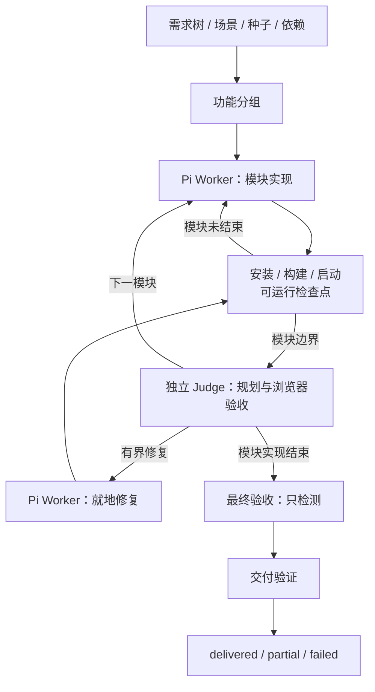

# ShallowCode

ShallowCode 是面向 GOSIM Factory / ARC-Bench 的轻量 coding-agent 控制器。它将需求树分组交给 Pi coding-agent 实现，再用独立生成的黑盒探针验收目标应用，管理可运行检查点、修复和交付。

Pi coding-agent（`@mariozechner/pi-coding-agent`）是唯一实现目标应用业务代码的 Builder。控制器负责调度与验收，并可安装任务无关的脚手架和通用能力。核心原则是 **Never let the builder grade itself**。

## 工作方式


```mermaid
flowchart TD
    C[需求树 / 场景 / 种子 / 依赖] --> G[功能分组]
    G --> B[Pi Worker：模块实现]
    B --> K[安装 / 构建 / 启动<br/>可运行检查点]
    K -->|模块未结束| B
    K -->|模块边界| J[独立 Judge：规划与浏览器验收]
    J -->|下一模块| B
    J -->|有界修复| R[Pi Worker：就地修复]
    R --> K
    J -->|模块实现结束| A[最终验收：只检测]
    A --> D[交付验证]
    D --> S[delivered / partial / failed]
```

1. Catalog 解析 `requirements.yaml`，保留需求原文、场景、种子声明、参考图与依赖。功能分组由 LLM 提议，程序校验覆盖、模块边界、容量与依赖顺序；无法获得有效结果时使用确定性分组。
2. Builder 按功能组推进模块实现。每组从新会话开始，以代码、测试和目标项目的 `ARCHITECTURE.md` 交接；开发检查使用文件、shell、`run_tests`、`app` 和按需启动的 browser 工具。
3. 控制器在独立候选副本中安装、构建和启动应用，通过一致性检查后保存可运行版本。模块边界由 Judge 独立验收，必要时有界修复，并复验已有通过路径。
4. 最终验收检查当前验收范围，记录行为结果；交付验证检查安装、构建、健康检查、浏览器首页、公共兼容端口及未知路径。交付故障可触发有界修复与复验。

### 独立验收与状态

Judge Planner 只接收需求与浏览器观测，不读取目标源码、diff 或 Builder 会话。Builder 接收需求、种子、可选参考图和白名单失败观测；隐藏计划、`.arc/` 与 `shallow-progress/` 对 Builder 工具屏蔽。主线端口来自公共运行合同，不读取官方测试目录。

Planner 生成受 schema 校验的浏览器白名单 DSL；Runner 用 Playwright 执行导航、交互和结果断言，按角色、label 或可见文字定位。计划须引用需求依据并映射显式场景结果，保持控件角色、对象身份和严格定位；Planner 不能提交任意脚本。

| Judge 结果 | 含义 |
| --- | --- |
| `pass` | 探针通过；需求取得 `verified` 还须满足覆盖与复核要求 |
| `fail` | 业务断言失败；控制器确认可复现的失败后记录 `failed` |
| `inconclusive` | 规划、覆盖、准备、定位、执行或预算等问题导致证据不足 |

`acceptedSha` 表示可运行检查点，`verifiedRequirementIds` 表示当前版本已通过独立行为验收的需求。构建成功和 Builder 回执都不授予 `verified`。Judge 故障保留可运行实现；未接受的修复恢复检查点，并保留失败尝试的 Git 历史和审计记录。

独立 case 使用隔离的应用运行与数据目录，继承已有应用时复制其默认持久化数据；同一 case 内的刷新与新浏览器会话继续使用该 case 的服务端状态。候选源码或构建发生变化会使原验证证据失效。

## 快速开始

需要 Node.js **>= 20.18.1**、npm、Git 和 Playwright Chromium。Python 适配入口另需 Python 3；Pi SDK 随 npm 依赖安装。

在仓库根目录执行：

```powershell
npm ci
npx playwright install chromium
Copy-Item .env.example .env
```

编辑 `.env`，填写 Builder 与 Planner 共用的网关配置：

| 变量 | 说明 |
| --- | --- |
| `OPENAI_API_KEY` | 网关 API key |
| `OPENAI_BASE_URL` | OpenAI-compatible 网关地址，如 `https://gateway.example.com/v1` |
| `MODEL` | 网关接受的完整模型 ID，包含 `/` 时原样传递 |

真实环境变量优先于 `.env`；`.env` 已被 Git 忽略。Pi 在独立 Worker 中注册 Chat Completions provider，密钥经 IPC 注入。

运行电子表格示例：

```powershell
npm start -- --requirements-dir data/official-competition/hackathon--sheet
```

仓库协作示例位于 `data/official-competition/hackathon--github`，更换需求目录即可运行。

| CLI 参数 | 说明 |
| --- | --- |
| `--requirements-dir` | 必填；目录中须有 `requirements.yaml` |
| `--output-dir` | 目标应用目录；缺省为系统临时目录下的 `shallowcode-local/main` |
| `--budget-ms` | 非负整数毫秒；缺省或 `0` 表示不限总调度时长，单次调用仍有上限 |

CLI 使用 `--key value` 格式。需要固定目录或继续已有应用时传入 `--output-dir`；输出目录作为独立 Git 仓库维护，空目录可自动初始化，已有完整 `frontend/` + `backend/` 应用作为本轮起点。主线和 baseline 应使用不同输出目录。

常用可选配置：

| 变量 | 缺省与用途 |
| --- | --- |
| `SHALLOW_RUN_DIR` | 系统临时目录下的 `shallowcode-runs`；每次运行建立独立日志子目录 |
| `SHALLOW_REFERENCE_IMAGES` | `0`；设为 `1` 开启参考图输入，首次附带前探测视觉能力 |
| `SHALLOW_FINAL_AUDIT_GENERATE_PLAN` | `0`；最终验收复用已有计划，设为 `1` 可为缺计划项补规划 |
| `SHALLOW_BUILDER_CONTEXT_WINDOW` | `256000`；主线 Builder 上下文窗口 |

缺计划项保持 `inconclusive`。其他配置见 [.env.example](.env.example) 与 [runtime-config.ts](src/runtime-config.ts)。

### Python 适配入口与 baseline

```powershell
python main.py data/official-competition/hackathon--sheet --type web
python baseline/main.py data/official-competition/hackathon--sheet --type web
```

[main.py](main.py) 对接平台参数、检查运行环境并驱动 TypeScript 管线。`SHALLOW_BUDGET_MS` 和 `ARCBENCH_*` 从真实环境读取，网关三变量也可来自仓库 `.env`。

[baseline](baseline/index.ts) 直接驱动同一 Pi 执行层，按 ROOT 子树顺序实现并复用一个会话，缺省输出为临时目录下的 `shallowcode-local/baseline`。它记录调用完成状态；业务正确性需要独立评估。

## 平台运行合同

目标应用提供 `frontend/` 与 `backend/`：两者支持 `npm install`，前端支持 `npm run build`，后端通过 `npm run start` 启动并提供前端构建产物。

后端读取 `PORT`（缺省 `3000`），同时监听公共兼容端口 `3301`，若两者相同则只绑定一次；提供 `/health` 和 `/api/health`。前端通过同源相对路径调用后端，未知 API 或资源返回错误响应且进程保持存活。

生成期使用独立探针端口，并设置 `ARC_EXTRA_PORTS=0`。交付验证另外以只设置 `PORT` 的方式复验兼容端口。合同的来源是 [runtime-config.ts](src/runtime-config.ts) 和 [平台提示词](prompts/system/platform-contract.md)。

## 增量与阶段任务

将输出目录指向已有应用、需求目录指向本轮 YAML，即可继续增量开发。Catalog 支持明确的 Evolution 标签和 Stage / Phase 后缀；前序阶段的外部依赖只作上下文，验收覆盖使用当前需求树。

Evolution 从历史计划与进度检查点提取需求 ID，用于区分新增、历史记录缺失、明确修改和沿用项。继承应用通过可运行检查后，初次实现聚焦增量项；缺省 `SHALLOW_EVOLUTION_AUDIT_INHERITED=0`，设为 `1` 可恢复沿用项回归。跳过项单独列出，历史记录不授予本轮 `verified`。

入口与范围规则见 [catalog.ts](src/catalog.ts)、[evolution.ts](src/evolution.ts) 和 [增量起点提示词](prompts/system/incremental-start-inherited.md)。

## 结果与日志

`delivered` 要求交付验证通过且当前验收范围全部 `verified`；交付验证通过但仍有未验证需求时为 `partial`；交付验证失败时为 `failed`。进程退出码为 `0` 也可能对应 `partial`，应读取 `pipeline_finished` 的完整汇总。

| 产物 | 用途 |
| --- | --- |
| stderr JSON | 实时结构化事件 |
| `run-log.txt` | 中文运行日志；启动时打印绝对路径 |
| `run-ledger.jsonl` | 同一私有日志目录中的机读台账 |
| `<output-dir>/.arc/` | 平台事件与需求状态投影 |
| `<output-dir>/shallow-progress/` | 产物可见进度日志与计划镜像，对 Builder 屏蔽 |

结构化事件、运行日志和台账经过脱敏。以上状态描述本轮控制器验收；官方得分以独立官方评测报告为准。

## 源码导航与开发

| 修改方向 | 入口 |
| --- | --- |
| 生产装配与适配 | [index.ts](index.ts)、[main.py](main.py) |
| 需求、调度与分组 | [catalog.ts](src/catalog.ts)、[scheduler.ts](src/scheduler.ts)、[llm-feature-grouper.ts](src/llm-feature-grouper.ts) |
| 管线与预算 | [pipeline.ts](src/pipeline.ts)、[run-budget.ts](src/run-budget.ts) |
| Builder、工具与提示词装配 | [src/builder/](src/builder/)、[prompts/system/](prompts/system/)、[prompts/fragments/](prompts/fragments/) |
| Judge 规划、DSL、覆盖与执行 | [src/judge/](src/judge/)、[prompts/judge/](prompts/judge/) |
| 候选、回滚与交付 | [candidate-runtime.ts](src/candidate-runtime.ts)、[git-ops.ts](src/git-ops.ts)、[final-verifier.ts](src/final-verifier.ts) |
| 事件与观测 | [run-state.ts](src/run-state.ts)、[human-log.ts](src/human-log.ts)、[arc-protocol.ts](src/arc-protocol.ts) |

开发检查使用 [package.json](package.json) 中的脚本：

```powershell
npm run typecheck
npm test
npm run test:browser
npm run test:all
```

`test:all` 依次执行类型检查、单元/集成测试和 Chromium 测试，交付前运行。测试使用 `node:test`，可单跑 `npx tsx --test test/catalog.test.ts`。真实网关冒烟需配置凭证并设置 `RUN_CREDENTIAL_SMOKE=1`，再运行 `npm run smoke:credentials`。

修改规则和按任务查找源码的索引见 [AGENTS.md](AGENTS.md)。
