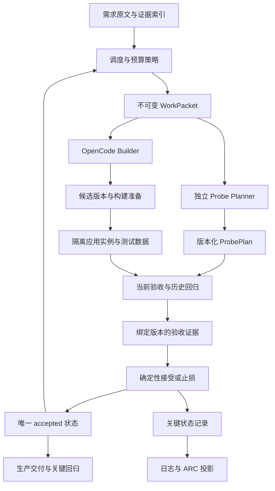

# ShallowCode Pipeline 改进方向与演进路线

日期：2026-09-05  
审阅基线：`main`，`0751f51`（包含显式网关、目录依赖、探针结构校验、回滚和进程可靠性修复）  
文档性质：设计建议；下文新模块、接口、策略和阈值均为提案，不代表已经实现。涉及现有架构约束变化的建议单独标注。

## 1. 建议优先解决什么

当前 pipeline 已经具备完整的开发—验收—修复—回滚闭环。下一阶段最值得投入的是提高“接受一个版本”的证据质量：确认浏览器测到的是本次候选代码，测试之间不互相污染，后续功能没有破坏已接受的行为。

建议按以下顺序推进：

1. **候选代码、构建产物、运行实例和验收报告绑定。** 先保证判定对象正确。
2. **可重复的测试前置条件与数据隔离。** 为回归测试建立可靠基础。
3. **跨 packet 回归与交付回归。** 让 accepted SHA 携带明确的行为保证。
4. **失败归因、预算分配与确定性自适应调度。** 在判定可信之后提高有效吞吐量。
5. **恢复能力、有限并行与离线经验积累。** 由真实运行数据决定复杂度是否值得。

本次判断来自代码审阅与本地需求样例，未测得竞赛分数提升或真实模型成本收益。文中的收益预期需要通过第 16 节的对照实验验证。

## 2. 当前实现：证据与尚存缺口

| 编号 | 当前代码证据 | 尚存缺口及影响 |
| --- | --- | --- |
| E01 | [pipeline.ts](../src/pipeline.ts)：`executePacket` 内局部保存 `plan`，`runShadowProbes` 执行当前计划 | 接受后没有保存可执行的历史回归套件；后续 packet 可破坏旧功能而不被发现 |
| E02 | [pipeline.ts](../src/pipeline.ts)：`runShadowProbes` 直接 `appLifecycle.start`；[final-verifier.ts](../src/final-verifier.ts)：安装、构建集中在 `verify` | packet 验收依赖 Builder 自行完成构建，控制器没有记录本次源码与实际运行产物的对应关系 |
| E03 | [final-verifier.ts](../src/final-verifier.ts)：最终浏览器计划只有 `goto /` 和 `expectVisible(main)` | 生产交付可启动，不等于之前接受的业务行为仍成立；交付修复也没有业务回归门槛 |
| E04 | [playwright-probe-runner.ts](../src/judge/playwright-probe-runner.ts)：每 case 新建 context，同一次 run 共享应用实例 | 浏览器存储隔离不代表后端数据隔离；创建、删除、权限变更会影响后续 case 和重跑 |
| E05 | [probe-schema.ts](../src/judge/probe-schema.ts)：完整 DSL schema、需求 ID 覆盖、每 case 至少一个断言 | 结构合法仍不能证明语义充分；用“页面可见”断言关联多个需求，也可能满足形式检查 |
| E06 | [playwright-probe-runner.ts](../src/judge/playwright-probe-runner.ts)：`newContext` 关闭旧 context；`actor` 未参与执行 | 无法保留两个用户的并存会话；多角色协作和权限撤销的表达能力不足 |
| E07 | [run-state.ts](../src/run-state.ts)：`decideAfterReport` 将所有非 pass 放入同一修复梯子 | 浏览器故障、服务端故障、Builder 失败和产品断言失败，最终可能消耗同类 Builder 修复机会 |
| E08 | [runtime-config.ts](../src/runtime-config.ts)：按初始总预算派生固定超时；[pipeline.ts](../src/pipeline.ts)：在 packet 边界和每次 Builder 尝试前查预算 | 没有逐阶段剩余预算分配；Planner 重试、浏览器执行和交付可能继续超出调度预算 |
| E09 | [scheduler.ts](../src/scheduler.ts)：固定排序、最多三个需求、英文 scenario 词项匹配 | 没有利用实际耗时、失败率、回归成本；中文关联弱，短描述也可能代表复杂功能 |
| E10 | [run-state.ts](../src/run-state.ts)：内存状态与追加 ledger；[pipeline.ts](../src/pipeline.ts)：同时维护 catalog 和 state 中的状态 | 重启后不恢复已接受进度；重复状态和 Git/事件更新顺序增加一致性风险 |
| E11 | [arc-protocol.ts](../src/arc-protocol.ts)：从原子需求构造 rows，`children_ids` 为空；事件直接写 `.arc` | 父目录引用缺少完整节点记录；平台投影与内部状态没有统一重放入口 |
| E12 | [builder/opencode-sdk.ts](../src/builder/opencode-sdk.ts)：短 session、技术 outcome、文本 summary；[llm-probe-planner.ts](../src/judge/llm-probe-planner.ts)：提取 message content | 模型 usage、阶段进展和版本化请求证据不足，难以判断时间与 token 花在哪里 |
| E13 | [main.py](../main.py)：检查 `node_modules` 是否存在并尝试下载 Chromium；[package.json](../package.json)：依赖 SDK，未声明 OpenCode CLI 包 | 缺少统一环境预检；SDK 包存在不代表 `opencode` 可执行程序已安装且兼容 |
| E14 | [builder/prompt-fragments.ts](../src/builder/prompt-fragments.ts)：词典规则；[catalog.ts](../src/catalog.ts)：产品类型匹配精确英文根名称 | 产品识别和规则选择较脆弱；引用图片目前主要作为路径字符串传递 |

本地样例规模：GitHub 为 **47 个原子需求、64 个场景**；Sheet 为 **24 个原子需求、48 个场景**。这些是 [GitHub 样例](../data/github/requirements.yaml) 和 [Sheet 样例](../data/sheet/requirements.yaml) 的当前统计，不代表最终比赛范围。

已经完成的显式网关、目录依赖展开、结构覆盖检查、失败交付回滚和 `.arc` 保留，是本文的起点。下面主要补强这些机制尚未覆盖的运行语义。

## 3. 演进边界与建议架构

### 3.1 保留的核心边界

- OpenCode 继续作为唯一生产代码 Builder；控制器不生成目标应用业务代码。
- Probe Planner 只接收需求证据、声明式计划和允许的定位观测；Probe Runner 只执行白名单动作。
- 官方测试、官方结果与评分反馈不进入任何运行模块，也不作为本文离线优化数据。
- Builder 回执保持诊断性质，不能成为接受、跳过测试或更改需求的控制协议。
- 首次实现加最多两次修复仍是硬上限；拆包、重启、恢复运行不能重置这一限制来绕过止损。
- 只维护一个正式 accepted 状态。临时候选副本用于隔离验证，不形成多 Builder 或多分支搜索。

### 3.2 职责分解

以下为建议结构，模块名称是候选命名：



| 建议模块 | 对外提供的能力 | 隐藏的复杂性 | 不应承担的责任 |
| --- | --- | --- | --- |
| `CandidateRuntime` | 准备、启动、停止一个确定版本的候选 | 构建缓存、进程归属、运行目录、数据目录和生命周期 | 理解业务源码并替 Builder 修代码 |
| `VerificationService` | 返回带验收对象和覆盖范围的证据 | case 前置条件、执行、回归选择、报告整理 | 自由修改需求预期或用 LLM 改判 |
| `BudgetPolicy` | 批准阶段执行额度、决定是否继续开发 | 全局剩余时间、清理余量、耗时估计 | 把全局预算塞进 Builder 需求 prompt |
| `RunController` | 驱动显式状态迁移 | 尝试计数、接受事务、异常恢复 | 直接解释每种 Playwright 操作 |
| `EvidenceStore` / `RunStore` | 保存关键决定与验证来源 | 原子落盘、序号、版本兼容、重启一致性 | 给 Builder 暴露完整 Judge 计划 |
| `ArcProjection` | 将内部状态投影为平台协议 | 幂等写入、重试、重建节点树 | 决定需求是否通过 |

无需一次性新增六个服务。第一阶段可以先在现有文件内形成窄接口；只有一个职责已经形成独立的生命周期和测试边界时再拆文件。

### 3.3 哪些建议涉及现有规格变化

| 建议 | 与当前约束的关系 | 落地前应更新的契约 |
| --- | --- | --- |
| 候选标识、重放证据、当前与历史探针复验 | 增强现有单调接受目标 | 补充接受证据和数据隔离要求 |
| 新的键盘、作用域定位、多 actor DSL | 白名单的显式扩展 | schema 版本、Runner 映射、refinement 可变字段 |
| 预留交付时间并提前结束开发 | 改变“总预算耗尽才进入交付”的时机 | `--budget-ms` 语义、交付进入条件和相应测试 |
| 可恢复 RunStore、关键日志写失败阻止接受 | 超出 V1-Lite 的内存状态与 best-effort ledger 设计 | 持久化格式、故障政策和恢复规则 |
| 选择性回归 | 比全量回归便宜，但保证较弱 | 报告必须明确复验范围和证据新鲜度 |

上述变化需要通过新的设计决定记录；本文不直接覆盖当前 [AGENTS.md](../AGENTS.md) 和 [V1-Lite 规格](superpowers/specs/2026-09-02-shallowcode-v1-lite-design.md)。

## 4. P0：让浏览器验收对应到确定的候选版本

### 2026-09-08 实施进展

主线已接入控制器拥有的候选构建副本与本地 `candidate` MCP。Builder 自测调用固定的准备/停止工具；Judge 与最终验证复用匹配产物、分别启动实例。源文件、构建产物、依赖状态和安装输入变化使缓存失效；验收报告与接受事件绑定候选、构建、实例及摘要，接受提交前后再次检查。仅复用本轮运行的准备状态，记录安装、构建及准备耗时。

具体文件范围、运行数据合同、依赖元数据检查、失败政策与测试入口见 [候选构建复用实施方案](2026-09-08-candidate-build-reuse.md)。以下保留原建议。当前实现未覆盖通用框架构建正确性证明、OS 级隔离、第 5 节测试数据隔离、跨运行缓存或完整 `VerificationEvidence` 扩展字段。

**问题与推断。** E02 中的启动合同没有证明已运行本次源码对应的生产构建。假设 Builder 修改了 `frontend/src`，旧 `dist` 仍被后端提供，探针就可能观察到旧页面。当前代码没有证据排除这种情况；这是一条需要复现测试覆盖的风险路径。

**建议。** 在 Builder 完成后增加明确的候选准备阶段：

1. 确认 Builder 已结束本次写入；超时清理未确认完成时不开始验收。
2. 创建候选标识，关联应用文件摘要、依赖锁文件摘要、运行合同版本。
3. 按平台合同准备依赖并构建；首次或缓存来源不明时执行完整流程。
4. 从该构建启动控制器拥有的应用实例，记录进程归属和实际基础地址。
5. 探针报告绑定 `candidateId`、`buildId`、`runtimeId`；接受前复核文件摘要未改变。

摘要应由确定性文件/Git 操作产生。`.arc` 等审计文件、临时日志不参与应用摘要；合法业务文件必须纳入，不能只看 tracked 文件而漏掉 Builder 新建的文件。控制器可处理文件标识与散列，源码内容不进入 Judge 模型。

安装可能生成锁文件，构建也可能产生约定产物。因此先区分源码、构建产物和运行数据，在准备完成后冻结最终 `applicationDigest`；从冻结到验收、接受之间的应用文件变化才使该证据失效。验收前无需提前创建 accepted 提交，用候选标识与摘要绑定，最终接受时再关联 Git SHA。

建议的最小证据结构：

```ts
// 提案示意，尚未实现；不替代当前 ShadowReport。
interface VerificationEvidence {
  candidateId: string;
  applicationDigest: string;
  buildId: string;
  runtimeId: string;
  requirementDigest: string;
  probePlanDigest: string;
  fixtureId: string;
  verdict: "pass" | "fail" | "inconclusive";
  checkedRequirementIds: string[];
  finishedAt: string;
}
```

仅检查 `/health` 成功仍不足以确认进程归属：端口抢占或旧进程也可能响应。首先验证端口占用和子进程生命周期；如果引入运行标记，标记只证明实例身份，不证明业务正确。不要把“应用自报版本正确”当成唯一依据。

**实现代价。** 每个 packet 重复安装与构建会增加时间。先保证正确，再按依赖锁文件、运行时版本、平台和构建输入缓存；缓存命中必须能说明命中了哪份输入。目标应用框架及构建脚本仍由 Builder 决定。

**验收标准。** 构造旧构建、新源码不一致；旧进程占用目标端口；Builder abort 后延迟写文件三个 fixture。三者均不能产生可接受证据。正常候选必须能从报告追溯到被测文件与构建。

## 5. P0：可重复的测试前置条件与数据隔离

**问题。** E04 只隔离浏览器 context。[Playwright 的隔离文档](https://playwright.dev/docs/browser-contexts)说明了 cookie 和浏览器存储的隔离；结合当前共享后端实例，可以推断后端数据仍可能跨 case 传播。现有 [fixture server](../test/fixtures/app/server.mjs) 的 `profileName` 就是进程级共享状态。

**建议。** 给每个 case 定义明确的起点、数据命名空间和结束条件：

- 首选通过允许的 UI 操作建立前置条件，例如注册用户、创建工作簿；这些步骤归属于 probe setup，同样受步骤数和时间限制。
- 动态对象使用受控变量，如 `caseNamespace`、`createdRepositoryName`。替换只能发生在 schema 声明的数据字段，不执行表达式、脚本或任意模板。
- case 重跑、locator refinement 后重跑和历史回归，都从相同的干净逻辑起点执行。禁止在已完成一半的创建流程上直接重放完整计划。
- 对破坏性操作，必要时给 case 单独的运行目录和数据目录；只通过运行合同指定目录或通用隔离机制处理数据，Judge 不打开应用数据库推断其内部结构。
- 持久性 case 在同一个隔离数据空间内刷新、重新登录或重启应用；如果重启时连数据空间也重置，会测错持久性要求。

第一版不必强制目标应用实现测试专用 reset API。优先独立命名和 UI setup；当需要物理数据隔离时，明确运行合同。若将来允许可信 fixture adapter，它应位于运行基础设施边界，并接受独立审计，不能伪造被测业务操作成功。

多用户场景采用命名 context：`openActor(owner)`、`switchActor(member)`、`closeActor(member)`。同一 case 中保留各用户独立会话，账号创建和登录仍通过真实 UI。`newContext` 目前只是重置会话，不能把它描述成已完成 actor 切换能力。

**实现代价。** 独立数据空间和重复 setup 会放大启动成本。先串行运行破坏性 case，可靠性达标后再考虑并行。

**验收标准。** 对同一构建改变 case 顺序、连续执行三次、重复创建/删除、切换两个用户，结果应保持一致；失败重跑不能因“对象已存在”而产生与原故障无关的新结果。

## 6. P0：跨 packet 回归与交付回归

**问题。** 当前 accepted SHA 表示这个版本通过过接受流程；它没有证明所有历史 verified 需求在最新版本仍然成立。一个新 packet 修改共享认证逻辑，即使自身通过，也可能破坏旧 packet。

**建议。** 接受 packet 时，将版本化 ProbePlan 与证据存入控制器私有的 `RegressionRegistry`。下一候选必须通过当前验收和规定的回归集合，才能更新 accepted SHA。

第一版在小样例上执行全部已接受探针，建立正确性基线。只有测得回归成本过高时，再引入分层选择：

| 集合 | 选择依据 | 触发时机 |
| --- | --- | --- |
| 当前验收集 | 当前 packet 的全部待验证行为 | 每次候选验收 |
| 依赖与关联回归集 | 需求依赖图、共享产品行为、过去共同失败记录 | 每次接受前 |
| 核心保活集 | 已实现的登录、导航、对象读取等少量关键行为 | 每次接受前 |
| 完整历史集 | 所有已接受探针 | 初期每次接受；后续周期性与最终交付 |

关联分析首先依据需求和黑盒观察，不给 Planner 提供源码或 diff。仅靠显式依赖也不充分：公共导航或权限边界可能影响依赖图之外的功能，所以必须保留全量校准。

每项需求至少区分两种信息：`acceptanceStatus` 表示是否已被接受，`lastVerifiedCandidateId` 表示最后在哪个候选上复验。旧证据不能伪装为最新证据，但也不应仅因未重跑就把所有已接受需求退回 todo，导致依赖调度失效。

若采用选择性回归，报告必须列出本轮复验集合、沿用的历史证据和剩余覆盖缺口。最终只执行了最小 smoke 时，不得称为“完整业务回归通过”。

交付修复可能改变构建路径、路由和静态资源提供方式。修复后应对最终构建重跑关键历史行为；高风险或证据允许时跑完整历史集。失败则恢复之前接受版本，并重新验证恢复后的实际交付状态。

**反馈边界。** Builder 修复只接收失败 case 的白名单观测和必要的已接受行为约束，不接收历史 ProbePlan、Judge 推理或完整其他工作包。修复目标是恢复被当前改动破坏的行为，不能借机拓展待办范围。

**验收标准。** 两个 packet：A 实现登录，B 实现仓库但破坏登录。B 的当前测试通过、A 的回归失败时，不允许接受 B。交付修复破坏 A 的情况也必须被识别。此能力依赖第 4、5 节先成立。

## 7. P1：从结构覆盖走向有来源的行为覆盖

**问题。** “每个需求 ID 出现在某个 case”与“每个 case 有断言”是必要条件，但并不充分。一个涉及保存、刷新、权限隔离的需求，不能仅凭页面标题可见就获得完整验证。

**建议。** 在保留全部需求原文的前提下，引入轻量的行为证据索引：

```text
原子需求 / 场景中的原文位置
  → 需要观察的行为（创建、持久化、拒绝越权……）
  → 对应 case / 断言
  → 最近验证的候选与结果
```

每个行为条目记录来源、前置条件、操作和可观察结果。确定性步骤提取负责保留来源；LLM 可以建议拆分和探针，但推导内容应标为推导，不能替换需求原文或增加未经要求的验收义务。

`ProbePlan` 扩展为记录行为映射和 `unsupportedObligations`。无法用现有 DSL 表达的需求应明确暴露为能力缺口，不能通过删掉困难断言制造 pass，也不能机械归因为 Builder 写错。

对高风险需求，可增加一次**计划语义审查**：审查者只看需求与计划，检查关键行为是否遗漏、预期是否有原文依据、setup 是否自足。它不看应用，不根据执行结果降低预期，不参与最终 pass/fail 投票。默认先使用确定性检查；只有计划质量实验表明需要时才增加模型调用。

本地 Sheet 的 `REQ-3-2-2` 包含 4 个场景。若与其他需求合并，当前最多 6 个 case 的上限可能不足以逐个验证重要行为。应先减少 packet 大小或拆分验证计划，而不是一律提高 LLM 输出上限。多批计划的总步骤、时间和 token 仍需受全局额度约束。

**验收标准。** 给审查器一组形式合法但漏掉持久化或权限断言的计划，应能指出具体缺失及其来源。对并未要求跨进程持久化的需求，不得擅自增加重启后持久化测试。

## 8. P1：扩展 DSL 表达力，同时明确定位语义

当前 DSL 适合简单表单，对表格编辑、多角色和复杂列表存在限制。本地 Sheet 包含单元格编辑、复制粘贴、撤销重做和公式重算；这些是扩展动作集的具体依据。

建议按需求样例分批增加：

| 能力 | 最小扩展 | 必须限制的部分 |
| --- | --- | --- |
| 键盘编辑与撤销重做 | `press(locator, key)` | key 使用枚举；修饰键和连续操作数量有界 |
| 重复按钮定位 | 作用域内的 role/label/text，有限 `hasText` / `has` | 最大嵌套深度；不引入自由 CSS/XPath |
| 状态断言 | `expectEnabled`、`expectChecked`、可见文本列表或顺序 | 预期必须来自需求或固定行为关系 |
| 多用户流程 | 命名 actor context 与显式切换 | actor 数量、账号生命周期、敏感会话数据边界 |
| 运行时数据引用 | 命名变量、受限数据绑定 | 字段白名单；无任意代码、网络请求或表达式求值 |

Playwright 已支持作用域定位和 locator 链接，见 [Locators](https://playwright.dev/docs/locators)。当前安装版本的类型定义也包含 `filter` 和 `press`；这不意味着应把其全部自由度直接开放给模型。

定位 refinement 需要比“只能修改 locator 对象”更精确的规则。将“要操作哪个业务对象”与“怎样找到控件”分开：实体名称、账号身份、指定行的业务标识属于固定行为输入；role、label 的绑定方式可以精化。即使都写在 locator 内，改成另一条仓库记录也改变了测试行为。

另有两条应先补测试的现有执行风险：

1. `expectCount` 的预等待除 count=0 外会调用 `locator.waitFor(attached)`。若 locator 合法匹配多个元素，单元素等待可能产生 strictness 错误，而集合数量断言本应允许多个元素。需要对 count=0/1/N 建真实浏览器回归；这是静态审阅推断，本文未额外复现。
2. 一个步骤内先等待 locator，再执行动作，二者各使用同一 timeout；取 snapshot 还会消耗额外时间。因此现在的单步/单 case 上限不能仅凭参数名视为严格累计截止时间。

第二点应通过统一剩余截止时间和可取消执行解决，同时为必要诊断保留有限余量。不能因为外层计时器先触发，导致所有本可精化的 locator 失败都失去 snapshot。

**验收标准。** 多个同名按钮能通过业务作用域定位；精化不能切换实体；集合断言不因合法多匹配失败；所有新增动作均有 schema 拒绝测试和真实浏览器测试；超时后没有继续运行的 case。

## 9. P1：依据故障来源分配修复机会

保留当前 `ShadowReport` 判词边界，在其外层增加结构化执行故障信息。产品验证失败与验证基础设施失效，不应靠解析自由文本混在一起。

| 故障来源 | 建议响应 | 对尝试预算的影响 |
| --- | --- | --- |
| 明确的业务断言失败 | 向 Builder 发送白名单观测 | 消耗一次实现/修复机会 |
| 候选应用无法安装、构建或启动 | 给出具体阶段、命令和观察，由 Builder 修复 | 同一修复上限内处理 |
| locator-only 且有可用快照 | 一次 locator-only refinement | 沿用现有限制 |
| 网关 429、网络瞬断、浏览器进程意外退出 | 有界基础设施重试；保持候选，已生成的合法计划保持不变 | 单独计数，总时间和实际消耗仍计入预算 |
| Planner 计划不合法或遗漏关键行为 | 计划级修正，失败后说明 Judge 能力问题 | 不让 Builder 修改代码来迎合无效计划 |
| 缺失凭证、CLI 或不兼容协议 | 环境预检阶段停止并报告 | 不逐 packet 重复烧修复次数 |

不能仅凭 HTTP 5xx 就认定是基础设施问题：来自被测应用的 5xx 可能是产品故障，来自模型网关的 5xx 则属于另一层。分类依据应是调用边界与结构化结果。

基础设施重试不能变成绕开第三次失败止损的入口。执行前记录 attempt identity；一次真实 Builder 调用已经开始，就不能在重试、拆包或进程恢复时把计数归零。禁止把确定性断言失败通过多次随机重跑“碰成 pass”。

**验收标准。** 同一候选、同一计划下模拟网关错误、浏览器崩溃和业务断言错误；只有前两类进入对应的基础设施路径，次数均受限，业务失败仍最多三次 Builder 调用。

**2026-09-06 实现进展。** 已在 `ExecutionFault`、Planner HTTP 分类及 pipeline 中落实浏览器故障独立限次、计划纠错、locator-only 止损、实际 Builder attempt 记录和环境故障终止。最终交付的浏览器基础设施故障也独立重试一次。当前按运行时启动结果识别不可用环境，完整前置预检仍属于第 15 节；Builder 运行期普通 SDK 失败仍计入实际调用上限。当前候选和计划可复用，被测应用的数据快照恢复尚未实现，参见第 5 节。当前规则见 README“故障来源与修复机会”，故障注入测试见 `test/probe-infrastructure.test.ts`、`test/pipeline.e2e.test.ts`。

## 10. P1：预算从固定超时升级为阶段额度

当前预算负责停止继续领任务与修复；它不是进程的强制结束时刻。这个语义已经被明确记录，后续增强应显式迁移，而不是悄悄改变。

建议区分：

- `generationBudget`：允许实现、Judge 规划和常规验证使用的时间。
- `deliveryReserve`：安装、最终构建、关键回归、一次交付修复及清理的预留。
- `hardDeadline`：若运行平台存在明确上限，则覆盖整个进程的最终截止时间。

一次阶段额度可按以下关系分配：

```text
剩余时间 = 截止时间 - 当前单调时钟
阶段额度 = min(阶段上限, 剩余时间 - 后续必需阶段余量)
```

不足以完成最小安全单元时，就不启动该阶段。耗时先使用保守初值，再用同类历史分位数修正；冷启动不应因为少量偶然快样本过度缩减额度。

额度通过 Builder/Planner/Runner 的执行选项传递，不能进入 Builder 的需求 prompt。Builder 生命周期的启动、创建 session、prompt、abort、退出确认都需要覆盖；目前 prompt 前的部分调用不在同一个倒计时内。

Planner retry delay、浏览器 case、获取失败快照、清理进程和日志落盘都必须计时。取消请求发出后还要确认执行停止；Node 文档明确指出，成功发送 kill 信号不等于进程已终止，见 [Child process](https://nodejs.org/api/child_process.html#subprocesskilled)。

**契约变化。** 如果提前预留交付时间，就要修订“总预算耗尽或没有 ready 需求才进入交付”的条件。建议提供明确的预算模式和迁移说明；当前默认行为在新政策启用前保持可解释。

**验收标准。** 用可注入时钟验证：阶段不能透支保留额度；不可逆交付只进入一次；取消后的晚到回调不能触发 accept；两个并行阶段的 wall-clock 不重复相加，但各自 token 消耗都记账。

## 11. P1：确定性自适应调度与 packet 大小

继续保持 Scheduler 无模型。提升重点是使用真实运行证据，而不是让 LLM 再决定先做什么。

建议的排序信号依次形成可解释记录：

1. 当前是否满足硬依赖，以及会解锁哪些后续需求。
2. 需求中可明确验证的行为数量及重要性。
3. 同类任务的实现、修复和验收耗时估计。
4. 共享状态、权限边界、跨页面流程带来的回归风险。
5. 当前剩余预算下完成并验证该 packet 的可能性。

可以实验下述启发式，但参数必须通过离线对照校准，不作为官方评分模型：

```text
优先级 = 预计可保留的验证价值 / 预计实现与验证时间
         + 有上限的依赖解锁收益
         - 回归风险惩罚
```

“可保留”意味着新增行为通过且没有让已有行为失效；原始 scenario 数量不能直接当成收益。前述回归机制未建立前，不宜把算法优化到复杂的成功率预测。

packet 仍限定 1–3 个原子需求，但在 dispatch 前自适应选择：复杂表格或权限修改取 1；共享 setup、操作简单且数据隔离可靠时才合并到 2–3。计划所需验证量超出 DSL/预算容量，也应触发缩包。

补强中文及多语言关联：优先结构路径、显式依赖和产品行为标签，词项相似度只作辅助。为中文 ID 和仅标点不同的 ID 增加稳定标识测试，避免 slug 拼接发生碰撞。

失败后拆包应作为后期受控实验。第三次失败后立即拆成新 ID 并继续调用 Builder，会破坏现有止损不变量，不能采用。

**验收标准。** 相同 catalog、历史统计快照和预算输入产生完全相同的选择；每个选择能说明成本和解锁收益；预算变化时 packet 可从 3 缩为 1；blocked 依赖的下游得到明确不可调度原因。

## 12. P1/P2：状态机、接受事务与恢复

### 12.1 先消除重复状态

以不可变 catalog 保存需求内容，以单一 `RunState` 保存运行状态。Scheduler 读取二者的只读视图，避免 `catalog.statusById` 与 `RunStateStore` 两份状态需要同步修改。

将过程表达为显式阶段：`selecting → building → preparing → judging → accepting/repairing/restoring → delivering → finished`。进入条件、可执行动作与终止条件由确定性 reducer 决定，外部 I/O 由 effect executor 执行。可先用函数和判别联合实现，不要求引入状态机框架。

这会使“没有 ready 需求时进入交付”“取消后收到成功回调”“回滚失败后是否仍报告正常结束”等路径可以作为迁移规则验证，而不隐藏在多层 try/finally 中。

### 12.2 关键状态与诊断日志分开

当前日志失败不影响业务判定，是诊断通道的合理策略；一旦要求崩溃恢复，就不能继续把唯一接受记录当成可丢弃日志。

建议划分：

- **关键 RunStore**：接受决定、候选证据引用、accepted SHA、尝试次数、预算消耗与阶段，写入失败时阻止提交接受决定。
- **诊断与平台投影**：中文日志、stderr、`.arc` 镜像允许降级；失败可重试，不改变已经提交的业务判定。

接受流程采用可恢复的准备—提交记录：

1. 持久化已通过的候选证据与 `accept_prepared`，包含之前 accepted SHA 和应用摘要。
2. 创建 Git 接受提交，获得新的 SHA。
3. 持久化 `accept_committed`，再更新内存状态并发出平台投影。

恢复时处理“Git 已提交、状态尚未提交”的中间态：只有准备记录、应用摘要和验证证据一致时才补记；证据不完整则恢复前一接受点。不能只看到最新 Git commit 就认为它通过过验收。

第一版可以用版本化快照加少量关键记录；在存在并发写入、索引或大量历史查询需求时，再评估 SQLite。原子 rename 可减少半写文件，但不能直接宣称解决断电持久性和跨平台 fsync 语义。

### 12.3 恢复条件

恢复清单至少包括：需求内容哈希、合同版本、prompt 与 probe schema 版本、模型标识、accepted SHA、最后提交事件序号、尝试 lineage 和预算消耗。

先确认旧 Builder/应用进程已经停止，再恢复候选；未知目录和未知进程不能直接清理。数据目录、忽略文件中的构建产物不会自动随 Git 回滚，因此恢复还必须重建运行环境或匹配其缓存身份。

**契约变化。** 持久化恢复是 V1-Lite 明确延期的能力，应在进程中断确实造成重复工作后升级。关键 RunStore 的写失败策略也需在规格中与现有 best-effort ledger 区分。

**验收标准。** 在三个接受步骤之间逐点注入进程退出；恢复后既不能丢失已确认接受，也不能把未验证候选升级为 accepted；修复次数与预算不能因重启被重置。

## 13. P1：观测、安全边界与 ARC 投影

### 2026-09-07 实施进展

已落地内部事件判别联合和关联字段、中文阶段/修复/交付日志、共享自由文本脱敏、有界私有失败证据，以及完整需求树的 ARC 投影与独立 journal 重建。`.arc` 字段对齐官方 `octos-org/arc-adapter` 的 `b0999c95f7875c8d4ff3e58e733fb2c5abc8caf7`，内部事件 ID 和 Builder 回执保留在控制器日志中。

本轮完成的是平台投影重放，尚未建立可恢复全部执行状态的 canonical RunStore。真实 usage 采集、证据自动过期清理、完整候选标识和 OS 级文件隔离仍待后续实施。当前能力、测试和字段映射见 [观测与 ARC 投影说明](2026-09-07-observability-arc-projection.md)。以下保留目标设计与最终验收标准。

建议统一事件 envelope：`runId`、`eventId`、递增序号、阶段、packet/attempt、候选标识、耗时、结果分类和证据引用。事件类型采用判别联合，避免 `type: string` 加任意 detail 导致字段漂移。

记录模型 usage 时，优先使用 SDK/网关返回的真实字段；无法获得时标记 unavailable。字符数估计可用于调度，但不能作为真实计费 token 报告。固定记录模型、prompt 资产摘要、DSL 版本和关键超时，支持比较实验。

失败证据采用分层存储：简短摘要进入日志；必要的 accessibility 片段和截图保存在控制器私有目录；报告通过 ID 引用。大小、留存时间与敏感信息处理都有上限。

[Playwright Trace Viewer](https://playwright.dev/docs/trace-viewer)适合人工复查执行过程，但原始 trace 可能包含页面资源、网络数据和测试上下文。Judge 不能因此获得应用源码或脚本响应，Builder 也不能获得隐藏计划。对外反馈应从明确白名单生成，而不是把 trace 文件整体交给模型。

当前 `sanitizeDiagnosticText` 主要去控制字符并截断；按字段名脱敏也无法覆盖 `message` 内嵌的凭证。应把网关密钥、会话 cookie、授权头和观测文本按来源分别处理，并测试自由文本中的凭证泄漏。截断本身不是脱敏。

`.arc` 应是内部状态的可重建投影：保留 ROOT/FOLDER/ATOMIC 的完整树，正确生成父子关系，并给事件增加幂等标识。它应保留失败历史，但不要把 Judge 私有计划、恢复凭证或完整失败附件放进去。

另一个架构边界是文件可见性：系统 prompt 禁止 Builder 读取控制器状态，并不等于操作系统已经隔离。当前 `.arc` 位于输出目录，SDK 也没有在此处建立完整隔离策略。若需要强信息防火墙，优先让控制器拥有私有存储，并通过目录挂载/权限边界把平台投影对 Builder 设为不可写、按需不可读；保持平台可读且不加入 `.gitignore`。具体机制需要目标运行环境验证。

**验收标准。** 日志和投影失败不改变已提交判定；重复投影不重复变更状态；可从 canonical RunStore 重建 `.arc`；敏感值和隐藏计划不能出现在 Builder 输入或公共事件中。

## 14. P1/P2：Builder 上下文、引用资产和有限并行

### 14.1 上下文应累积可复用事实

短 session 有利于限制任务范围，但 Builder 每次都要重新发现技术栈、路由和已有数据约定。可增加与 accepted 版本关联的简短项目合同，例如平台启动约定、已接受直接依赖的可观察行为、当前模块的稳定产品边界。

合同的需求事实来自 catalog，验证事实来自证据记录。Builder 回执中的自述仍只是诊断线索；不能解析“检查通过”就更新合同。涉及实现细节的笔记可由 Builder 自己维护在目标项目中，Judge 不读取它们。

prompt 编译器记录各区块长度与资产版本，优先保留当前需求和场景原文，压缩重复祖先/依赖说明；超过可用上下文时先缩包。产品 kind 应有稳定的输入契约或显式映射，不能仅靠两个精确英文标题。

引用解析器应把需求目录中的合法图片和文档解析为明确资产，校验路径归属、可读性和大小。图片可作为需求证据的补充，但不能由目标应用截图反向生成“正确预期”。视觉相似度只有在明确参考和评价目标存在时才进入后期实验。

`fillTemplate` 当前拒绝填充值中的字面 `{{`，这是已记录的设计边界。后续可研究单次模板解析：只替换模板源码中的占位符，插入值永不再次解释，从而支持合法的模板语法示例。此项改变既有拒绝语义，需要同步资产规格和针对嵌套替换的测试。

### 14.2 优先并行 Builder 与初始 Planner

二者都只依赖选定 packet：Planner 无需等待 Builder 结束才能根据需求生成初始计划。可以在 packet 选定后并发执行，理论 wall-clock 从两段耗时之和趋近较大者；实际收益受网关并发限制影响，需测量。

约束是 packet 输入不可变、Planner 永远看不到 Builder 输出、应用执行仍等待候选准备完成。Planner 若不可恢复地失败，应通过受控取消结束 Builder，确认停止后回滚。并行取消不能留下后台编辑，也不能遗失 token 记账。

浏览器进程可以先尝试 run 级复用、case 级独立 context；浏览器崩溃时重建进程。测试用例并行要等第 5 节后端数据隔离完成。默认仍保持单个 Builder 写候选，避免把复杂性提前转移到多分支合并。

**验收标准。** 并行和串行模式在同一固定计划、同一候选上产生一致决定；任何一侧失败均能取消并清理另一侧；单次运行的峰值资源、总 token 和端到端时间都有对比数据。

## 15. P0/P1：运行环境预检与交付重演

在任何业务 Builder 调用前，预检 Node/npm/Git/OpenCode CLI、SDK 与 CLI 兼容性、Chromium 可执行文件、目录权限和模型网关配置。`node_modules` 存在不代表安装完整，也不代表 CLI 可执行。

离线检查应尽量不消费模型调用；协议兼容性冒烟单独、显式启用。支持的 provider/model 与结构化输出能力来自实际配置和探测，不因 schema 在本地通过就假定网关支持。

冷启动交付重演使用独立目录：只有交付文件、明确环境变量和平台合同，重做安装、构建、启动及关键回归。这样才能发现依赖全局安装、旧 `node_modules`、旧 `dist`、本地 `.env` 或手工启动进程的问题。

Linux 是部署侧的重要验证目标；Windows 通过不能代替 Linux 子进程清理和权限模型测试。CI 至少覆盖两个平台的关键合同，并明确区分未运行、因平台不适用跳过、因缺少凭证跳过。

**验收标准。** 缺少 CLI 或 Chromium 时在首个 packet 前给出稳定错误；干净交付目录可以按固定合同重建；终止验证后本次进程和端口均释放。

## 16. 用什么实验判断改进有效

### 16.1 先建立不依赖官方测试的对照集

扩展团队自建 fixture，而不是只增加 Fake 返回值组合：

| 场景 | 正确对照 | 故意错误的对照 |
| --- | --- | --- |
| 保存与刷新 | 服务端状态正确保存 | 只更新前端文本，刷新丢失 |
| 角色权限 | 所有者与普通成员按规则授权 | 后端忽略身份，仅隐藏按钮 |
| 多 packet 修改 | 新功能兼容旧登录流程 | 新功能通过但共享认证回归 |
| 测试数据隔离 | case 自建前提，顺序无关 | 后续 case 依赖前一个 case 遗留对象 |
| 构建与运行一致性 | 新源码对应新构建 | 新源码配旧静态产物或旧进程 |
| 表格状态 | 输入变化后重新计算，撤销满足需求 | 显示固定结果，引用或撤销链失效 |

故意错误的实现只属于测试 fixture，不进入生产代码生成路径。Planner 在对照实验中同样保持源码不可见。

对需求明确规定的行为，可增加有限的关系检查：例如撤销后恢复先前可见状态、保存后刷新保持同值、权限撤销后原用户访问被拒。关系必须有需求依据，不能假设所有编辑都可撤销或所有对象都需跨进程持久化。

### 16.2 核心指标

- **误接受率**：已知错误 fixture 被 Judge 接受的比例。
- **误拒绝率**：已知正确 fixture 被拒绝的比例，区分产品与基础设施原因。
- **回归漏检率**：预置旧功能破坏未被接受门槛拦截的比例。
- **结果稳定性**：同候选、同计划、相同前置条件重复运行是否一致。
- **保留下来的完成量**：交付时仍通过独立验证的行为数量，不只累计历史 verified 数。
- **有效成本**：每个最终保留行为的真实 token、wall-clock、修复次数和基础设施重试次数。
- **恢复与预算可靠性**：超出硬截止的时间、崩溃后重复工作量、残留进程/端口数量。

指标按 GitHub/Sheet、行为类型和故障来源分组。内部行为覆盖率不称为官方测试通过率，无法测得的指标写 unavailable。

### 16.3 对照方法与升级门槛

固定需求输入、合同、模型配置、prompt 和已保存计划，用成对运行比较基线与改进；测试执行种子固定并记录，LLM 本身的非确定性另外记录。每次先改变一个策略。

先用少量重复运行筛查方向，再增加样本和置信区间；不根据单次成功宣布调度或模型策略更优。预先设定可接受的误接受、稳定性和成本退化阈值，再决定是否上线。

增加语义审查必须在漏测减少的收益超过调用成本时保留；增加选择性回归必须测量相对于全量基线的漏检；增加并行必须同时检查资源峰值和数据竞争。测得收益不足时可以撤回优化，保留较简单的可靠路径。

## 17. 分阶段实施路线与完成条件

优先级含义：P0 影响验收对象、接受正确性或运行可达性；P1 提升表达、成本和可诊断性；P2 需要足够运行证据支撑的扩展。P0 并不要求在一个提交里一起实现。

| 阶段 | 建议交付 | 主要落点 | 完成条件 |
| --- | --- | --- | --- |
| R0：测量基线 | 故障对照 fixture、阶段耗时与失败来源记录 | `test/fixtures`、`RunEvent`、日志 | 能稳定复现旧构建、状态污染、旧功能回归三类缺口 |
| R1：确定被测对象 | 候选准备、构建身份、拥有权明确的运行实例、环境预检 | `final-verifier.ts`、`git-ops.ts`、Builder runtime、`main.py` | 验收报告能关联唯一候选；旧实例不能提供成功证据 |
| R2：可重复验证 | UI setup、受控数据变量、必要的数据目录隔离 | probe schema、Runner、运行合同 | case 可独立、乱序和重复执行；refinement 重跑不污染数据 |
| R3：保住已接受行为 | RegressionRegistry、全量历史回归、交付关键回归 | `pipeline.ts`、`VerificationService`、证据存储 | 新功能通过但破坏旧功能的候选不能接受 |
| R4：提高有效推进率 | 失败来源分类、阶段预算、dispatch 前自适应缩包 | `run-state.ts`、`runtime-config.ts`、`scheduler.ts` | 修复计数守恒、预算可解释，同预算下保留行为增加 |
| R5：提高表达与上下文质量 | 行为来源映射、有限 DSL 扩展、引用解析、计划质量检查 | Catalog、Planner、Runner、prompt compiler | 复杂表格和多 actor 场景能表达，且误接受未上升 |
| R6：恢复与效率实验 | 关键 RunStore、ARC 重建、有限并行和缓存 | Controller、存储、平台适配 | 故障注入恢复一致；并行和缓存能证明收益且不削弱保证 |

R4 和 R5 可以在 R2/R3 的稳定接口上分头推进；不要为了并行开发而提前拆出大量互相调用的小模块。每个阶段至少包含实现、失败路径测试、可观测字段、迁移说明和一次冷启动验收。

如果只投入下一轮三个改进包，建议选择：

1. **候选准备与身份绑定**：解决“究竟测了哪份代码”。
2. **测试数据隔离与可重复前置条件**：解决“同一测试能否可靠重跑”。
3. **跨 packet 和交付回归**：解决“已接受能力能否保留到最终交付”。

这三项建立后，调度优化、更多探针和并行运行的收益才有可靠的衡量基础。
