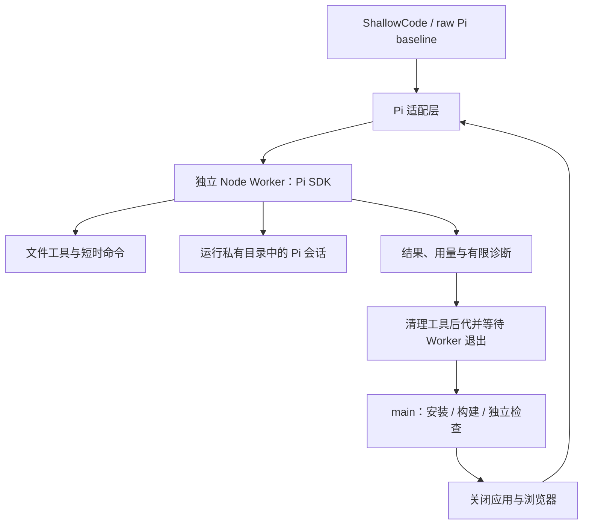

# Pi SDK Builder 重构计划

日期：2026-09-14  
起点：`2e4b4d6`（重构前提交）  
工作分支：`codex/pi-sdk-builder`  
状态：计划。本轮仅创建分支和本文，运行代码、依赖及默认行为尚未修改。

## 1. 目标与判断标准

用 Pi coding-agent SDK 替换 OpenCode，降低生成阶段的进程树内存，同时保留连续实现、编辑、命令行检查、图片、上下文压缩和修复能力。本地 Windows 与评测 Linux 均须可运行；评测按整个运行容器最多 2 GB 设计。

优先级依次是：资源限额内完成运行、交付可运行应用、业务正确率、耗时和调用成本。默认总预算仍为不限时，显式 `0` 同义；不通过新增总截止时间让困难题提前结束。

验收分为三层，分别报告：

| 层次 | 要证明的事实 |
| --- | --- |
| 代码契约 | 类型检查、无凭证集成与真实 Chromium 测试通过；两条入口与打包产物可用 |
| 引擎可用性 | 当前真实网关能进行连续工具调用、跨进程续接、图片处理、错误恢复和取消 |
| 受限运行效果 | 真实 2 GB Linux 限额下完整运行，无 OOM、无残留进程累积，并记录外部正确率与耗时 |

内存工作目标：生成容器 `memory.peak` 尽量不超过 1536 MiB，给瞬时分配留出余量；Pi Worker 及必要工具子进程争取控制在约 500 MiB。这两个数字是验收目标，不是已测得的 Pi 性能。若平台的“2 GB”是十进制字节数，按平台实际字节限额测试，不能默认为 2 GiB。

用户提供的 Windows 整树峰值为 Working Set 2563.4 MB、Private 2813.4 MB，OpenCode 单进程峰值 976.1 MB。它们只能作为当前风险证据；Windows 进程指标不等于 Linux cgroup 用量，也不能据此计算替换后的必然收益。

## 2. 本轮重构范围

### 2.1 最终形态

- main 使用 `PiSdkBuilder`；baseline 同步使用相同 Pi 执行层，保留其 ROOT 子树顺序实现与单会话语义，作为 raw Pi 对照。
- OpenCode 的历史 main/baseline 由起点提交 `2e4b4d6` 保留，用独立检出和产物目录对比。当前分支最终不保留双引擎选择器。
- Builder 每次调用运行在独立 Node 子进程中，调用结束清理工具后代并退出。会话保存在磁盘，进程退出不等于对话清空。
- 安装、构建、独立浏览器检查在 Worker 退出后由控制器执行；主线移除 Builder 浏览器 MCP，增加模块边界的少量独立功能反馈。
- 完整原子验收、集中修复、最终交付继续保留；反馈检查通过不直接等于需求 `verified`。

### 2.2 保留的项目能力

需求原文、种子数据、参考图片、模块依赖顺序、可运行检查点、Judge 信息防火墙、官方 ARC 投影、独立业务失败复现、修复回归保护、平台 frontend/backend 合同、中文日志和现有 CLI 均保留。

Builder 可以按需编写和运行传统测试、类型检查及短命令检查。本次不强制为每个生成应用增加测试框架或内部 TDD，也不限制模型使用这些能力。

### 2.3 不随本次合并的优化

`score-optimization-roadmap` 中的全面断言诊断改造、探针覆盖率策略、扩大修复次数、验收批处理、需求文本压缩分别独立实施。本计划只加入替换浏览器自测所需的最小模块反馈，避免重建整个调度器。

## 3. 当前代码事实与迁移入口

| 位置 | 当前职责 | 迁移要求 |
| --- | --- | --- |
| `src/builder/port.ts` | `run(request, { timeoutMs, sessionKey })`、`close()` | 保留对管线的接口形状，明确返回前退出进程的契约 |
| `src/builder/opencode-sdk.ts` | 模型接入、会话复用、拒图回退、服务生命周期 | 用 Pi 适配层和 Worker 替换，不搬运 HTTP 服务与 MCP 连接状态机 |
| `index.ts` | OpenCode、candidate MCP、自测装配 | 装配 Pi；继续保留 CandidateRuntime 给控制器使用 |
| `src/pipeline.ts` | 所有模块实现后验收、最多两轮修复 | 先只迁移引擎，再单独加入模块反馈与共享修复计数 |
| `src/candidate-runtime.ts` | 私有构建、摘要、依赖复用、应用数据与进程 | 删除 Builder MCP 专属入口；保留构建一致性；隔离各次独立检查的数据 |
| `baseline/index.ts` | 直接依赖 OpenCodeRuntime | 改用同一个 Pi Worker 客户端，继续自行组织 baseline 提示词 |
| `main.py`、`baseline/main.py` | 检查 Node、安装依赖、查找 OpenCode CLI | 移除 OpenCode 二进制准备，检查选定 Pi 版本所需 Node |
| `package.json` 与打包脚本 | 同时携带 OpenCode、MCP 和 Playwright | 锁定 Pi 依赖，删除失去用途的依赖，验证 ZIP 可独立启动 Worker |

当前代码中的 Planner 单次尝试上限已是 180 秒，不能套用之前讨论中的 45 秒。当前 Python 入口最低 Node 版本是 20.18.1，本机为 24.19.0。

## 4. 先验证 SDK 和运行环境

截至本次查阅，Pi 官方仓库主分支的 coding-agent 包名为 `@earendil-works/pi-coding-agent`，源码版本为 `0.85.1`，声明 Node `>=22.19.0`。主分支源码不等于已经确认的 npm 发布包；本轮未安装 SDK，也未验证评测镜像的实际 Node 版本。[包清单](https://github.com/earendil-works/pi/blob/main/packages/coding-agent/package.json)

实施第一步必须完成：

1. 核对 npm 可安装版本、包导出与引擎要求，锁定一个通过验证的版本及 lockfile；后续只参考该版本代码和文档。
2. 在本地及实际 Linux 评测环境检查 Node/npm、Git、shell、架构、libc 和 SDK 图片依赖。验证全新安装及 SDK 导入，不能只在当前 node_modules 下测试。
3. 若评测 Node 不满足要求，先检查有无满足原运行环境的正式 Pi 版本；若所需能力要求升级，则在提交包内提供明确、固定版本的任务运行时方案并验证，不能只提高版本检查后把运行失败交给评测机。此项未通过前不进入完整迁移。
4. Windows 显式选择可用的 SDK shell 工具，优先使用经验证的 PowerShell 工具；Linux 使用 Bash。工具名与提示词一致，不把 Windows `bash.exe` 的存在误判为可用的本地 Git Bash。[Windows 支持](https://github.com/earendil-works/pi/blob/main/packages/coding-agent/docs/windows.md)
5. 用本地模拟网关验证请求与响应，再用现有真实网关验证一段读写、编辑、命令执行、续接会话的完整工具往返。多轮推理、图片与取消另列测试。

网关继续使用 `OPENAI_API_KEY`、`OPENAI_BASE_URL`、`MODEL`。模型 ID 原样传递，包括 `/`；明确使用 Chat Completions 接入，按实际网关验证推理内容、usage、输出 token 字段和系统角色，不增加 Responses 转换服务。[模型配置](https://github.com/earendil-works/pi/blob/main/packages/coding-agent/docs/models.md)

## 5. Builder 结构与生命周期

### 5.1 对外接口保持简单

`PiSdkBuilder` 实现现有 `BuilderPort`：编译 main 提示词，把调用交给 Pi Worker 客户端，再返回现有 `completed / failed / timed_out` 和图片诊断。

共同的 Pi Worker 客户端接受已编译文本、工作目录、会话 key、截止时间和经过控制器指定的图片来源。baseline 使用这个较低层接口，不需要假造 main 的 WorkPacket，也不套用 main 的 Judge 提示词。

拟新增文件按实际职责组织：

- `src/builder/pi-sdk.ts`：main 的 BuilderPort 适配、请求编译与结果映射。
- `src/builder/pi-worker-client.ts`：两入口共享的子进程调用、会话文件映射、IPC、截止时间和退出确认；少量消息类型放在此边界，不设计通用插件协议。
- `src/builder/pi-worker.ts`：唯一运行时导入 Pi SDK 的入口，负责单次调用、会话恢复、工具装配和 SDK 事件判定。
- `src/builder/pi-tools.ts`：必要的路径限制、命令工具与取消适配；复用 SDK 工具实现，不另写业务代码编辑引擎。
- `src/process-lifecycle.ts`：从现有应用进程管理中提取并补齐实际共享的进程组启停逻辑，供 Worker 和应用生命周期使用。

### 5.2 每次调用的明确契约

1. 父进程创建调用 ID 与唯一截止时间，确认上一调用及验证进程已经结束。
2. 启动 Worker。通过 IPC 传递请求和网关密钥，避免把密钥放入命令行或模型配置文件。
3. Worker 创建或打开本次会话，装配显式工具与提示词，再执行任务。
4. 正常结束时完成会话写入、关闭 SDK、终止属于该调用的工具进程。父进程取得结果并确认退出后，`run()` 才返回。
5. 超时、取消或异常都执行同样的资源回收。清理尚未完成时不得启动构建、浏览器或回滚写文件；清理失败按执行故障终止，不报告完成。

Worker 的 TS 启动方式跟随当前源码运行方式，通过包内路径和明确的 TS loader 启动；验证打包后无仓库绝对路径依赖。父进程只保存有限结果与会话索引，不导入整个 Pi 运行时，也不复制完整对话、模型流和工具输出。

### 5.3 会话与代码版本

| 情况 | 处理 |
| --- | --- |
| 下一个实现模块，sessionKey 相同，代码未回滚 | 从指定会话文件继续；可跨 Worker 进程 |
| 模块回滚、调用失败或不完整写入 | 使该会话映射失效；后续以新 key / 新会话开始 |
| 集中修复或交付修复 | 独立新会话，输入当前候选的白名单观测 |
| 正常 Worker 退出 | 保留会话文件及逻辑身份 |
| 恢复时模型、工作目录或会话不匹配 | 明确失败或由控制器指定新会话；禁止静默切模型或继续错误工作区 |
| 控制器整个进程崩溃后重启 | 本次不承诺恢复整条管线；会话文件存在不等于 ledger、预算、候选状态可自动续跑 |

会话目录置于该次运行的私有目录，远离应用产物和 `.arc`。会话可能含完整代码与图片输入，不进入公开日志、ARC 投影或 Judge 输入。

保留 SDK 自带的上下文压缩；不在每个模块结束时强制总结或截掉历史。验证压缩前后能保持数据结构、接口约定和之前的实现结果。正常跨进程恢复与失败后的新会话是两种不同操作。[会话及 SDK 能力](https://github.com/earendil-works/pi/blob/main/packages/coding-agent/docs/sdk.md)

### 5.4 终止、重试与完成判定

- `prompt()` 返回或 `agent_end` 事件本身不是成功依据；根据该固定 SDK 版本的终态、模型错误、工具执行状态和取消原因映射结果。允许模型修复一个中间工具错误后正常完成，不把任意一次工具失败都当作整轮失败。
- 成功结果只说明 Builder 本轮正常结束。可运行性仍由 CandidateRuntime 检查，功能正确性仍由 Judge 检查。
- SDK 网络重试有明确次数与同一截止时间；鉴权、模型不存在、非法配置等确定性错误不重试。启动故障最多重试两次；已经执行工具的异常退出不盲目重放整轮，让管线按失败恢复检查点。
- abort 与落地清理沿用各最多 5 秒的范围；超时后强制回收拥有的进程组并等待确认。主线实现、修复与交付的调用上限继续取现有阶段额度和 runtime 配置的较小值。
- 拒图回退保留：只有明确不支持图片且尚未执行工具时，才在新会话纯文本重试一次，复用本次截止时间。适配器在整个 run 内保留文本模式状态；Worker 退出不能把它清空。
- 图片沿用当前格式、路径、单图 10 MiB 和每包 30 MiB 检查，优先在 Worker 内读取和编码，避免在父子进程间复制多个 base64 大对象。图片载荷不进入事件。

### 5.5 工具与配置边界

显式装配文件读取、编辑、写入和平台对应 shell；需要搜索工具时使用 SDK 提供的实现。允许 Builder 运行针对性的传统测试和短构建命令；由控制器安排的正式构建和浏览器阶段必须与 Worker 互斥。Builder 自行执行的大型命令仍属于生成阶段峰值，不能宣称仅靠退出 Worker 就给该峰值设了上限。

采用受控 ResourceLoader 和设置，避免自动加载宿主或项目中的任意扩展、技能、模型目录与控制器 AGENTS.md。目标应用内明确允许的项目说明可作为实现上下文；不加载它声明的任意可执行扩展。模型默认目录刷新和其他额外网络发现须按锁定版本检查并关闭或显式限定。

路径限制同时覆盖读取、写入、编辑和搜索；解析相对路径、绝对路径、符号链接、Windows junction 以及新文件的已存在父目录，禁止访问 `.arc` 和 Judge 私有目录。shell 必须保留项目既有禁止读取官方测试、台账与外部目录的约束，并限制环境继承，避免把网关密钥交给工具子进程。

任意 shell 的文本检查不能构成完整 OS 隔离；这点沿用当前仓库已记录的限制，不把 Pi hook 包装称为安全沙箱。评测验证需检查实际挂载、路径可见性和进程权限。若现有部署无法满足信息边界，应记录具体缺口并解决；不能仅靠 prompt 让测试显示通过。

Linux 按拥有的进程组回收，包括 Worker 已退出后的后代；Windows 需验证正常退出、超时和 Worker 提前崩溃的后代回收。若 SDK 启动方式使现有 `taskkill /T` 在父进程早退时漏进程，补齐 Job Object 或等价的明确归属机制后才判定生命周期通过，不扫描并杀死机器上无关的 Node/浏览器。

## 6. 模块边界反馈：替代 Builder 常驻浏览器

引擎迁移先按原调度通过一组对照测试，再在本分支完成本节。最终交付包括本节，不能只移除 Builder 自测而把功能反馈全部留到末尾。

### 6.1 执行顺序

`模块实现 → Worker 清理并退出 → 安装/构建/启动一致性检查 → 模块反馈 → 关闭验证进程 → 保存可运行检查点或处理失败 → 下一个模块`

所有模块处理完仍进行完整原子验收，然后执行剩余集中修复与最终交付。保持完整模块工作单元，不退回逐原子开发。

### 6.2 有界检查选择

- 每个模块边界最多两个反馈 case：一条当前模块路径，加一条已有模块的回归路径。
- 当前模块优先选择其内被后续需求依赖最多、且前置需求已实现的原子；同优先级按声明顺序。Planner 仅依据这条需求及前置文字生成一条完整路径，有输入动作时优先覆盖动作后的行为。
- 回归路径从已有成功反馈中选：优先当前模块依赖的功能，否则选已建立的基础路径；固定顺序打破平局。没有合格路径时只运行新路径。
- 新增一个明确的 `module_feedback` 规划用途，限制为一个完整 case；沿用现有 DSL 和定位恢复规则，不把完整计划强行截成缺少准备步骤的片段。
- 反馈计划缓存供后续边界复跑；完整验收使用自己的计划缓存。反馈 case 不能冒充该需求的完整验收计划。
- 新代码版本重跑计划，历史通过只作回归选择依据，不直接沿用为当前版本 pass。

### 6.3 状态和失败处理

反馈结果单独记录为 `passed / failed / inconclusive`，与正式需求状态分开。探针通过只表示该路径通过；不会输出整条需求 `test/passed`，也不更新 `verified`。

| 反馈结果 | 行为 |
| --- | --- |
| 路径通过 | 保留可运行实现，继续模块开发 |
| Planner、定位或浏览器不能建立证据 | 记录不确定，保留实现，留待完整验收 |
| 新路径可复现业务失败 | 在共享修复额度允许时进行一次反馈修复；否则保留可运行实现，记录待完整验收的问题 |
| 旧路径可复现回归 | 暂停后续模块，额度允许时修复；修复失败、不能证明恢复或无额度时恢复到该模块之前的检查点 |
| 安装、构建、启动或候选一致性失败 | 继续沿用模块失败与恢复规则，不记成功实现 |

反馈修复必须从当前候选的失败观测生成新会话，最多每个边界尝试一次。它与末尾集中修复共享每 run 两次的上限，不能变成“每模块再给两轮”。交付修复仍独立最多一次。

修复接受要求：至少一条可复现失败路径转为通过，且修改前已通过的本轮所选路径全部重新通过。此范围只保护抽样路径，不宣称全项目无回归；完整验收继续负责更广的检查。

保存三种身份：模块前已接受版本 A、模块实现后的待检版本 B、修复版本 C。修复前可用现有 Git 捕获能力保存 B 的临时提交，但不能推进接受状态。若只修新路径且未改善，恢复 B 后可以保留其可运行实现；若旧路径仍回归则恢复 A 并将当前模块标为 blocked。任何回滚后均废弃对应会话及当前证据，禁止把 C 的观测当作 A/B 的当前问题。

### 6.4 时间与数据

正预算继续按实现 60%、初验 20%、修复 15%、交付 5% 预留。模块反馈及早期修复计入实现阶段，不能使用 `remaining(repair)` 越过实现阶段预留；早期修复最多 4 分钟且不超过实现阶段剩余的一半，留出复验时间。没有剩余额度时如实跳过反馈/修复，仍保留最后可运行版本。默认/0 不增加总时限，单次调用及检查数量有界。

当前 CandidateRuntime 在重启间复用 `candidate/data`，仅重启进程不能保证失败复现和回归检查的初始数据一致。新增反馈之前，改为每次独立 probe 执行使用新的控制器私有数据目录，由应用按种子数据初始化；同一 case 内刷新、浏览器新上下文及需要验证的重启继续使用同一数据目录。失败确认使用另一个全新目录。数据由该执行的生命周期清理，不混入源码摘要，不回写交付应用，也不接触官方评估数据。

## 7. 观测与内存验证

继续走 `state.record → logSink`，同步 `types.ts`、`human-log.ts` 与 ARC 防火墙测试，遵循 `docs/2026-09-07-observability-arc-projection.md`。

最小新增记录：

- Builder 引擎、SDK 精确版本、Node 版本、调用 ID、Worker 启停、逻辑会话是否恢复、退出原因及清理耗时。
- SDK 能可靠提供时记录逐调用 usage、工具调用计数和压缩事件；只累加本次调用新增内容，避免把恢复历史重复计费。缺失值记 unavailable，不能填 0。
- 模块反馈的需求/路径 ID、候选版本、计划指纹、判词、是否修复及共享修复次数。
- Linux 整容器 `memory.current`、`memory.peak`、`memory.events` 和实际 `memory.max`；按可用的 cgroup v1/v2 接口采集并标明口径。正确解析当前进程所属 cgroup，不固定假设根路径。

内存采样是诊断，不作为跳过困难需求或伪造通过的条件。cgroup `memory.peak` 可用时作为累计峰值；只有轮询时必须标注其可能漏掉瞬时峰值。Windows 的 Working Set/Private 单独记录。

受限验证覆盖冷安装、长模块、上下文压缩、跨模块恢复、大图片、构建、浏览器、集中修复和异常清理。限制 swap 与平台一致；测试期间其他生成任务不共享这份内存额度。官方评分由隔离的外部评估步骤执行，不将其源码和结果发回运行中的 Builder 或 Judge。

性能对照分开报告：

1. OpenCode main（`2e4b4d6`）与迁移 Pi、尚未增加模块反馈的 main：判断替换引擎及装配的整体影响。两者的浏览器/MCP 配置不同，不能把全部差异归因于引擎本体；需要分析引擎本体时，再用双方均关闭浏览器自测、隔离外部配置、相同工具工作量的受控任务比较。
2. 只迁移 Pi 与加入模块反馈后的 Pi main：判断流程变化的影响。
3. raw Pi baseline 与 Pi main：判断控制器带来的收益和开销。

至少覆盖 `data/github`、`data/sheet` 和一个明显更大的任务；固定模型、网关、资源、需求与输入，全部使用独立产物目录。首先完整不限时运行，再按需做显式预算实验。条件允许每配置重复三次，报告中位数和范围；单次探索不作为稳定收益证明。若旧 OpenCode 在 2 GB 中失败，记录失败；可另外用较大内存取得旧版质量基线，但必须明确其资源条件不同。

## 8. 文件责任与实施顺序

下表按文件责任和依赖顺序组织实施。

| 步骤 | 文件责任 | 实施内容 | 完成标准 |
| --- | --- | --- | --- |
| M0：可行性验证 | SDK 依赖候选、运行环境记录、最小网关 fixture | 验证发布包、Node、两种 OS、工具往返、会话恢复、图片和取消；测冷启动与长会话开销 | 选定一个版本和运行时，真实网关兼容性有证据；没有模型替换或协议转换依赖 |
| M1：Pi 执行层 | `pi-worker-client.ts`、`pi-worker.ts`、`pi-tools.ts`、`process-lifecycle.ts` | 明确 IPC、工具与配置限制、正常及异常清理、恢复与重试 | 模拟网关＋真实子进程测试通过，返回后无后台写入，无不受控工具后代 |
| M2：main 接入 | `pi-sdk.ts`、`index.ts`、提示词、图片链路 | 接入 BuilderPort，保留原调度验收规则；移除 main 的 OpenCode/MCP 自测装配 | 同一 fake 控制器测试仍成立；真实 Pi 完成受控应用实现；取得引擎迁移对照 |
| M3：入口与依赖统一 | `baseline/`、`main.py`、`package*.mjs`、package/lockfile | baseline 改 raw Pi；入口按固定运行时检查；清除旧依赖与启动查找 | 两个全新解包目录均可启动；不要求全局 Pi CLI 或 OpenCode；baseline 无 Judge 输入 |
| M4：模块边界验收 | `pipeline.ts`、`judge/plan-cache.ts`、Planner 用途、`candidate-runtime.ts`、必要 Git 调用 | 并行计划生成、模块边界完整审计、独立修复配额、版本绑定 | 模块边界审计、修复额度耗尽和 A/B/C 回滚均有行为测试 |
| M5：观测与回归 | `types.ts`、`human-log.ts`、运行元数据、相应文档和测试 | 接入引擎、会话、usage、资源记录；更新项目不变量 | `npm run test:all` 通过；公开日志无私有数据；文档反映最终实现 |
| M6：受限完整运行 | 现有本地评估脚本与受控 Linux 测试环境 | 完整题目与异常路径的 2 GB 验证，比较正确率、耗时、峰值 | 给出可复查结果；测试缺失或内存不达标时明确列出，不能宣称迁移已稳定交付 |

M2 是实验检查点，不是最终交付：移除 Builder 浏览器后，必须继续完成 M4 的模块边界验收。上述阶段便于审阅和单因素比较，不自动创建提交或推送。

最终删除 `src/builder/opencode-sdk.ts`、`src/builder/self-test.ts`、`src/builder/candidate-mcp.ts` 及只有这些通道使用的 prompt。删除 `opencode-ai`、`@opencode-ai/sdk`、`@playwright/mcp`；检查 `@modelcontextprotocol/sdk`、`undici` 的直接引用后删除失去用途的直接依赖。保留 Judge 的 Playwright 与 CandidateRuntime 构建能力。

`README.md`、`AGENTS.md`、`.env.example`、模块优先设计、观测说明更新为最终 Pi 实现。历史设计文档保留历史身份，不批量替换其中的 OpenCode 名称。`tsconfig.json` 保持 NodeNext/strict/noEmit 源码运行约定，只有实际 SDK 类型或入口需要时才调整；不以关闭检查来消除迁移错误。

## 9. 验证清单

### 执行层与模型协议

- 本地 HTTP fixture 使用真实 Pi SDK：文本工具调用、工具结果回传、连续两轮、流式错误、缺失 usage、鉴权拒绝、请求取消。
- Worker 两次启动恢复同一逻辑会话；两次修复调用隔离；失败会话不复用；压缩后的真实上下文续接。
- 未执行工具时拒图可回退一次；已经写文件后拒图不可重放；大小、格式、路径越界与恶意链接仍被拒绝。
- 正常完成、模型异常、无限命令、Worker 崩溃、子进程孙进程、晚到事件；等待结束后源文件不再变化、端口释放。
- 验证限制实际生效，不只断言配置对象中存在某字段；测试不读取用户真实密钥或私人文件。

### 控制器与业务验证

- 模块整体开发、原子依赖上下文、可运行检查点与 verified 分离。
- Worker 退出先于控制器构建和浏览器启动，上一验证实例关闭先于下一 Worker 启动。
- 反馈两 case 上限、前置需求不满足时跳过、缓存用途区分、正式验收覆盖不被反馈缓存取代。
- 新功能失败保留可运行候选、旧路径回归可恢复、Judge 故障不误回滚、共享两次修复额度与一次交付修复。
- 检查内的数据持久化可见，检查之间和失败确认时数据独立；A/B/C 的报告、会话、计划和接受版本对应正确。
- 默认/0 不限总预算，正预算阶段预留仍成立，新增反馈不偷用后续阶段时间。

主要回归入口：`test/pipeline.e2e.test.ts`、`test/candidate-runtime.test.ts`、`test/run-budget.test.ts`、`test/locator-recovery.test.ts`、`test/llm-probe-planner.test.ts`、`test/baseline.test.ts`、prompt/图片/observability/ARC/human-log 测试，以及新增 Pi 执行层与模块反馈测试。

原 OpenCode SDK 序列化与 MCP 连接测试按替代行为重写；仍有价值的跨引擎契约继续验证，不仅删除失败断言。使用现有 `node:test`、fakes 和 Chromium fixture；Pi 自身使用什么测试框架不改变本项目惯例。

### 交付与结论边界

- 代码交付前运行 `npm run test:all`；本轮文档计划不运行代码测试。
- Windows 与 Linux 分别验证 `python main.py`、baseline 入口、直接 TS 启动、全新打包安装与 Worker 启动；程序启动检查不能代替真实模型检查。
- 凭证冒烟使用现有显式开关；测试跳过如实报告，不伪造网关成功。完整模型评估与本轮计划编写分开执行。
- 最终报告区分：已经完成的实现、无凭证验证、真实网关验证、2 GB 完整运行和外部正确率。不能用内部 verified 或一次低峰值代替后两项。
