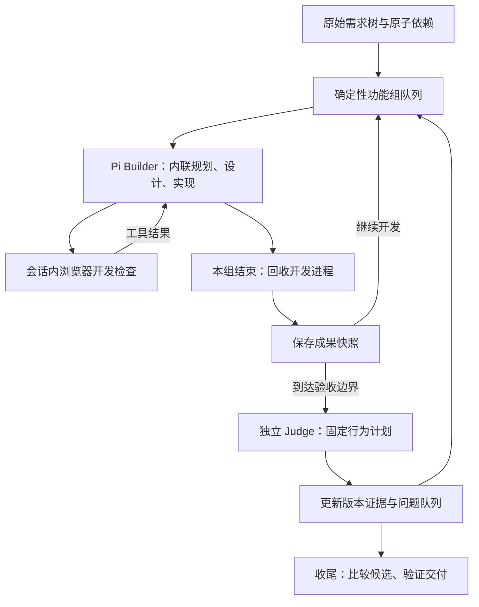

# ShallowCode：功能组调度、Builder 开发闭环与候选版本选择

日期：2026-09-15  
状态：设计提案；运行代码尚未实施本文方案。  
核对基线：`fb39ee5`。静态分组实验使用当前 `data/*/requirements.yaml`、Catalog 与提示词编译器。

## 1. 建议采用的整体方案

使用确定性规则把原子需求组成有界功能组；Pi Builder 在同一次调用内完成局部规划、共享设计核对、端到端实现与浏览器调试；把开发进展、独立验收证据和交付版本选择分开管理。

三个决定：

1. **需求树负责组织上下文，原子依赖决定开发顺序，功能组控制每次工作范围。** 同一大模块可以多次进入，原子需求与场景原文保持完整。
2. **Builder 内联规划、设计和实现。** 提示词规定每一步需要确认的事实与完成条件；Pi 统一负责共享数据模型、前后端与集成，使用会话内浏览器观察和修复。Judge 独立，磁盘会话支持调用之间的连续性。
3. **每次成果先保存，运行故障先修，功能失败进入待办队列。** 开发沿最新可运行版本继续，交付时依据可比的独立证据选择版本。

优化目标是可运行应用的功能覆盖、连贯性及成本。自建探针指标只用于内部比较，不能冒充官方得分。本文提出的阈值和默认次数是实验起点，尚无真实模型成绩证明它们最优。



## 2. 外部实践给出的依据与限制

本次通过 Exa 在长任务 harness、多 agent 协调、对照研究三个方向检索了 15 条结果，重点阅读全文 6 篇原始资料；另核对了本地两个参考项目的实现。

- Anthropic 2025 年的应用实验使用初始化、逐功能开发、交接记录和浏览器测试，指出只做单测或 HTTP 检查容易漏掉端到端缺陷。这支持缩小工作范围、保留开发上下文和补上浏览器反馈。[Effective harnesses for long-running agents](https://www.anthropic.com/engineering/effective-harnesses-for-long-running-agents)
- Anthropic 2026 年后续实验还报告：更强模型下可移除固定 sprint 和频繁重置，把评估移到较晚阶段。结论具有模型与任务条件，不能把“每小步都增加 agent 和验收”作为普遍最优策略。[Harness design for long-running application development](https://www.anthropic.com/engineering/harness-design-long-running-apps)
- Cursor 的大规模实验观察到平级共享状态、锁和责任不清会导致等待、重复工作与缺乏端到端负责人；其后续 swarm 也需要专门处理设计冲突与合并。适合借鉴明确责任和控制共享状态的原则，规模与资源条件不能直接外推到 Shallow。[Scaling long-running autonomous coding](https://cursor.com/blog/scaling-agents)、[Agent swarms and the new model economics](https://cursor.com/blog/agent-swarm-model-economics)
- Co-Coder 把任务划分中的依赖与跨 agent 通信成本作为优化对象，分离共享枢纽文件。它研究已有仓库上的任务，不能证明从零构建本项目题目时并行一定获益。[When Parallelism Pays Off](https://arxiv.org/html/2606.00953)
- MSEval 比较从零开发完整应用的多种协作结构，把运行部署、反馈、时间和成本同时计量。它说明协作方式需要实测；其多 agent 拓扑比较不能替代我们自己的单 Builder 对照。[An Empirical Study of Coordination Mode](https://arxiv.org/html/2607.27877)
- Octos Python 编排器在实现超时后验收已写产物，完整验收保存最佳通过数对应版本；agent-arc-based 保存失败阶段的提交并提供阶段重试。这些思路可以移植，但前者向 Builder 提供验收测试，后者允许实现代理修改生成测试，均不能直接替代 Shallow 的独立 Judge。源码：`tmp/octos-arc/arc/main.py:1954,2145`；`tmp/agent-arc-based/core/workflow.py:490,1071`。
- Octos Python 普通节点路径支持在实现轮中先写设计，其 `design_mode` 默认值为 `inline`。设计覆盖接口、页面、数据模型和状态处理。这是同一调用中规划与实现的具体参考；实际收益仍需本项目对照。源码：`tmp/octos-arc/arc/main.py:1007,1210,1886`。

以下具体分组算法、Builder 内联执行规范、浏览器开发协议、预算与版本比较规则是针对 Shallow 的设计推论。

## 3. 先确定如何拆分需求

### 3.1 需求单位与工作单位分开

**原子需求**保持原始 ID、描述、场景、祖先约束和依赖，是追踪与验收单位。

**功能组**是一次集中开发的范围，尽量围绕同一页面、业务对象和状态变化，把界面、接口、持久化、输入校验及刷新后的结果一起实现。原子需求在初始计划中只有一个主要所属组；后续修复可以再次引用同一 ID。

**模块**保留为架构上下文和导航分组。一次功能组完成后，允许转去其他模块，再回来补齐剩余原子需求。

### 3.2 确定性分组与组内实施规划

1. 复用 Catalog 的原子依赖展开和无环校验，不修改原始依赖或删减场景。
2. 从尚未安排、且依赖已安排的原子需求中选取下一项，初始按声明顺序稳定排序。
3. 扩展当前组时，优先选择同一直接父目录中的可安排项，其次选择同一 ROOT 子树的其他可安排项。依赖可以在同组中先实现。
4. 达到需求数量、场景数量或需求正文规模阈值时结束本组。原子需求不截断；单条超过阈值时独立成组，依靠多次开发交接完成。
5. 当前模块暂时没有可安排项时，转去其依赖所在的其他模块；以后再回来。分组不改变原子顺序约束，不把模块间的循环再次合成大包。
6. 用程序验证：全部原子 ID 唯一覆盖；每条依赖在当前项之前或同组内之前；原文与场景没有变化。

本轮实验采用：每包最多 6 条原子需求、12 个场景、18,000 个需求描述及场景字符；超长单条完整保留。字符数不是 token 数，也不包括公共上下文。实现时应同时记录最终编译后的输入长度，用真实模型数据校准阈值。

这套规则是结构上的分组，不宣称能自动理解所有语义。Builder 在当前调用内核对原始需求、现有实现和共同约定，确定组内实施顺序、需要复用的公共能力与具体检查。发现跨组障碍时，在回执中关联原始 ID，交由工作队列安排续做；控制器继续保证完整覆盖、依赖顺序与原始验收要求。

局部规划达到“已明确本组的状态归属、实现位置、操作链路及检查方式”后，在同一调用内进入实现。公共状态或页面结构复杂时补充必要设计；简单扩展沿用既有约定。原子需求的主要所属组和完成标准由控制器与原始需求清单管理。

### 3.3 当前 data 的只读实验

| 题目 | 原子需求 | 现行工作包数 | 实验工作包数 | 现行最大包 | 实验最大包 |
| --- | ---: | ---: | ---: | ---: | ---: |
| 12306 | 117 | 5 | 24 | 59 | 6 |
| bookstack | 34 | 9 | 11 | 10 | 6 |
| ctrip | 125 | 11 | 27 | 27 | 6 |
| github | 47 | 6 | 10 | 12 | 6 |
| keep | 32 | 6 | 9 | 23 | 6 |
| prestashop | 86 | 9 | 19 | 19 | 6 |
| sheet | 24 | 2 | 6 | 19 | 5 |
| stackoverflow | 66 | 10 | 16 | 17 | 6 |
| ticketbooking | 1 | 1 | 1 | 1 | 1 |

9 道题共 532 条原子需求，覆盖、唯一性和依赖顺序检查全部通过。实验没有调用模型或执行应用，也没有修改 Scheduler。工作包总数从 59 增至 123；需要控制每次交接的开销，不能在每包后机械增加完整验收。

复用当前提示词编译方式时，Sheet 最大任务正文从约 57,629 降至 32,406 字符，GitHub 从约 49,201 降至 37,299 字符，12306 从约 56,671 降至 10,793 字符。路径取示例 `/tmp/app`，Windows 合同端口取 43210；不含系统提示词、历史会话和图片。

### 3.4 Sheet 的具体顺序

实验生成以下 6 组，保持全部 24 条原子需求：

1. 工作簿打开、创建、重命名与 CSV 导入导出：`REQ-1` 的 5 条。
2. 工作表重命名、添加与行列结构：`REQ-2-1-3`、`REQ-2-1-1`、`REQ-2-2-1`、`REQ-2-2-2`。
3. 网格编辑、粘贴、选区、复制剪切和撤销重做：`REQ-3` 的 5 条。
4. 基本公式、重算、错误与相对引用：`REQ-4` 的 4 条。
5. 过滤、验证、排序和透视：`REQ-5` 的 4 条。
6. 工作表切换与删除对上述状态的完整处理：`REQ-2-1-2`、`REQ-2-1-4`。

前期需要可用的基础网格、活动工作表标识和切换入口，否则后续无法开发。这些可以在基础实现中提前存在；第 6 组负责补齐切换、删除对过滤、验证和透视状态的完整要求，最后独立验收才判断这些需求是否 verified。不能误解成“到最后才第一次实现切换”，也不能因为已有按钮就提前宣称整个原子需求完成。

### 3.5 公共上下文与局部输入

- 第一次 Builder 调用建立或核对应用基础：需求要求的数据对象、身份与权限、路由、存储、种子初始化、平台启动合同和可见界面骨架。简单题并入第一个功能组；evolution 先检查已有实现。
- 为未来功能确定最小共享约定，例如 workbook/worksheet ID、会话归属、保存事务；不一次创建所有业务接口或扩写题目范围。
- 当前组收到完整需求、场景、祖先约束及引用；同时给出接下来相关需求的 ID/名称，避免把当前局部误认为整个产品。
- 复用稳定的项目约定与磁盘会话，减少反复输入全部已完成需求。只有完整原文已经通过可信输入提供或可读时，才能使用短索引代替重复文本；不采用有损摘要来省掉强约束。
- 分组只影响开发。验收覆盖来自原始需求清单，不依赖 Builder 的完成回执或 `implemented` 集合过滤。

## 4. Builder 如何实现：内联规划、设计与开发检查

### 4.1 Builder 内部流程与控制器职责

| 角色 | 输入与职责 | 权限 |
| --- | --- | --- |
| 控制器 | 原始需求、工作队列、预算、结果与快照；确定下一组 | 调度、运行、保存、选择；不生成业务代码 |
| Pi Builder | 当前组、完整原始要求、参考图、项目约定、相关源码、浏览器工具与白名单观测 | 在同一上下文内规划、设计、实现和开发检查；唯一业务代码写入者 |
| Judge | 原始需求与黑盒运行观测 | 不读取源码、diff、Builder 会话或开发自测结论作为验收依据 |

规划与设计是 Builder 的工作步骤。首次调用先结合产品上下文与后续功能索引，确定当前所需的公共基础；后续调用核对本组新增或变化的约定。例如 Sheet 需要明确选区、公式和撤销的状态归属，GitHub 需要贯通会话与权限，参考界面需要保持导航、页面骨架和反馈状态的一致性。

开发前用 3–5 条简短决定记录：本组需求范围、复用的状态与接口、端到端实施顺序和实际检查路径。这是可观察的工作摘要，不要求展开内部推理。决定足以指导本组开发后立即进入实现；实现中发现事实冲突时修正局部决定，并同步必要的共享约定。

跨调用长期有用的数据约定、公共接口和页面结构记录在已有 `ARCHITECTURE.md` 中，只在发生重要变化时更新。每个小步骤的检查和待办留在会话与简短回执中。

提示词引导 Builder 的开发行为；覆盖、配额、进程回收、快照保存和 verified 判定由代码执行。连续相同失败需要独立诊断视角时，在同一代码快照上用新 Pi 会话执行 root-cause-repair；正常开发保持上下文连续。

### 4.2 提示词规范草案

实现时将内联步骤放入 `prompts/system/action-implement.md`，开发工具约定继续由 `self-test.md` 承载，最终简短报告沿用 `receipt.md`。下面是行为草案，尚未写入生产 prompt；浏览器条目按实际提供的工具生效。

```text
1. 实现当前功能组前，阅读原始需求、场景、相关现有源码和参考资料。
   保留各需求 ID 与原始验收标准。按共享状态和 UI 复杂度调整规划深度，
   用 3–5 条简明决定说明：本组范围，复用的数据/状态归属及接口，
   端到端实现顺序，以及关键用户路径和具体检查。
   决定足以指导本组开发后，在同一次调用中立即进入实现。

2. 先贯通真实用户操作、接口、存储与可见结果，再补齐本组场景要求的
   校验、权限、错误处理及刷新/重开行为。根据实际代码和检查结果修正设计。
   共享数据、接口或状态契约发生实质变化时，简短更新 ARCHITECTURE.md。

3. 执行与改动相关的构建和开发检查；提供浏览器工具时，通过真实用户
   操作检查关键流程、适用的持久化行为及受影响的既有路径。
   依据实际失败修复并复查。开发自测作为调试证据，验收由独立 Judge 判定。

4. 本组端到端连通且适用检查通过后，报告本次完成的工作与检查结果。
   如仍有未完成内容、检查失败或工具限制，明确涉及的需求 ID、影响与
   下一步，供控制器保存进展和安排续做。
```

例如创建笔记的检查应覆盖输入、保存、列表更新及刷新后仍存在；涉及公式或事务逻辑时，可增加有价值的小范围测试。规划摘要和开发完成报告都不作为控制器判定 verified 的依据。

### 4.3 会话内浏览器开发检查

建议向 Pi Coder 暴露少量浏览器工具，支持启动开发预览、导航、获取页面状态与截图、点击、输入及读取错误。工具调用期间 Worker 保持运行，返回后继续编辑，不要求结束整个 Builder 调用。

控制器通过 IPC 管理浏览器与应用进程的启动、取消和回收，Coder 决定需要观察的开发操作。只在需要时启动一个开发浏览器实例，同一功能组内复用页面和会话；组结束统一释放。开发服务在可用时利用热更新，后端或启动配置变化时才针对性重启，依赖变化时才重新安装。

简单流程允许把几个确定的操作放进一次有界工具请求，失败后再逐步观察。优先返回必要的页面结构与错误信息，视觉检查时再取截图；每次点击都重新规划、构建或返回整页大图会抵消会话内工具的效率收益。

一个典型调用内的流程为：编辑代码 → 打开页面 → 点击保存 → 读取错误/截图 → 修改代码 → 刷新复查 → 完成本组。文件修改与浏览器操作按顺序执行，必要时等待应用就绪；不在同一交互步骤中同时变更应用文件。

开发预览用于快速观察当前工作区，不授予正式验收证据。Judge 与最终交付仍使用冻结输入的 CandidateRuntime，检查生产构建与平台启动合同。开发模式通过并不证明生产启动通过。

开发检查与 Judge 使用独立用途、计划、浏览器上下文、数据目录及证据访问路径。开发工具不调用私有 ProbePlanner，不读取隐藏计划，不把自测成功汇入独立验收结果。开发结果包含当前 URL、页面状态、必要错误、截图及观察时的代码版本信息；源码变化后旧结果不代表当前版本。

本组结束、超时或取消时，父进程必须回收 Worker、浏览器和开发服务，并等待退出确认，再保存用于正式评估的快照。IPC 超时、悬挂请求、页面数量、开发数据清理以及截图输入的模型兼容性需要一起验证。

本次核对 `tmp/mem-watch/run-20260915-204111/pipeline.err.log`：5 次有峰值记录的 Pi 调用自报进程峰值约 167.8–234.8 MiB，清理记录为 0–1 ms；3 次实际构建约 0.94–1.20 s，准备缓存命中约 140–206 ms。该 Windows 样本不是完整进程树或 Linux cgroup 峰值，无法单独证明所有任务都具备同样余量。

已测数据不支持把进程回收认定为主要延迟。会话内工具的价值主要在于保留连续交互、复用页面和服务，减少完整回执/下一任务提示的往返。工具结果仍需模型继续处理，不能宣称消除了模型请求。比较两种执行方式时应记录模型调用、构建、服务启动和浏览器各自的耗时，以及整容器峰值内存。

### 4.4 会话策略

- 同一功能组的开发检查和修复在 Coder 当前调用内进行；需要跨调用续做时沿用磁盘会话。
- 正常连续实现可以沿用会话，SDK 负责压缩；不按固定包数强制重置。
- 回滚到其他源快照、会话损坏或连续相同失败需要换诊断视角时，使用新会话，并附当前源码版本、简短项目约定与未解决事项。
- 超时后先保留并检查产物；会话是否可安全续接单独判断。不能因为会话不可复用就同时丢掉代码。
- 控制器崩溃后的完整任务续跑必须验证需求摘要、Git 根、快照和状态的一致性，不能仅凭一个 session 文件承诺恢复；先实现同一 run 的可靠交接。

## 5. 调度与预算：推进覆盖，按进展修复

### 5.1 工作状态与功能证据分离

工作状态可用 `queued / active / needs_work / parked / attempted` 等少量状态表达。`attempted` 只表明已安排开发，不表示完成。独立验收仍为 `verified / failed / inconclusive`，并绑定候选版本。

依赖决定计划的先后和排错优先级，不要求前置需求已经 verified 才允许开发后续需求。若实际缺少公共能力，先把这一障碍交给 Builder；不能把一次失败永久传播成整个后续子树不可进入。

初始功能组覆盖每条需求。后续问题按需求 ID、失败类别和复现特征归组；多个 ID 指向同一公共故障时合并修复，不为每个症状各启动一个 Builder。源码层根因由 Builder 确认，Controller 不把它的诊断当作独立功能证据。

### 5.2 下一步选择顺序

1. 当前应用无法构建或启动：优先一次局部运行修复，使下一步有工作基础。
2. 关键公共链路有已复现的业务失败：优先处理会阻塞多个待办组的根因。
3. 继续尚未得到首次实现机会的可安排功能组。
4. 再处理可复现的业务失败、未完成组及回归；同类错误集中处理。
5. Judge 的定位、浏览器和模型故障走 Judge 恢复，不默认要求 Builder 改应用。

一个局部问题连续没有新进展时，保存当前成果并延后它，让其他工作继续。新依赖实现、新的独立失败证据或新的诊断可以使延后问题重新被考虑，但仍受该需求的累计资源约束。

### 5.3 初始预算规则

- 保留默认/0 不限总时长的语义；用有限工作队列和重试上限保证运行会结束。
- 显式正预算时，建议先以末尾 15% 作为版本比较与交付窗口，其余时间由实现和修复共同使用；内联规划、设计、读代码与开发检查均计入当前调用时限。这个比例需要实测；不再给四个阶段各设置不可返回的时间段。
- 有首次实现尚未安排时，单组额度参考剩余开发时间与剩余工作量分配；不能给每个新小包机械套用旧大模块的完整时限。剩余不足以完成一次有意义的开发与检查时进入收尾。
- 初始建议：每组首次开发之外最多两次续做/修复机会，一次立即反馈后仍未解决则可延后；浏览器开发操作计入当前调用时限，完整检查旅程最多三轮，单次点击/输入不单独消耗一轮。次数与阶段时限不因工具调用而重置。
- 相同问题连续两次没有可验证进展时延后；累计次数按需求/问题身份计数，合并或拆分修复包不重置额度。
- 最终启动/交付故障仍可有一次专门修复，但它也必须留出后续验证时间。
- 有限次数控制继续花费，不触发删除成果。一次普通失败不结束所有其他问题的修复机会。

预算管理应记录耗时和原因。模型 usage 当前未完整采集时，不声称执行了严格 token/费用上限；优先补齐可取得的 usage，再做成本对照。

## 6. 保存与选择版本，改进硬性淘汰

### 6.1 快照的含义

每次 Worker 清理完成后，保存当前应用文件，即使该次执行超时、模型返回失败或应用尚未可运行。快照记录父快照、关联需求、输入摘要、执行结果、运行检查、独立证据索引及待办。

运行至少区分：

- **当前工作快照**：包含正在开发的成果，可以临时不完整。
- **最新可运行快照**：供后续开发接续和运行故障回退。
- **当前最佳已评估快照**：只依据相同独立验收范围和行为计划比较后更新。

这三种属性不需要三个工作区或并行分支。保存单线 Git 历史与几个索引即可。Judge 证据继续保存在私有运行目录。

快照需要明确可恢复的输入清单：源码、依赖锁文件、所需静态资源和种子输入应可恢复；编译缓存、生成构建产物与临时运行数据由 CandidateRuntime 重建或隔离。Git 实际保存的文件与候选摘要范围必须一致。不能只保存受 Git 跟踪的文件，却把未存档的 ignored 文件变化当成可恢复的源码证据；当前 CandidateRuntime 与 Git 忽略规则需要联合核对。

当前 `restoreAccepted` 会移动 HEAD，且要求目标是当前 HEAD 的祖先。新方案需要让失败尝试仍可被引用：先保存尝试，再恢复目标应用文件并产生新的恢复提交，保持历史可达。不能仅依赖 reflog 恢复已撤销的工作。恢复继续保留 `.arc` 审计历史，并验证输出目录、文件摘要和构建一致性。

### 6.2 每类失败的动作

| 事件 | 建议动作 |
| --- | --- |
| 模型超时、普通调用错误 | 清理 Worker，保存文件，实际构建和检查；需要时续做 |
| 应用构建或启动失败 | 保存失败快照，反馈具体错误，尝试局部修复；仍失败才恢复最新可运行版本供后续开发 |
| 新功能业务失败 | 保留可运行成果，加入问题队列 |
| 旧路径业务回归 | 记录损失和受影响需求；优先修公共故障，通过可比证据决定修复版本是否更好 |
| Judge 故障或时间不足 | 记 inconclusive，保存候选，不把未知当成业务失败 |
| 本轮修复效果不好 | 最多恢复到本次修复之前的可运行版本；修复快照保留 |
| 配额耗尽 | 停止当前问题的投入，保存、延后并继续其他工作 |
| Worker 清理未确认 | 停止会修改/检查应用的操作，报告执行故障；不能让残留写入与快照恢复竞争 |

原 A→B→C 场景：A 是模块之前，B 是可运行的新实现，C 是反馈修复。C 无效恢复 B，B 的旧路径回归进入问题队列。不能仅凭这次抽样再删除整个模块退到 A。

### 6.3 如何定义“最佳”

不用一次抽样中的 `passed` 数直接排序全部版本。可比证据需要相同的需求范围、计划行为版本、输入/种子策略及运行合同；定位精化允许改变 locator，操作、输入和预期保持不变。

完整候选比较优先考虑：

1. 交付可运行：安装、构建、实际平台启动合同、readiness、基础浏览器入口。
2. 在同一完整验收集合中的独立 verified 原子需求数。没有明确权重时按原子需求等权，不按测试数量加权，避免长需求因为生成更多 case 获得更高权重。
3. 相同独立结果时，优先保留最新可运行成果；显式已知的公共链路风险进入后续修复。

例如 A 有 20 条 verified，B 有 25 条 verified，并且两边其余判定都完整有效，可以选择 B，即使其中一条旧 pass 变成真实失败。新收益和旧损失同时计量。

不确定时用区间辅助识别不可比较：某版本有 P 条 verified、U 条 inconclusive/尚未验证，则探针集合内可能的通过数落在 `[P, P+U]`。区间明显分离才有稳健的大小判断；区间重叠应优先补测造成差异的条目，而不能把 U 置零。区间只表达当前探针证据的不确定性，不是官方得分的置信区间。

预算到期仍不可比较时，默认延续最新可运行候选，并报告未知项；只有可运行性失败或已有可比证据明确支持旧版本时恢复旧版本。此策略偏向保留实现覆盖，不能保证未知情况下真实得分一定更高，但避免因 Judge 没有完成工作自动删除新功能。

### 6.4 何时独立验收

- 每个功能组可做开发检查，独立 Judge 的频率另行管理。
- 在公共能力完成、相关功能组组成完整业务流程或发生高影响回归时，安排独立抽查与集成路径检查。
- 收尾时完整验收原始原子清单，包括未被 Builder 宣称完成的项；预置模板或其他组可能已经实现了这些能力。
- 固定计划按需生成并缓存，不在每个源码版本上重新规划。最终评估优先覆盖未测项；比较候选时复用同一计划，重跑必要差异与回归路径。
- 应用启动与依赖安装可复用已验证缓存；各次检查的数据隔离与失败复现仍保留。跨模块状态测试应明确用同一应用的连续操作，不靠偶然残留状态制造覆盖。
- 比较通常只涉及最新候选和一个最佳已评估候选，不对全部历史快照反复全量打分。
- 交付修复、恢复快照或生产启动方式变化后重新验证；没有对应当前文件及构建摘要的旧 pass 不计入当前交付结果。

## 7. 实施顺序与责任

| 阶段 | 主要修改位置 | 交付与验证 |
| --- | --- | --- |
| 1. 功能组调度 | `src/scheduler.ts`、相关领域类型和调度测试 | 确定性分组、9 道题覆盖与依赖顺序；保存分组统计 |
| 2. Builder 内联执行规范 | `prompts/system/`、`prompt-input.ts`、`prompt-builder.ts`、`port.ts` | 简短计划与设计决定、完整业务链路、会话恢复、原文/图片/种子输入 |
| 3. 会话内开发检查 | Pi Worker IPC/工具装配、开发浏览器执行入口、`candidate-runtime.ts` | 工具结果返回当前调用；开发与正式验收隔离；取消、进程清理与输入版本绑定 |
| 4. 快照与队列 | `git-ops.ts`、`run-state.ts`、`pipeline.ts`、`run-budget.ts` | 尝试存档、失败续做、配额归属、有限终止、可运行与最佳已评估版本分离 |
| 5. 独立比较与交付 | `judge/audit.ts`、验收选择逻辑、`pipeline.ts`、`final-verifier.ts` | 固定计划、未知项、完整覆盖、净改善接受、交付后状态一致性 |
| 6. 观测与项目合同 | `types.ts`、`human-log.ts`、ARC 投影、README、AGENTS | 中文日志、事实与自述分离、旧文档中不再适用的不变量同步更新 |

分组与排序保持纯函数；快照存取集中在 Git 实现；检查执行复用 CandidateRuntime 的资源所有权。必要时提取小的工作队列和候选比较模块，使 Pipeline 只负责调用顺序，不建立通用工作流引擎。

baseline 保留 raw Pi 的对照语义；共享 Worker 的协议与生命周期变化需要同时验证 baseline。官方测试、结果和评分逻辑继续不进入任何运行模块。

## 8. 验证方案

### 8.1 工程正确性

针对实际语义变化验证：

- 原始 532 条需求唯一覆盖，依赖顺序正确，场景和引用完整；Sheet/12306 不再因模块合并出现大包。
- 超时或失败回执仍能保留并验证可运行产物；构建错误可以修复；延后任务可以重新调度。
- A→B→C 中 C 失败恢复 B，不额外丢弃 B；所有尝试快照持续可达。
- 一次修复真实净改善可保留；未知项不伪装业务失败；不同验收范围不混比分。
- 恢复源码时删除目标快照没有的新文件、保留 `.arc`，独立证据和最终文件摘要一致。
- 开发检查与 Judge 计划/数据/证据隔离；开发自测不能设置 verified。
- 调度器保证唯一覆盖与原始约束保持；Builder prompt 包含明确的规划完成条件、原始需求和开发检查规则，开发自述与独立判词分开记录。
- 浏览器 IPC 往返、服务复用/重启、图片不支持、工具超时、Worker 清理失败、应用数据清理和磁盘会话恢复。
- 默认不限时下有有限停止路径；拆分问题和包不会重置累计次数；交付窗口仍能执行必要检查。
- 执行 `npm run test:all`，同时验证 baseline、打包与适配入口。Fake 测试证明控制流，不证明得分提升。

### 8.2 真实效果对照

同模型、相同题目版本、相同总时间/资源和独立外部评估口径，逐项比较：

1. 当前主线。
2. 只改变分组。
3. 分组加 Builder 内联规划/设计规范，单独测量提示词引导的收益与耗时。
4. 再加入会话内浏览器开发检查。
5. 再加入进展保留、工作队列和候选择优。

先用 Sheet 与 Keep 做小规模重复实验，确认没有成本或稳定性倒退；再加入 GitHub 和 12306，覆盖强共享状态、丰富场景与大需求树。每个比较条件至少多次运行，记录中位数与波动，不凭最好的一次宣布成功。

记录外部正确率、可运行率、首次可运行时间、有效开发时间、开发检查/Judge 开销、各类失败恢复率、丢失的已保存实现、输入与输出用量、cgroup 峰值内存。取得可靠 usage 之前把成本标为不可用。

若要比较多写入者方案，增加独立实验条件，并把合并、重测、重复上下文和资源开销纳入同一预算；不能拿更长运行或更多总 tokens 的结果直接证明协作结构更好。

本轮已完成需求分组的静态实验与源码/资料核对。上述 Builder 协议、快照、队列和效果对照尚未实施或运行。
