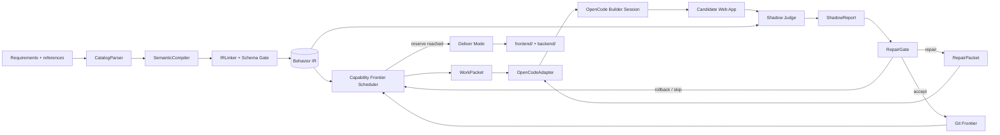

# ShallowCode V1 Agent 设计

- 状态：已批准设计，尚未进入实现
- 日期：2026-09-01
- 目标平台：GOSIM Factory 2026 / ARC-Bench
- 核心假设：运行中的 Agent 得不到官方测试、官方失败日志或隐藏评分反馈
- 主 Builder：OpenCode，通过 `@opencode-ai/sdk` 驱动

## 1. 决策摘要

ShallowCode V1 采用“控制平面 + OpenCode 执行平面”的单 Agent 架构：

- ShallowCode 负责需求编译、能力依赖图、动态调度、黑盒自评、修复止损、Git 检查点和平台交付。
- OpenCode 是唯一负责修改业务代码的 Builder；V1 不实现第二套 coding loop。
- Shadow Judge 是提交 Agent 内部的盲测模块。它可以反馈给 RepairGate 和 Builder，但看不到源码工具、官方测试或官方结果。
- 开发单位不是单个叶子需求，而是能关闭完整场景并复用共享能力的垂直切片（vertical slice）。
- 一个评测运行只启动一个 OpenCode server；每个 WorkPacket 使用一个短 session，第二次同类失败才创建 Investigator session。
- 生成应用使用确定性 Capability Kernel，OpenCode 主要实现 feature plug-ins。
- Git Frontier 管理可回滚的代码状态；Run Ledger 单独记录不可回收的 token 和时间。
- 剩余预算触达保险线后不可逆地进入 Deliver Mode，不再启动新功能。

本方案的新颖点不是增加角色数量，而是建立一个模型无关、可审计、短反馈的控制闭环：

> Durable Behavior IR + Capability Frontier + Strict Black-box Judge + Evidence-gated Repair + Short OpenCode Sessions.

## 2. 已核实的平台事实与设计假设

### 2.1 已核实事实

截至 2026-09-01：

- 比赛允许参赛者使用 OpenCode、Octos、Claude Code、自研 harness 等不同方案；官方列出的目标指标包括 GUI Test Pass Rate、Token Efficiency 和 Completion Time，但具体权重仍待公布。来源：[GOSIM Factory 2026](https://create.gosim.org/factory26/)。
- 开放版 ARC-Bench runner 支持 Python、JavaScript 和 TypeScript Agent 入口，会安装提交包的 Python/Node 依赖，并向 Agent 传入 requirement 目录和 `--output-dir`。本设计核实的仓库快照为 `bb0ef32`（2026-08-31）。来源：[ARC-Bench repository](https://github.com/code-philia/arc-bench-website)。
- 当前开放版 Web 评测会执行 frontend install/build、backend install/start，在端口 3000 上等待服务，并用 4 个 Playwright worker 执行测试；开放版默认单测试超时为 10 秒。生产配置可能覆盖这些值，因此所有参数必须通过 PlatformProfile 配置，而不能散落在业务逻辑中。
- 当前项目中的 GitHub 需求树含 47 个 ATOMIC、64 个具名场景；Sheet 需求树含 24 个 ATOMIC、48 个具名场景。大量场景跨刷新、重登录、账号、权限和持久化状态，适合按依赖闭包和共享能力组织，而不适合按 YAML 顺序逐叶实现。
- OpenCode 官方 SDK 可启动 server/client、创建和中止 session、发送 prompt、请求结构化输出并订阅事件流。来源：[OpenCode SDK](https://opencode.ai/docs/sdk/)。
- 官方 Octos 适配器已经验证了顺序节点执行、长生命周期会话、每节点提交、端口看护和最终构建演练的实用性。本设计核实的适配器快照为 `b0999c9`（2026-08-28）。ShallowCode 在这些可靠工程实践上增加行为 IR、能力调度、严格 Shadow Judge 和双账本。来源：[octos-org/arc-adapter](https://github.com/octos-org/arc-adapter)。

### 2.2 设计假设

以下不是官方已公布事实：

- 官方评分权重未知，因此调度器不使用固定的最终评分加权公式。
- 正式比赛部署版本可能落后或领先于开放仓库，因此 V1 同时提供 TypeScript 主入口和 Python 兼容入口。
- Agent 运行时不接收官方测试反馈。开发阶段可以由 Agent 外部的实验控制器在运行结束后测量黑盒结果，但结果不得回流到同一次 Agent 运行。
- V1 优先提高跨模型稳定性，不针对单一比赛模型维护专用 prompt。

## 3. 目标与非目标

### 3.1 目标

1. 在隐藏 GUI 测试下最大化可正确完成的行为场景，而非最大化生成文件数或实现描述数量。
2. 在不同 OpenAI-compatible 模型之间保持同一控制协议，仅替换 ModelProfile。
3. 让高中心性能力（session、persistence、RBAC、routing、grid state）只实现一次并被多个场景复用。
4. 在没有官方反馈时，仍能通过需求驱动的黑盒探针发现高置信度缺陷并形成修复闭环。
5. 限制失败需求上的沉没成本，并始终保留一个可构建、可启动、可提交的检查点。
6. 满足 ARC-Bench 的入口、目录、事件、traceability、Git、构建、端口和并发合同。

### 3.2 非目标

V1 不包含：

- 第二套自研 Coding Agent；
- 并行 Builder、多分支竞赛或复杂多 Agent 协作；
- 跨提交在线强化学习或 Tree Search；
- 完整 Excel 公式兼容；
- 重型视觉/OCR Judge；
- 针对 Kimi、GLM、MiniMax 或 DeepSeek 的私有提示分叉；
- 读取、复制、搜索或运行官方测试目录。

## 4. 总体架构



ShallowCode 是一个提交 Agent，而不是平台外部服务。它内部包含以下模块：

| 模块 | 主要职责 | 是否调用模型 | 是否修改业务代码 |
|---|---|---:|---:|
| PlatformBridge | 入口、环境、事件、traceability、暂停/恢复、交付合同 | 否 | 否 |
| ContractCompiler | 将需求树编译为 Behavior IR | 少量结构化调用 | 否 |
| FrontierScheduler | 构建能力超图并选择 WorkPacket | 否 | 否 |
| OpenCodeAdapter | 管理 OpenCode server/session/事件/中止 | 间接 | 否 |
| OpenCode Builder | 实现 feature 或批准的 kernel change | 是 | 是 |
| Shadow Judge | 生成受限探针并执行黑盒行为验证 | 可选少量调用 | 否 |
| RepairGate | 分类失败、限制修复、回滚或跳过 | 否 | 否 |
| SnapshotManager | Git Frontier、Run Ledger、最终候选选择 | 否 | 否 |

## 5. 运行时与入口

### 5.1 推荐提交结构

```text
submission/
├── index.ts                 # 开放版 runner 的 TypeScript 主入口
├── main.py                  # 兼容旧 Python-only 调用，启动 dist/index.js
├── dist/index.js            # 预编译兼容产物
├── package.json
├── package-lock.json
├── opencode.json
├── src/
│   ├── platform/
│   ├── compiler/
│   ├── scheduler/
│   ├── builder/
│   ├── judge/
│   ├── repair/
│   └── state/
└── assets/kernel/
```

主控制平面使用 TypeScript，以直接复用 OpenCode SDK 类型和事件流。平台按 runtime profile 只选择一个入口，不会同时启动二者。TypeScript profile 必须固定 `tsx` 依赖；`main.py` 只做参数透传、信号转发和退出码转发，不承载业务状态机。

### 5.2 启动预检

PlatformBridge 在任何模型调用前执行：

1. 解析 requirement path、output dir 和 ARC 环境变量；
2. 验证输出目录只包含或可创建 `frontend/`、`backend/` 和控制状态目录；
3. 验证 Node、Git、Chromium/Playwright、端口和可写空间；
4. 解析 `OPENAI_API_KEY`、`OPENAI_BASE_URL`、`MODEL`；
5. 验证 OpenCode SDK/server 健康；失败则切换 CLI Adapter；
6. 建立 baseline Git commit、Run Ledger 和 runner event 流；
7. 将 OpenCode 的项目根限定为生成应用目录，不向它传入 requirements 之外的外部路径。

## 6. Contract Compiler 与 Behavior IR

### 6.1 三阶段编译

#### A. CatalogParser（零 token）

- 递归遍历 ROOT/FOLDER/ATOMIC；
- 保留每个 id、name、description、dependencies、scenario、step、reference；
- 原样保存引号内文案、fixture、角色名、字段名、按钮名、错误文本和数值；
- 为每条事实建立 `sourceRef`，保证后续模型归纳可追溯到原始需求；
- 检查缺失依赖、重复 id、环和悬空 reference。

#### B. SemanticCompiler（少量结构化调用）

- 按 ROOT 子树或 FOLDER 分块，而不是逐 ATOMIC 调用；
- 使用 JSON Schema structured output；
- 推断 actor、entity、permission、state transition、UI contract、invariant、fixture 和 capability；
- 每个推断必须携带 `sourceRefs` 和 `confidence`；
- 不允许改写 exact text；模型只建立关系和语义标签。

#### C. IRLinker（零 token）

- 合并相同 actor/entity/capability；
- 建立 requirement → scenario → capability 的多部图；
- 连接显式依赖、共享实体、共享 route、跨账号/刷新/重启状态链；
- 标出冲突和高不确定节点；
- 通过 Schema Gate 后才允许调度。

### 6.2 Behavior IR 核心结构

```ts
type BehaviorIR = {
  requirements: RequirementNode[];
  scenarios: ScenarioNode[];
  actors: ActorNode[];
  entities: EntityNode[];
  transitions: StateTransition[];
  uiContracts: UIContract[];
  invariants: Invariant[];
  fixtures: Fixture[];
  capabilities: CapabilityNode[];
  edges: DependencyEdge[];
};

type EvidenceBound = {
  sourceRefs: string[];
  confidence: "high" | "medium" | "low";
  exact?: boolean;
};
```

必须表达的跨场景语义包括：

- 创建后刷新、重登录、服务重启仍存在；
- 不同账号看到不同权限下的同一对象；
- 失败时没有半成品和部分状态；
- 操作后列表、详情、导航和审计一致；
- 公式、排序、筛选、撤销等操作对同一工作簿状态连续生效；
- 并发执行时 session 和测试 fixture 不互相污染。

## 7. Capability Hypergraph 与动态调度

### 7.1 调度单位

WorkPacket 是最小可验证垂直切片，包含满足依赖所需的最小能力闭包，并至少关闭一个完整 scenario。它通常聚合共享：

- actor/session；
- entity 和持久化关系；
- route/page；
- permission path；
- state transition；
- UI contract。

WorkPacket 不能只创建抽象层而没有可观察的端到端结果。

```ts
type WorkPacket = {
  sliceId: string;
  requirementIds: string[];
  scenarioIds: string[];
  requiredCapabilities: string[];
  entityContracts: string[];
  journeys: AcceptanceJourney[];
  uiContracts: string[];
  fixtures: string[];
  allowedPaths: string[];
  kernelChange: boolean;
  budget: { tokenCap?: number; timeCapMs: number };
  doneWhen: GateSpec;
};
```

### 7.2 候选向量

每个可调度 WorkPacket 产生向量：

```text
[direct scenario closure,
 transitive unlock,
 reuse degree,
 predicted success,
 -expected tokens,
 -expected time,
 -regression blast radius]
```

选择过程：

1. 过滤依赖不满足、预算不可承受和与 blocked capability 冲突的候选；
2. 删除被其他候选严格支配的项；
3. 根据当前阶段打破 Pareto 平局；
4. WorkPacket 完成或失败后，用真实 token、时间、diff 大小和 Shadow 结果更新先验；
5. 重新计算，而不是继续静态队列。

### 7.3 阶段策略

| 阶段 | 预算区间（默认） | 目标 |
|---|---:|---|
| Bootstrap | 0–20% | 平台合同、session、persistence、routing、基础 UI |
| Expand | 20–70% | 高复用垂直切片，最大化完整场景关闭和解锁 |
| Close | 70–85% | 低风险边缘行为、精确文案、定位器和负路径 |
| Harden | 85–100% | 停止新功能，影响面回归、并发、重启和交付演练 |

这些百分比是 PlatformProfile 中的可调默认值，不是比赛事实。

## 8. OpenCode 执行平面

### 8.1 SDK 拓扑

- 整场评测只调用一次 `createOpencode()`；
- PlatformBridge 先把 submission、requirement、output 和 state 路径全部解析为绝对路径，再把进程工作目录固定到生成应用根目录；OpenCode server 因而只把该目录识别为项目。ShallowCode 后续文件操作只使用绝对路径；
- 每个普通 WorkPacket 创建一个显式标题的短 Builder session；
- 每个 RepairPacket 创建新的 repair session，避免把失败对话污染后续工作；
- 第二次同指纹失败才创建 Investigator session；
- 通过 `event.subscribe()` 采集生命周期、工具事件和模型 usage；
- 达到 WorkPacket 预算时调用 `session.abort()`；
- 运行结束必须关闭 server，并清理开发端口进程。

### 8.2 Adapter 接口

```ts
interface BuilderPort {
  health(): Promise<BuilderHealth>;
  execute(packet: WorkPacket): Promise<BuilderResult>;
  investigate(input: InvestigationPacket): Promise<RootCauseReport>;
  repair(packet: RepairPacket): Promise<BuilderResult>;
  abort(sessionId: string): Promise<void>;
  close(): Promise<void>;
}
```

实现：

1. `OpenCodeSdkAdapter`：默认；
2. `OpenCodeCliAdapter`：SDK/server 启动或 API 不兼容时的降级路径；
3. `FakeBuilderAdapter`：单元和调度测试。

控制平面不得依赖 SDK 的原始 event 类型；Adapter 必须转换为稳定的 ShallowEvent。

### 8.3 OpenCode 配置

- 使用比赛环境的 `OPENAI_API_KEY`、`OPENAI_BASE_URL`、`MODEL` 建立 OpenAI-compatible provider；
- 固定 SDK、OpenCode CLI 和 provider adapter 版本并提交 lockfile；
- 显式 session title，避免额外标题调用；
- 禁用 web、task/subagent 和外部目录访问；
- 允许的文件修改范围来自 `WorkPacket.allowedPaths`；
- 普通 packet 默认禁止改 `kernel/`；只有 `kernelChange: true` 才开放；
- Builder prompt 只包含 WorkPacket、相关 IR 原文和当前代码，不包含 Shadow Judge 的推测性修复建议。

## 9. Capability Kernel

Kernel 通过确定性文件复制进入生成项目，不消耗模型 token，也不包含固定题目答案、官方 fixture 或测试选择逻辑。

### 9.1 推荐生成应用栈

- Backend：Node 内置 `http`；
- Frontend：原生 ES modules；
- 构建：确定性脚本生成 `frontend/dist`；
- 运行时第三方依赖：V1 默认零；
- 状态：JSON snapshot + 进程内事务队列 + 临时文件原子替换，数据根由 `DATA_DIR` 注入；
- 会话：稳定 session id/cookie；
- API：统一 command/query envelope；
- UI：可访问组件和可预测 locator contract。

零依赖是默认策略，不是不可更改的宗教约束。如果验证证明某个固定依赖显著提高 Sheet 通过率且安装可靠，可以通过 ADR 引入。

### 9.2 内核层次

1. Backend kernel
   - health/static serving；
   - atomic store 和 serialized mutation；
   - session/identity；
   - RBAC policy；
   - audit event；
   - schema/version migration。
2. Accessible UI runtime
   - router/navigation；
   - form/dialog/toast/table/grid；
   - visible label 与 unique accessible name；
   - 单一错误容器和 error boundary；
   - locator registry。
3. Generic capability packs
   - RecordPack：CRUD、membership、lifecycle、permission、audit；
   - Minimal GridPack：workbook/sheet、sparse cells、基础公式依赖图、selection/edit、undo/redo、sort/filter/validation。
4. Feature plug-ins
   - OpenCode 按 WorkPacket 实现 routes、views、domain commands 和 exact UI contracts。

### 9.3 修改所有权

- ShallowCode 复制并登记 kernel 文件；
- 普通 Builder 只修改 feature 和 manifest；
- kernel change 必须单独 WorkPacket、单独 commit，并触发所有受影响 scenario 的 Shadow 回归；
- 共享回归发生时，新功能调度暂停，优先修复或回滚 kernel commit。

## 10. Shadow Judge

### 10.1 位置与信息边界

Shadow Judge 是 ShallowCode 内部模块，能向 Agent 反馈，但不是官方 Judge。

允许输入：

- Behavior IR 的当前 slice；
- requirement 原文与 reference assets；
- fixture bank；
- 运行中的候选应用 URL；
- 浏览器产生的 DOM、console、network 和 screenshot 证据。

禁止输入：

- 官方测试文件或目录；
- 官方 Playwright report、失败日志或隐藏通过率；
- Builder 源码读取工具；
- Git diff；
- 平台测试选择逻辑。

### 10.2 Probe DSL

模型不直接生成 Playwright/JavaScript/Python 代码，只能生成 JSON Schema 校验过的受限探针：

```ts
type ProbeStep =
  | { op: "goto"; route: string }
  | { op: "click"; by: "role" | "label" | "text"; value: string }
  | { op: "fill"; label: string; valueRef: string }
  | { op: "select"; label: string; option: string }
  | { op: "expectVisible"; by: LocatorKind; value: string }
  | { op: "expectText"; by: LocatorKind; value: string; exact: boolean }
  | { op: "expectValue"; label: string; valueRef: string }
  | { op: "reload" }
  | { op: "newContext"; actorRef: string }
  | { op: "restartApp" };
```

ProbeInterpreter 通过可信 Playwright adapter 执行。优先使用从 IR 确定性生成的探针模板；只有复杂或低置信度场景才调用模型补充 ProbePlan。

V1 的浏览器适配器优先复用 runner 已验证可用的 Python Playwright，通过 JSONL 子进程协议与 TypeScript 控制面通信；本地开发可以使用 Node Playwright adapter。启动预检决定使用哪一个。

每次局部或全局 Shadow suite 都使用独立临时 `DATA_DIR`。测试 fixture 不写入 Git，也不进入最终应用的默认数据目录；需要验证多步骤持久化时只在该 suite 的同一临时目录内重启服务。

### 10.3 ShadowReport

```ts
type ShadowReport = {
  sliceId: string;
  status: "pass" | "hard_failure" | "soft_concern" | "inconclusive";
  failureType?: "build" | "locator" | "persistence" | "permission" |
    "calculation" | "regression" | "infrastructure";
  reproduction: ProbeStep[];
  expected?: string;
  actual?: string;
  evidenceRefs: string[];
  affectedIrNodes: string[];
  fingerprint: string;
};
```

判定规则：

- Hard failure：确定性合同被可重现违反，可以进入 RepairGate；
- Soft concern：模型或视觉启发式判断，只记录，不单独触发回滚；
- Inconclusive：浏览器、网络或探针不稳定，最多复测一次；仍不确定则作为基础设施问题，不修改业务代码。

## 11. RepairGate

RepairGate 对失败指纹归一化：

```text
slice + phase + failure type + invariant/locator + normalized actual + console signature
```

状态机：

1. Triage：区分产品失败、探针失败和基础设施失败；基础设施先重启并复测；
2. Repair 1：新 OpenCode repair session，输入原 WorkPacket 和已验证 ShadowReport；
3. Repair 2：同指纹再次出现时，Investigator 先产生 RootCauseReport，再允许一个独立 patch；
4. Stop：仍失败则回滚到健康 Git Frontier commit，标记 capability blocked/penalized，转向不依赖它的切片。

RepairGate 不会：

- 无限重复“请继续修复”；
- 因单个 soft concern 修改代码；
- 让 Investigator 自己直接提交 patch；
- 为追逐一个失败消耗 Deliver Mode 的保留预算。

## 12. Git Frontier 与 Run Ledger

### 12.1 双账本原因

Git 回滚可以撤销代码，但不能撤销已经计入评测的 token 和 active time。因此 V0 的单一 `best_passed`/monotonic score 被拆为：

- Code Frontier（可逆）：代码 commit、Shadow hard coverage、共享回归、交付健康、并发结果和不确定性；
- Run Ledger（不可逆）：累计所有 Compiler、Builder、Investigator 和 Judge 模型调用的 token、从 Agent 启动到提交的 wall-clock、Agent active time、session 次数、repair 次数和边际 coverage/token。

### 12.2 提交协议

- OpenCode 只修改文件；ShallowCode 检查 diff 范围、运行 Gate 并创建 commit；
- commit metadata 包含 WorkPacket id、IR node、ShadowReport hash、Builder session id；
- 每个健康 commit 更新 Frontier；
- 有共享回归的 commit 进入 quarantine，不删除历史；
- 失败 rollback 后，Run Ledger 的成本保持不变。

### 12.3 最终候选选择

最终 commit 必须先满足：

1. frontend install/build 成功；
2. backend install/start 和 health 成功；
3. 没有已知共享 hard regression；
4. 关键 refresh/relogin/restart/concurrency probes 通过；
5. traceability 和输出目录完整。

在满足硬门槛的候选中：

1. 最大化已关闭的 hard scenario；
2. 平局时选择不确定性更低、blast radius 更小、并发更稳的 commit；
3. 不以旧 commit 的“历史 token 更少”作为虚假优势，因为该 token 已经消耗。

## 13. 预算与 Deliver Mode

每个 WorkPacket 的预算为：

```text
min(profile.packetCap, remainingBudget - deliveryReserve)
```

预算信号包括：

- 所有模型客户端统一上报的 SDK/gateway usage（若网关提供）；
- total wall-clock 与 Agent active time；
- 无文件变化或无新证据持续时间；
- 重复失败指纹；
- remaining delivery rehearsal estimate。

进入 Deliver Mode 的触发条件任一成立即可：

- 剩余预算达到默认 15–20% 保留线；
- 预计只够再做一次完整交付演练；
- 所有非支配候选的预计边际收益低于风险；
- OpenCode/model 不稳定且当前已有健康候选。

Deliver Mode 不可逆，步骤为：

1. 停止新 feature packet 和所有 OpenCode session；
2. 选择健康 Frontier candidate；
3. 执行影响面回归和全局 Shadow Suite；
4. 丢弃所有 Shadow 临时 `DATA_DIR`，以全新数据目录验证默认空状态或需求定义的确定性 seed；
5. 清洁执行 frontend install/build；
6. 清洁执行 backend install/start，验证 `PORT=3000` 和 readiness；
7. 验证刷新、重启、四并发、traceability、Git 和输出目录；
8. 输出最终候选并正常退出。

## 14. 信息隔离与审计

V1 的信息隔离目标是“Agent 的决策和模型上下文不接触官方测试或结果”。措施：

- PlatformBridge 从不枚举或读取 tests path；
- OpenCode project root 指向生成应用目录；权限配置拒绝 external directory、web 和 subagent；
- Builder prompt、event adapter 和日志过滤器拒绝含已知 tests/report 路径的输入；
- Shadow 的模型调用没有 tools，只接收序列化 IR 和 Probe schema；
- Probe DSL 不支持文件、shell、JavaScript evaluate 或任意网络目标；
- Judge browser 只允许候选应用 origin；
- 每个模型调用记录 purpose、IR ids、input hash、output hash、usage，不记录密钥；
- 运行结束执行 firewall audit，若发现官方测试路径进入模型事件则标记 run invalid，而不是利用该信息继续修复。

开放版 runner 的 workspace 可能在文件系统层面让 sibling 目录可达，因此 V1 的主要保证来自不传入路径、OpenCode 权限和受限 DSL。若运行环境提供 `bubblewrap`/namespace，PlatformProfile 可启用 OS 级只读挂载；没有该能力时不得宣称实现了强敌手安全隔离。

## 15. 平台协议与错误处理

### 15.1 输出合同

最终至少包含：

```text
output/
├── frontend/
│   ├── package.json
│   └── dist/...
└── backend/
    ├── package.json
    └── src/...
```

需要按当前开放版平台复现：

```text
frontend: npm install && npm run build
backend:  npm install && PORT=3000 npm run start
```

正式实现应从 PlatformProfile 读取命令和超时，以适应生产 runner 变化。

### 15.2 错误分类

| 错误 | 动作 |
|---|---|
| OpenCode SDK 健康检查失败 | 切换 CLI Adapter |
| provider/model 不可用 | 重新解析环境一次；仍失败则进入 Deliver Mode |
| SemanticCompiler Schema 失败 | 有界重试；失败分块使用原文和低置信启发式 IR |
| Builder 超时/无进展 | abort session，记录成本，重新调度或 RepairGate |
| candidate app 不可启动 | 先基础设施修复；重复后回滚 |
| Judge probe 不稳定 | 复测一次，随后 inconclusive |
| shared kernel regression | quarantine commit，暂停新功能，优先回滚/修复 |
| delivery rehearsal 失败 | 回到上一个 delivery-healthy Frontier commit |

## 16. V1 实现范围与 V2 候选

### 16.1 V1

- TypeScript 主入口、Python 兼容入口；
- PlatformBridge 和 PlatformProfile；
- CatalogParser、SemanticCompiler、IRLinker、Schema Gate；
- Capability Hypergraph、Pareto candidate filter、阶段调度；
- OpenCode SDK/CLI/Fake adapters；
- Backend/UI kernel、RecordPack、Minimal GridPack；
- Probe DSL、Playwright adapter、ShadowReport；
- RepairGate；
- Git Frontier、Run Ledger、Deliver Mode；
- ARC events、traceability 和 checkpoint/resume。

### 16.2 V2 候选

- 学习型成本先验和 provider profile；
- 参考图差分与轻量 vision judge；
- worktree 隔离的并行候选；
- 更丰富的 formula、review、workflow capability packs；
- 可用时的 OS 级 Builder/Judge 文件系统隔离。

## 17. 验证计划

### 17.1 基线

| 方案 | 描述 |
|---|---|
| B0 | OpenCode one-shot：整份需求、单长会话 |
| B1 | Sequential atomic：按 ATOMIC 顺序、长会话、每节点提交 |
| S1 | ShallowCode V1：IR、能力调度、短 SDK session、Shadow/RepairGate |

### 17.2 分阶段实验

1. Stage A Smoke
   - 一个模型、缩小需求集；
   - 淘汰入口、依赖安装、构建或启动不稳定方案。
2. Stage B Ablation
   - 两个行为差异较大的比赛模型；
   - 分别移除 IR、Kernel、Scheduler、Judge、RepairGate 和短 session。
3. Stage C Finalists
   - 四个比赛模型；
   - GitHub + Sheet 完整任务；
   - 每个配置至少 3 次重复；预算不足时使用序贯淘汰。

外部评测控制器可以在 Agent 退出后运行授权黑盒测试，但不得把测试内容或结果传回同一次 Agent 运行。

### 17.3 指标

- Primary：外部黑盒 individual test pass rate；
- Efficiency：pass/10k tokens、pass/minute；
- Calibration：Shadow hard-failure precision、false-repair rate；
- Robustness：worst-model pass、基础设施成功率、重复运行方差；
- Repair：first-repair yield、second-repair yield、skip 后获得的替代 coverage；
- Delivery：clean install/build/start 成功率和 readiness 时间。

### 17.4 建议工程门槛

以下是 go/no-go 目标，不是官方要求：

- 在不超过最强基线 1.2 倍 token 的前提下，pass rate 相对提高至少 5 个百分点；
- Shadow hard-failure precision 至少 85%；
- clean delivery success 至少 95%；
- 移除 Scheduler、Judge 或短 session 后至少有一个关键指标显著变差，否则对应模块应删除或简化。

## 18. 主要风险

| 风险 | 影响 | 缓解 |
|---|---|---|
| SDK/server/provider 漂移 | Builder 无法启动 | 固定版本、health、CLI fallback、Fake adapter contract tests |
| IR 误读需求 | 系统性实现错误 | 保存原文、sourceRefs、confidence、Schema 和冲突检查 |
| Shadow 误判 | 错误修复或回滚 | 受限 DSL、hard/soft/inconclusive、独立探针和复现门槛 |
| Kernel 缺陷 | 大面积回归 | 默认冻结、kernel contract tests、显式 change、影响面回归 |
| Grid/formula 范围爆炸 | 时间耗尽 | 只实现 IR 出现的运算符子集，优先状态链和常见聚合 |
| 并发状态竞态 | 隐藏测试随机失败 | 事务队列、稳定 ID、原子写、独立 session、四并发演练 |
| 短 session 重复读代码 | token 上升 | 精简 WorkPacket、一个 server、相关路径约束、实际 ablation |
| 长 session 上下文漂移 | 错误累积 | 不默认复用；只在 ablation 证明收益时合并相邻 packet |
| Deliver reserve 不足 | 最终构建失败 | 不可逆阶段门、动态 rehearsal estimate、健康 Frontier |

## 19. 相对 V0 的修订

| V0 | V1 决策 |
|---|---|
| 原子需求账本、叶子优先 | Behavior IR + 能力超图 + 垂直切片 |
| 一个主要长 Builder session | 一个 OpenCode server、每 WorkPacket 短 session |
| Just-in-time 生成 Playwright 代码 | IR 驱动的受限 Probe DSL，复杂场景才调用模型 |
| `best_passed` 单调分数 | 可逆 Code Frontier + 不可逆 Run Ledger |
| 失败最多两次后 skip | 保留两轮，但第二轮必须先 Investigator 根因报告 |
| 主要依赖模型搭骨架 | 确定性 Capability Kernel，Builder 聚焦 feature plug-ins |
| 未突出平台交付 | Deliver Mode、clean rehearsal、并发和 traceability 是硬门槛 |

V0 的核心洞察仍保留：OpenCode 负责写，ShallowCode 负责选择、验证和止损；Builder 不能给自己打分。

## 20. 完成定义

只有同时满足以下条件，V1 才可进入比赛提交候选：

- 能完整解析当前两棵需求树，保留全部 ATOMIC id、具名 scenario、dependency、exact text 和 reference；
- Behavior IR 无悬空引用，低置信推断可追溯；
- OpenCode SDK 与 CLI adapters 通过同一 contract suite；
- Builder 无法从 WorkPacket 获得官方测试或结果；
- Shadow 模型输出只能通过 Probe DSL Schema；
- RepairGate 对同指纹最多两轮并能回滚；
- Git Frontier 与 Run Ledger 在 rollback 后语义正确；
- generated app 通过 kernel contract、refresh/restart、cross-account 和四并发 smoke；
- TypeScript 主入口和 Python 兼容入口都能完成最小端到端运行；
- clean frontend build、backend start、端口 3000 readiness、events、traceability 和最终输出合同全部通过；
- 与 B0/B1 的基线和至少一组 ablation 有可重复结果。

## 21. 待实现前核实的开放项

1. 正式比赛部署是否启用开放 runner 的 TypeScript runtime；若未知，默认提交 Python runtime，`main.py` 启动预编译 JS 控制面。
2. 锁定版本的 `@opencode-ai/sdk` 是否自带或能稳定启动匹配 OpenCode server；必须在目标 runner 镜像做离线/镜像安装演练。
3. 比赛 gateway 对 OpenAI-compatible streaming、usage 和 structured output 的具体兼容度；不支持时使用普通 JSON response + 本地 Schema 校验。
4. Agent 可用 Playwright 入口；优先 Python preflight，Node adapter 作为本地测试实现。
5. 生产评分的 pass/token/time 权重和总时限；全部由 PlatformProfile 配置，不改变架构。
