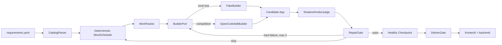

# ShallowCode V1-Lite 收敛规格

- 状态：已批准进入框架实现
- 日期：2026-09-02
- 上位参考：[ShallowCode 目标架构](./2026-09-01-shallowcode-agent-design.md)
- 首个里程碑：不依赖真实模型密钥，使用 FakeBuilder 跑通完整 pipeline
- 主 Builder：OpenCode SDK；FakeBuilder 仅用于 harness 自测

## 1. 收敛目标

V1-Lite 只验证三个最可能提高比赛分数的假设：

1. 按依赖和共享上下文选择垂直切片，比把整份需求交给一个长会话更可控；
2. Builder 与黑盒 Judge 分离，可以在没有官方反馈时发现可重现缺陷；
3. 有界修复、健康检查点和交付保留预算，可以避免局部失败拖垮整次运行。

第一阶段不追求完整目标架构。框架必须先做到可启动、可观测、可替换 Builder、可从输入走到可运行输出。

## 2. V1-Lite Pipeline



首个可执行闭环：

1. 解析 requirement tree；
2. 生成一个确定性 WorkPacket；
3. FakeBuilder 复制最小 Kernel，生成可构建应用；
4. 启动候选应用；
5. ShadowSmokeJudge 从外部检查 health、页面文本和刷新；
6. RepairGate 接收结构化结果；
7. 通过时创建健康 Git checkpoint；
8. DeliverGate 在干净状态下重新 build/start；
9. 写出 Run Ledger、checkpoint 和最终输出目录。

该闭环通过后，再把 BuilderPort 从 FakeBuilder 切换为 OpenCodeSdkBuilder。两者必须通过同一 contract tests。

## 3. 严格范围

### 3.1 V1-Lite 包含

- TypeScript 控制平面和 `index.ts` 主入口；
- 极薄 `main.py` 兼容入口，启动预编译 `dist/index.js`；
- YAML requirement tree 的确定性解析；
- 简单依赖图和启发式 SliceScheduler；
- `BuilderPort`、`FakeBuilder`、`OpenCodeSdkBuilder`；
- 最小 Kernel template；
- 不调用模型的 ShadowSmokeJudge；
- 最多两次的 RepairGate；
- 单个“最近健康 commit”；
- JSONL Run Ledger；
- 固定 20% Deliver reserve；
- build/start/readiness 的 DeliverGate；
- 单元测试和 FakeBuilder 端到端测试。

### 3.2 本阶段不包含

- SemanticCompiler 或任何模型生成的 Behavior IR；
- Capability Hypergraph、Pareto candidate filter 或学习型成本模型；
- 模型生成 Shadow probes；
- 完整 Probe DSL；
- 独立 Investigator Agent；
- OpenCode CLI fallback；
- RecordPack、GridPack 等通用能力包抽象；
- 多候选 Git Frontier；
- 并行 Builder/worktree 竞赛；
- 视觉/OCR Judge；
- 完整 ARC traceability 数据模型。

目标架构中的上述能力只有在基线或 ablation 证明收益后才进入后续版本。

## 4. 技术栈与版本

目标 runner 使用 Node 20.19.x。提交依赖固定并生成 lockfile：

| 依赖 | 固定版本 | 用途 |
|---|---:|---|
| `@opencode-ai/sdk` | `1.18.26` | OpenCode server/client/session API |
| `yaml` | `2.9.0` | requirement YAML 解析 |
| `tsx` | `4.23.13` | TypeScript Agent 入口与测试 |
| `typescript` | `7.0.2` | 类型检查和预编译 |
| `@types/node` | `20.19.43` | 与目标 Node 20 对齐的类型 |

测试使用 Node 内置 `node:test` 和 `node:assert`，不引入测试框架。

生成应用的 frontend/backend 运行时依赖为零：

- frontend：原生 HTML/CSS/ES modules；
- frontend build：Node 脚本把 `src/` 复制到 `dist/`；
- backend：Node 内置 `http`，服务 API、health 和 `frontend/dist`；
- persistence：JSON 文件 + 串行写队列 + 临时文件原子替换。

## 5. 文件结构与所有权

```text
shallow/
├── index.ts
├── main.py
├── package.json
├── package-lock.json
├── tsconfig.json
├── src/
│   ├── cli.ts
│   ├── pipeline.ts
│   ├── types.ts
│   ├── catalog.ts
│   ├── scheduler.ts
│   ├── ledger.ts
│   ├── builder/
│   │   ├── port.ts
│   │   ├── fake.ts
│   │   └── opencode-sdk.ts
│   ├── judge/
│   │   └── shadow-smoke.ts
│   ├── repair/
│   │   └── gate.ts
│   ├── checkpoint.ts
│   └── deliver.ts
├── assets/kernel/
│   ├── frontend/...
│   └── backend/...
└── test/
    ├── fixtures/requirements.yaml
    ├── catalog.test.ts
    ├── scheduler.test.ts
    ├── builder-contract.test.ts
    ├── repair-gate.test.ts
    └── pipeline.e2e.test.ts
```

模块必须保持单一职责。Pipeline 只编排接口，不包含 YAML、Git、HTTP 或 OpenCode 的具体实现。

## 6. 最小数据合同

### 6.1 RequirementCatalog

```ts
type RequirementNode = {
  id: string;
  name: string;
  type: "ROOT" | "FOLDER" | "ATOMIC";
  description: string;
  dependencies: string[];
  scenarios: Scenario[];
  parentId?: string;
};

type RequirementCatalog = {
  rootId: string;
  nodes: Map<string, RequirementNode>;
  atomics: RequirementNode[];
};
```

CatalogParser 必须：

- 保留全部 id、name、description、dependency 和 scenario step 原文；
- 拒绝重复 id、悬空 dependency 和不支持的节点类型；
- 不读取 requirement path 之外的文件；
- 不推断 actor、entity 或隐藏测试结构。

### 6.2 WorkPacket

```ts
type WorkPacket = {
  id: string;
  requirementIds: string[];
  title: string;
  sourceText: string;
  scenarios: Scenario[];
  allowedPaths: string[];
  attempt: 0 | 1 | 2;
};
```

V1-Lite 每个 packet 包含 1–3 个 ATOMIC：同一最近 FOLDER、依赖已满足，并共享直接 dependency 或场景上下文。

### 6.3 BuilderPort

```ts
interface BuilderPort {
  readonly kind: "fake" | "opencode-sdk";
  health(): Promise<void>;
  execute(packet: WorkPacket, context: BuildContext): Promise<BuilderResult>;
  close(): Promise<void>;
}
```

`BuilderResult` 只返回 session id、状态、usage 和改动文件；不返回官方测试信息。

### 6.4 ShadowResult

```ts
type ShadowResult = {
  status: "pass" | "hard_failure" | "inconclusive";
  failureType?: "build" | "start" | "health" | "content" | "refresh";
  expected?: string;
  actual?: string;
  evidence: string[];
  fingerprint: string;
};
```

## 7. 确定性 SliceScheduler

V1-Lite 不实现超图。Scheduler 维护 `todo`、`verified`、`blocked` 三个集合。

候选必须满足：

- 所有显式 dependencies 已在 `verified`；
- 不依赖 `blocked`；
- packet 构建后仍保留 20% Deliver reserve。

种子优先级：

```text
3 × scenarioCount
+ 2 × directDependentCount
+ exactUiTextCount
- descriptionCostBucket
```

随后最多加入两个与种子同属最近 FOLDER、依赖已满足的 ATOMIC。每次 pass、hard failure 或 skip 后重新计算。

这只是透明、可测试的启发式，不宣称近似官方评分。

## 8. Builder 实现

### 8.1 FakeBuilder

FakeBuilder 用于证明 harness pipeline，而不是模拟模型质量：

- 第一次执行时复制 `assets/kernel` 到 output；
- 写入当前 WorkPacket 的 id、title 和一个可见 marker；
- 返回确定性的 BuilderResult；
- 测试模式可配置为第一次失败、第二次成功，以验证 RepairGate；
- 不调用网络或模型。

### 8.2 OpenCodeSdkBuilder

- 每个 pipeline run 启动一次 `createOpencode()`；
- 使用比赛环境的 `OPENAI_API_KEY`、`OPENAI_BASE_URL`、`MODEL`；
- 每个 WorkPacket 创建一个短 session；
- prompt 只包含 packet 原文、scenarios、attempt 和 allowed paths；
- attempt 1 提供可重现 ShadowResult；
- attempt 2 追加“先说明根因，再做最小修改”，不创建独立 Investigator；
- 订阅事件并把 usage、session 和状态转换为 RunEvent；
- 达到 packet time cap 时调用 `session.abort()`；
- `close()` 关闭 server。

本阶段没有 CLI fallback。SDK 健康检查失败时必须产生明确错误，并保留 FakeBuilder pipeline 的可验证性。

## 9. ShadowSmokeJudge

V1-Lite Judge 不调用模型，只执行固定黑盒合同：

1. frontend build 成功；
2. backend start 后 `/health` 在超时内返回 2xx；
3. `/` 返回 HTML；
4. HTML 包含 WorkPacket 的可见 marker；
5. 再次请求或刷新后 marker 仍存在；
6. console/start log 不包含未处理异常。

Judge 启动应用时使用临时 `DATA_DIR`，不会污染最终默认状态。它只能访问候选应用 origin，不读取源码、Git diff 或 tests 目录。

Playwright 场景 DSL 和模型探针属于后续里程碑；首个 pipeline 用 HTTP/HTML smoke 足以证明模块边界和反馈闭环。

## 10. RepairGate 与 Checkpoint

### 10.1 RepairGate

- pass：标记 packet requirement 为 verified；
- inconclusive：重启应用并复测一次，不消耗代码 repair attempt；
- 第一次 hard failure：生成 attempt 1 packet；
- 第二次同 fingerprint hard failure：生成 attempt 2 root-cause-first packet；
- attempt 2 后仍失败：恢复最近健康 commit，标记 packet blocked，继续其他 ready packet；
- 若没有 ready packet，则进入 Deliver Mode。

### 10.2 单健康检查点

- Builder 不执行 Git commit；
- Shadow pass 后由 CheckpointManager 检查 changed paths 并提交；
- 只记录 `latestHealthyCommit`，不实现 Pareto Frontier；
- commit message 包含 packet id 和 attempt；
- rollback 不修改 Run Ledger；
- Fake pipeline 的临时输出 repo 使用本地命令级 Git identity，不依赖用户全局配置。

## 11. Run Ledger 与 DeliverGate

Run Ledger 使用 append-only JSONL，至少记录：

- pipeline started/finished；
- catalog parsed；
- packet selected；
- builder started/finished/aborted；
- shadow result；
- repair/skip；
- checkpoint created/restored；
- delivery started/finished；
- wall-clock、Builder usage（FakeBuilder 为 0）和错误摘要。

DeliverGate：

1. 停止新 packet；
2. 恢复 latest healthy commit；
3. 使用全新临时 `DATA_DIR`；
4. 在 frontend 执行 `npm install --no-audit --no-fund` 和 `npm run build`；
5. 在 backend 执行 `npm install --no-audit --no-fund`；
6. 以 `PORT=3000 npm run start` 启动；
7. 等待 `/health`；
8. 请求 `/` 并验证 2xx；
9. 终止服务，写入成功事件，保留 frontend/backend 输出。

固定在总运行预算剩余 20% 时进入 Deliver Mode。V1-Lite 不实现动态 rehearsal estimate。

## 12. 信息边界

- Agent 只接收调用参数指定的 requirement directory；
- CatalogParser 不遍历父目录；
- OpenCode cwd 为 output project；
- OpenCode 禁用 external directory、web 和 subagent；
- WorkPacket 不含 tests path、Playwright report 或官方结果；
- ShadowSmokeJudge 不调用模型，不接受任意脚本；
- Ledger 记录模型输入 hash 和目的，不记录密钥；
- 若日志或 event 中出现已知官方 tests/report 路径，pipeline 立即失败，不继续利用该信息。

这是严格逻辑隔离；若平台未来提供 OS namespace，可在后续版本强化为文件系统隔离。

## 13. 首个里程碑完成定义

以下命令必须在无比赛 API key 的环境通过：

```text
npm ci
npm run typecheck
npm test
npm run pipeline:fake -- test/fixtures/requirements.yaml --output-dir <temp>
```

端到端测试必须证明：

- fixture requirement 全量解析且依赖校验生效；
- Scheduler 选择预期的 ready packet；
- FakeBuilder 通过 BuilderPort 执行；
- 生成 `frontend/` 和 `backend/`；
- ShadowSmokeJudge 能发现失败并在成功时返回 pass；
- RepairGate 的 attempt 上限有效；
- 健康 commit 被记录；
- DeliverGate 完成干净 build/start/readiness；
- Run Ledger 包含从 started 到 finished 的关键事件；
- pipeline 不读取 fixture 目录之外的 sibling tests；
- 所有子进程在测试结束后退出，不残留端口进程。

真实 OpenCode 验收分两级：

1. 无密钥：SDK import、配置构造、Builder contract 和 health failure 行为通过；
2. 有比赛密钥：单个最小 WorkPacket 完成一次真实 session，产生可运行 output，usage 和 session id 进入 Ledger。

## 14. 升级门槛

只有满足以下证据才增加复杂模块：

- SemanticCompiler：确定性分组在真实需求上频繁产生错误切片；
- 模型 Shadow Judge：HTTP smoke 无法发现足够多的可重现行为错误；
- Capability packs：重复实现代码成为主要 token 成本；
- Pareto Frontier：单健康 checkpoint 经常因局部回归错失更好候选；
- CLI fallback：SDK 在目标 runner 上出现可复现的不稳定；
- Investigator：第二轮 root-cause-first prompt 的修复率不足。

每项升级必须有 baseline/ablation 数据，并作为独立规格和实施计划进入。
