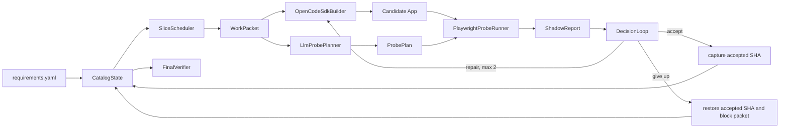

# ShallowCode V1-Lite 收敛规格

- 状态：首个实现的约束规格
- 初版日期：2026-09-02
- 修订日期：2026-09-04
- 目标平台：GOSIM Factory 2026 / ARC-Bench
- 主 Builder：OpenCode，通过 `@opencode-ai/sdk` 驱动
- 核心假设：运行中的 Agent 得不到官方测试、官方失败日志或隐藏评分反馈

本文约束首个可运行版本。若与[目标架构](./2026-09-01-shallowcode-agent-design.md)冲突，以本文为准。

## 1. 收敛结论

V1-Lite 不是另一套 coding agent，而是 OpenCode 外的一层轻量比赛控制器：

> ShallowCode 只实现 OpenCode 因为不知道整场比赛的全局状态而无法可靠实现的部分。

因此边界如下：

| 责任 | 所有者 | 理由 |
| --- | --- | --- |
| 创建和修改目标应用 | OpenCode | 这是 Builder 的核心能力，不在 ShallowCode 重复实现 |
| 选择技术栈、文件结构、局部实现策略 | OpenCode | 依赖目标仓库上下文，应由 coding agent 判断 |
| 执行局部 build、lint、开发者测试和修复 | OpenCode | 与代码修改属于同一局部闭环 |
| 解析整棵需求树并跟踪跨 session 状态 | ShallowCode | 单个短 session 不知道整场进度 |
| 在全局预算下选择下一个 WorkPacket | ShallowCode | 需要比较所有未完成需求及剩余资源 |
| 从需求生成独立的黑盒探针 | ShallowCode 的 LLM Probe Planner | Builder 自测容易复述自己的实现假设 |
| 用真实浏览器确定性执行探针 | ShallowCode 的 Playwright Probe Runner | 需要统一、可审计的跨 WorkPacket 判定 |
| 接受候选状态或回到最后接受状态 | ShallowCode 的 Decision Loop | 需要记住整场 accepted SHA 和失败历史 |
| 预留尾部预算并完成最终交付验证 | ShallowCode | 局部 session 不知道全局时间、token 和交付风险 |

ShallowCode 不提供生产级 Capability Kernel，不规定目标应用必须使用哪种框架，也不实现第二套源码编辑工具。

## 2. 最小生产闭环



一次正常迭代为：

1. `CatalogState` 读取完整需求树和历史状态。
2. `SliceScheduler` 选择 1 至 3 个相邻、依赖已满足的 ATOMIC requirement，形成一个 `WorkPacket`。
3. `OpenCodeSdkBuilder` 创建短 session，让 OpenCode 在输出仓库中实现并自检该 packet。
4. `LlmProbePlanner` 只根据需求证据生成声明式 `ProbePlan`。
5. `PlaywrightProbeRunner` 启动目标应用，用真实浏览器执行计划并生成 `ShadowReport`。
6. `DecisionLoop` 接受、要求修复，或在达到上限后恢复最后接受状态并阻塞该 packet。
7. 进入预留交付预算后停止开发，`FinalVerifier` 独立验证最终构建、启动和就绪状态。

## 3. 模块规格

### 3.1 CatalogState

职责：

- 无损读取 requirement 的 ID、原文、父目录、依赖、scenario、reference 和显式 UI 文本。
- 为每个 ATOMIC requirement 维护 `todo | verified | blocked`。
- 拒绝未知依赖、重复 ID 和依赖环。
- 只保存编排需要的结构，不把自然语言提前压缩为自创语义 IR。

```ts
type RequirementStatus = "todo" | "verified" | "blocked";

interface AtomicRequirement {
  id: string;
  folderPath: string[];
  text: string;
  dependencyIds: string[];
  scenarios: string[];
  references: string[];
  exactUiStrings: string[];
}

interface RequirementCatalog {
  requirements: AtomicRequirement[];
  statusById: Record<string, RequirementStatus>;
}
```

### 3.2 SliceScheduler

职责：在不调用模型的情况下，从全局 catalog 选出下一组最有价值且可实现的需求。

V1-Lite 规则固定且可测试：

- 只选择所有依赖均为 `verified` 的 `todo` requirement。
- 一个 packet 包含 1 至 3 个 ATOMIC requirement。
- 优先合并同一最近 FOLDER 下、共享依赖或共享 scenario 词项的 requirement。
- 排序信号依次为：具名 scenario 数、直接依赖者数、显式 UI 文本数、估算成本的倒数、原始声明顺序。
- 不做 Pareto frontier、超图搜索或模型驱动调度。

```ts
interface WorkPacket {
  id: string;
  requirementIds: string[];
  requirements: AtomicRequirement[];
  attempt: 1 | 2 | 3;
}
```

`attempt: 1` 是首次实现；`2` 和 `3` 分别是最多两次修复。第三次 Shadow 失败后不得继续在该 packet 消耗预算。

### 3.3 OpenCodeSdkBuilder

职责：把 `WorkPacket`、平台合同和上一轮 Shadow 证据交给 OpenCode，并等待 session 完成。

约束：

- 一次 Agent run 只启动一个 OpenCode server/client。
- 每个首次实现或修复使用一个短 session，不保留无限增长的对话。
- 通过 `@opencode-ai/sdk` 创建 session、发送 prompt，并在超时时 abort；V1-Lite 不额外维护事件订阅状态机。
- OpenCode 是唯一生产 Builder，可以读写目标仓库、选择目标技术栈、运行局部命令并修复代码。
- ShallowCode 不为目标应用生成页面、数据层、认证层或组件骨架。
- 首次 prompt 包含完整 packet 原文、相关 scenario/reference、依赖完成状态、平台构建/端口合同。
- 修复 prompt 只增加结构化 `ShadowReport`，不得泄露 Judge planner 的隐藏推理文本。
- 第二次修复必须要求先给出根因判断再改代码，但仍由同一个 Builder 完成，不新增 Investigator 角色。

```ts
interface BuilderRequest {
  packet: WorkPacket;
  outputDir: string;
  platformContract: PlatformContract;
  shadowReport?: ShadowReport;
  requireRootCauseFirst: boolean;
}

interface BuilderResult {
  sessionId: string;
  outcome: "completed" | "failed" | "timed_out";
  summary: string;
}

interface BuilderPort {
  run(request: BuilderRequest): Promise<BuilderResult>;
  close(): Promise<void>;
}
```

### 3.4 LlmProbePlanner

这是 Shadow Judge 的生成部分。它调用与比赛兼容的 LLM，但不具备源码工具，也不运行浏览器。

输入边界：

- 当前 `WorkPacket` 的 requirement 原文、scenario、reference 描述和显式 UI 文本。
- 平台基础 URL、允许的 probe DSL 和通用可访问性定位规则。
- 不提供目标应用源码、OpenCode 对话、git diff、官方测试或官方测试结果。

首次生成在一次有界 LLM 调用中尽量覆盖三类 probe：

1. 主成功路径。
2. 刷新、重开 context 或重新登录后的持久性路径；仅当需求涉及状态时生成。
3. 非法输入、权限或隔离路径；仅当需求明确要求时生成。

Planner 必须通过 JSON Schema 返回声明式计划。计划不能包含 JavaScript、shell、CSS 注入或任意 URL 请求。

```ts
type ProbeLocator =
  | { by: "role"; role: string; name?: string; exact?: boolean }
  | { by: "label"; text: string; exact?: boolean }
  | { by: "text"; text: string; exact?: boolean };

type ProbeStep =
  | { op: "goto"; path: string }
  | { op: "click"; locator: ProbeLocator }
  | { op: "fill"; locator: ProbeLocator; value: string }
  | { op: "select"; locator: ProbeLocator; value: string }
  | { op: "expectVisible"; locator: ProbeLocator }
  | { op: "expectText"; locator: ProbeLocator; text: string; exact?: boolean }
  | { op: "expectValue"; locator: ProbeLocator; value: string }
  | { op: "expectCount"; locator: ProbeLocator; count: number }
  | { op: "reload" }
  | { op: "newContext"; actor?: string };

interface ProbeCase {
  id: string;
  requirementIds: string[];
  purpose: "happy_path" | "persistence" | "negative" | "permission";
  steps: ProbeStep[];
}

interface ProbePlan {
  packetId: string;
  cases: ProbeCase[];
}
```

允许一次可选的 locator refinement：仅当 Runner 能明确分类为“定位器未命中且行为结论不成立”时，把清洗后的 accessibility snapshot 和原计划发给 Planner。Planner 只能修改 locator，不能改变期望行为、输入值或断言。每个 packet 最多调用一次 refinement。

### 3.5 PlaywrightProbeRunner

这是 Shadow Judge 的执行部分，必须使用真实 Playwright browser/context/page，而不是 DOM 字符串模拟。

职责和安全边界：

- 按顺序解释 allowlist 中的 `ProbeStep`。
- locator 只映射到 `getByRole`、`getByLabel` 和 `getByText`。
- `goto.path` 必须是相对路径，并绑定到受控 `baseUrl`。
- 禁止 `page.evaluate`、任意网络请求、文件系统、shell、动态代码和未声明 CSS/XPath selector。
- 每个 case 使用隔离 context；`newContext` 用于显式模拟第二 actor 或新会话。
- 每个 step 和 case 均有硬超时；超时被记录为确定性失败。
- 输出结构化、可复现的报告；不得由 LLM 在执行后自由改判。

```ts
interface ProbeFailure {
  caseId: string;
  stepIndex: number;
  category: "assertion" | "locator" | "navigation" | "timeout" | "runner";
  message: string;
  locatorSnapshot?: string;
}

interface ShadowReport {
  packetId: string;
  verdict: "pass" | "fail" | "inconclusive";
  passedCases: string[];
  failures: ProbeFailure[];
}
```

判定规则：

- 所有 case 通过才是 `pass`。
- 行为断言失败、导航错误或超时是 `fail`。
- 只有 locator 未命中且 snapshot 足以进行一次安全 refinement 时是 `inconclusive`。
- refinement 后仍未命中则转为 `fail`，不无限调整测试来适应实现。

### 3.6 DecisionLoop、RunState 与最小 GitOps

ShallowCode 需要保留唯一一个看似“代码管理”的例外：最后接受提交的 SHA。原因不是 OpenCode 不会使用 Git，而是接受、止损和回滚依赖跨所有 session 的全局判定。

```ts
interface RunState {
  statusByRequirementId: Record<string, RequirementStatus>;
  attemptsByPacketId: Record<string, number>;
  acceptedSha: string;
  remainingBudget: {
    wallClockMs: number;
    modelTokens?: number;
  };
  ledger: RunEvent[];
}

interface GitOps {
  captureAccepted(message: string): Promise<string>;
  restoreAccepted(sha: string): Promise<void>;
}
```

V1-Lite 不实现 `CheckpointManager` 类、分支 frontier 或多检查点策略。`GitOps` 只有两个窄操作：

- pipeline 启动、Builder 尚未运行时调用一次 `captureAccepted`，把 starter output（空目录时允许空提交）记录为初始 `acceptedSha`。
- Shadow `pass` 后调用 `captureAccepted`，更新 `acceptedSha`，把 packet requirement 标为 `verified`。
- 第三次 Shadow 失败、Builder 失败且无预算修复，或候选状态破坏全局启动时，调用 `restoreAccepted`，把 packet requirement 标为 `blocked`。

首次实现加两次修复共最多三次 Builder 调用：

- 第一次失败：新 session，携带精确 `ShadowReport` 修复。
- 第二次失败：新 session，要求先做根因分析再修复。
- 第三次失败：恢复 `acceptedSha` 并阻塞 packet。

`RunState` 只需单进程内存实现和追加式 JSONL ledger；V1-Lite 不实现崩溃恢复数据库。ledger 用于审计，不驱动复杂规划。

### 3.7 FinalVerifier

进入总 wall-clock 预算最后 20% 时，调度器停止领取新 packet。该阈值一旦触发不可退出。

FinalVerifier 独立于 OpenCode session，执行平台合同中明确的：

- 依赖安装或已有依赖检查。
- 前端/后端构建命令。
- 生产启动命令。
- 端口 3000 readiness。
- 根页面的最小浏览器 smoke。
- 停止由本次验证启动的进程。

失败时只允许在保留预算内启动一次交付修复 session；随后重新运行完整 FinalVerifier，不继续开发新 feature。

## 4. 信息防火墙

在严格 Shadow Judge 假设下，模块可见信息固定如下：

| 信息 | Scheduler | OpenCode Builder | Probe Planner | Probe Runner |
| --- | ---: | ---: | ---: | ---: |
| 完整 requirement catalog | 是 | 否，只看 packet | 否，只看 packet | 否 |
| 当前 packet 原文和场景 | 是 | 是 | 是 | 仅看 ProbePlan |
| 目标应用源码和 diff | 否 | 是 | 否 | 否 |
| 浏览器页面 | 否 | 可自行开发测试 | 否 | 是 |
| ShadowReport | 是 | 修复时是 | locator refinement 时仅清洗快照 | 生成者 |
| 官方测试/官方结果 | 否 | 否 | 否 | 否 |
| 全局预算和 accepted SHA | 是 | 否 | 否 | 否 |

官方测试即使在评测机器文件系统上技术可达，也不构成本设计读取或使用它们的授权。

## 5. 运行时和依赖

首个实现只提供 TypeScript 主入口 `index.ts`，匹配当前开放版 runner。若正式 runner 明确要求 Python，再增加只负责转发参数的薄包装，不预先维护双实现。

固定依赖：

- 生产：`@opencode-ai/sdk@1.18.27`、`yaml@2.9.0`。
- 测试/构建：`@playwright/test@1.54.0`、`tsx@4.23.13`、`typescript@7.0.2`、`@types/node@20.19.43`。
- 单元测试优先使用 Node 内建 `node:test`；Playwright 包同时供 Runner 和浏览器集成测试使用。
- LLM Probe Planner 使用 Node 内建 `fetch` 调用 OpenAI-compatible gateway，不再引入第二个模型 SDK。

环境变量：

- `OPENAI_API_KEY`
- `OPENAI_BASE_URL`
- `MODEL`

OpenCode Builder 和 Probe Planner 共用 gateway/model 配置，但各自维护独立上下文；模型调用次数和超时由全局 budget policy 限制。

## 6. 首个里程碑：框架和 pipeline 跑通

首个里程碑只证明控制流和边界正确，不承诺比赛分数：

1. TypeScript 入口能解析平台参数并初始化 `RunState`。
2. Catalog parser 能读取 fixture requirements，Scheduler 能产出确定性 `WorkPacket`。
3. 生产 `OpenCodeSdkBuilder` 和 `LlmProbePlanner` 具备真实适配器接口与配置校验。
4. 测试目录中的 `FakeBuilder` 创建一个最小 fixture app；它不属于生产架构。
5. 测试目录中的 `FakeProbePlanner` 返回合法 ProbePlan；它只用于无凭证 CI。
6. 生产 `PlaywrightProbeRunner` 启动真实 Chromium，在 fixture app 上执行 click/fill/reload/assertion。
7. pipeline 测试证明 `schedule -> build -> plan -> browser judge -> accept` 全链路通过。
8. 失败测试证明 `fail -> repair -> pass`，以及三次失败后 `restore -> blocked`。
9. credential-gated smoke 才调用真实 OpenCode SDK 和真实 LLM Probe Planner；缺少凭证时明确 skip，不伪装成功。

最小验收命令：

```powershell
npm ci
npm run typecheck
npm test
npm run test:browser
```

## 7. 明确延期

以下能力不进入 V1-Lite：

- Durable Behavior IR / SemanticCompiler。
- capability hypergraph 和 Pareto frontier。
- 生产 Capability Kernel、RecordPack、GridPack 或应用脚手架生成器。
- 独立 Investigator、多 Agent 辩论或多 Builder 投票。
- `CheckpointManager`、多分支 frontier、持久化恢复数据库。
- Python 主实现、CLI fallback 和双 Playwright adapter。
- 无 LLM 的模板化 Shadow Judge。
- 截图视觉相似度模型、跨运行学习和官方反馈回灌。

## 8. 升级门槛

只有观测到具体瓶颈才扩展：

| 观测证据 | 允许的升级 |
| --- | --- |
| LLM ProbePlan 经常违反 schema | 增加一次结构化重试或更严格 decoder |
| locator-only 失败占显著比例 | 改进 accessibility snapshot refinement |
| OpenCode 重复生成同类基础设施且稳定性差 | 提供 prompt 级模板说明；仍不先建生产 Kernel |
| 单次 packet 经常跨越过多页面导致失败 | 将 packet 上限从 3 动态降为 1 或 2 |
| Runner 与正式平台入口不兼容 | 基于正式 runner 证据增加薄兼容层 |
| 进程崩溃导致大量有效工作丢失 | 再引入可恢复 RunState；不直接升级为复杂 frontier |

## 9. V1-Lite 成功定义

V1-Lite 完成必须同时满足：

- 生产路径只有一个业务代码 Builder：OpenCode SDK。
- ShallowCode 的每个生产模块都能解释其所需的比赛全局信息。
- Shadow Judge 至少一次调用 LLM 生成 probe，并由真实 Playwright 执行。
- Probe Runner 不执行模型生成的任意代码。
- 无凭证测试通过 fake model adapters 和真实浏览器跑通完整 pipeline。
- 失败有严格上限，并能回到最后接受 SHA。
- 最终交付验证有独立预算和可重复命令。

满足这些条件后再讨论调度优化和更丰富的 Judge；在此前不扩大框架。
